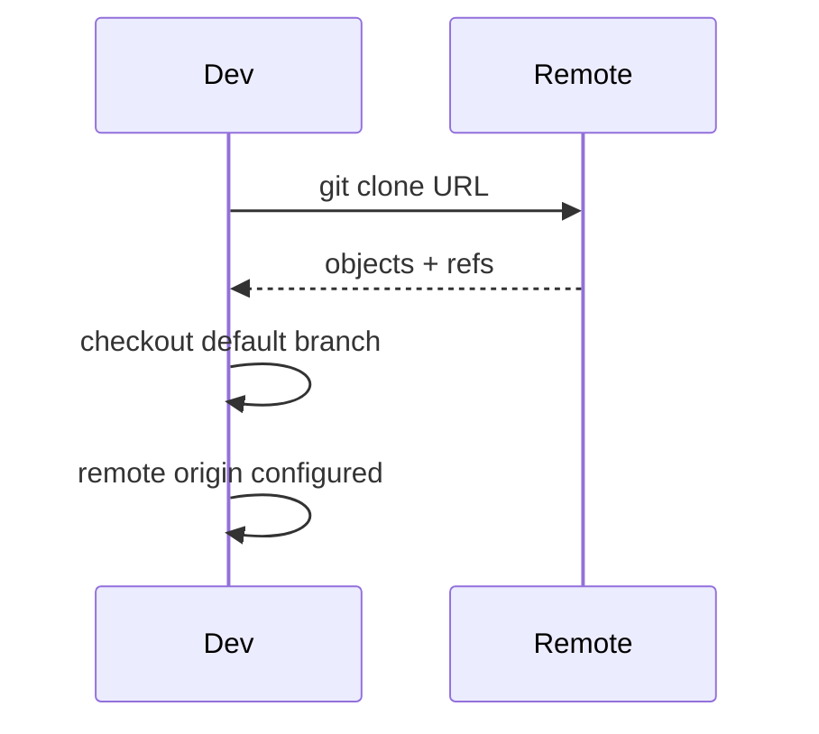

## Executive Summary

`git clone` copies a remote repository into a new directory, sets up `origin`, checks out the default branch, and creates a full local object database (unless shallow). Choose transport (HTTPS vs SSH), depth, and path based on CI vs developer needs.

---

## Core Concepts



| Transport | When to use |
| :--- | :--- |
| **HTTPS** | Firewalls, tokens, quick setup |
| **SSH** | Daily dev with SSH keys, no password prompts |
| **Local path** | `git clone /path/to/repo.git` — same machine |

| Clone variant | Effect |
| :--- | :--- |
| Default | Full history, all branches fetched as remote-tracking |
| `--depth N` | Shallow — only last N commits |
| `--mirror` | Bare mirror for backup/migration |
| `--filter=blob:none` | Partial clone — blobs on demand |

---

## Quick Reference

| Task | Command |
| :--- | :--- |
| Standard clone | `git clone <url>` |
| Into folder | `git clone <url> my-folder` |
| Specific branch | `git clone -b main <url>` |
| Shallow | `git clone --depth 1 <url>` |
| SSH | `git clone git@github.com:org/repo.git` |
| Mirror | `git clone --mirror <url>` |
| Sparse (partial tree) | see Examples below |

```bash
git clone https://github.com/org/app.git
git clone git@github.com:org/app.git app-workspace
git clone --depth 1 --single-branch -b release/2.0 <url>
```

---

## Examples

### Clone + immediate branch work

```bash
git clone git@github.com:org/api.git
cd api
git switch -c feature/billing
# first push sets upstream
git push -u origin feature/billing
```

### Sparse checkout (monorepo — one service)

```bash
git clone --filter=blob:none --sparse https://github.com/org/monorepo.git
cd monorepo
git sparse-checkout set services/billing
```

### Clone from internal bare server

```bash
git clone ssh://git@gitserver/srv/git/payments.git
```

### Recover from failed clone

```bash
# partial clone — resume
cd payments && git fetch --all

# or remove and re-clone
rm -rf payments && git clone <url>
```

---

## Best Practices

- Use **SSH keys** (or credential helpers) for developer machines; **deploy keys** or tokens for CI.
- CI jobs: `--depth 1` + `--single-branch` for speed; fetch full history only when needed (e.g. `git describe`).
- After clone, verify remote: `git remote -v` and `git branch -a`.
- For monorepos, prefer **sparse checkout** over cloning subtrees manually.
- Never embed credentials in clone URLs committed to docs — use env vars.

---

## Common Interview Questions


**Q:** What does `git clone` actually do?

**A:** Creates a directory, initializes `.git`, **fetches** all objects/refs from remote, adds **remote `origin`**, checks out **HEAD** of default branch into working tree, and sets up **remote-tracking branches** (`origin/main`).



**Q:** Shallow clone limitations?

**A:** Missing ancestors — `git log` truncated, some merges/rebases harder, `git describe` may fail. Use `git fetch --unshallow` or deepen with `git fetch --depth=N` when full history required.


---

## Related Topics

- [Repository](/git-cheatsheet/repository/) — what gets copied into `.git`
- [Remote](/git-cheatsheet/remote/) — manage origin after clone
- [Git Basics](/git-cheatsheet/git-basics/) — first commits after clone
