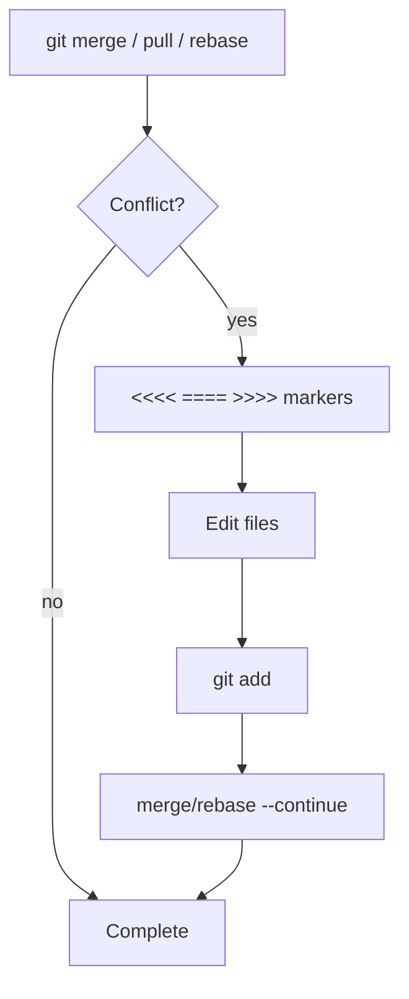

## Executive Summary

A **merge conflict** occurs when Git cannot auto-merge overlapping changes. Conflict markers appear in files — you edit to the desired result, `git add`, then continue merge/rebase/cherry-pick. Prevention: small PRs, frequent integration, clear ownership of files.

---

## Core Concepts



| Conflict marker | Meaning |
| :--- | :--- |
| `<<<<<<< HEAD` | Your side (current branch) |
| `=======` | Separator |
| `>>>>>>> branch-name` | Incoming side |

| Operation | Continue command | Abort |
| :--- | :--- | :--- |
| Merge | `git merge --continue` | `git merge --abort` |
| Rebase | `git rebase --continue` | `git rebase --abort` |
| Cherry-pick | `git cherry-pick --continue` | `git cherry-pick --abort` |

---

## Quick Reference

| Task | Command |
| :--- | :--- |
| List conflicted files | `git status` |
| See conflict diff | `git diff` |
| Accept ours (merge) | `git checkout --ours <file>` |
| Accept theirs (merge) | `git checkout --theirs <file>` |
| Use merge tool | `git mergetool` |
| Mark resolved | `git add <file>` |
| Abort merge | `git merge --abort` |
| Who changed lines | `git blame <file>` |
| Rerere (reuse resolution) | `git config rerere.enabled true` |

```bash
git status                    # Unmerged paths:
# both modified: src/Service.java
```

---

## Examples

### Resolve merge conflict manually

```java
<<<<<<< HEAD
    return inventory.reserve(itemId);
=======
    return inventory.reserveWithLock(itemId);
>>>>>>> feature/stock-fix
```

After edit:

```java
    return inventory.reserveWithLock(itemId);
```

```bash
git add src/Service.java
git merge --continue
```

### Rebase conflict (repeat per commit)

```bash
git rebase origin/main
# fix conflicts in files
git add .
git rebase --continue
# may repeat for multiple commits
```

### Use VS Code / IDE merge UI

```bash
git config --global merge.tool vscode
git config --global mergetool.vscode.cmd 'code --wait $MERGED'
git mergetool
```

### Binary file conflict

```bash
# choose one version explicitly
git checkout --ours design.png
git add design.png
git merge --continue
```

---

## Best Practices

- Pull/rebase from **main frequently** — smaller conflict surface.
- Don't commit conflict markers (`<<<<<<<`) — enable pre-commit hooks to block.
- For `pom.xml` / lockfiles — understand which dependency version wins; run tests after.
- Communicate on **shared file** changes (configs, schemas) in team channels.
- Enable **`rerere`** if you often resolve similar conflicts on long-lived branches.
- After resolution, run **full test suite** — semantic conflicts pass Git but break behavior.

---

## Common Interview Questions


**Q:** What causes a merge conflict?

**A:** Git's 3-way merge finds **overlapping edits** to the same lines (or adjacent logic) that it cannot reconcile automatically. Delete/modify on same region also conflicts.



**Q:** `--ours` vs `--theirs` during rebase?

**A:** During **rebase**, meanings **swap** — "ours" is the branch you're rebasing onto, "theirs" is your replayed commit. Always verify with `git status` and diff before blindly choosing.


---

## Related Topics

- [Merge](/git-cheatsheet/merge/) — when conflicts arise
- [Rebase](/git-cheatsheet/rebase/) — rebase conflict loop
- [Pull Request Workflow](/git-cheatsheet/pull-request-workflow/)
- [Git Hooks](/git-cheatsheet/git-hooks/) — block conflict markers
