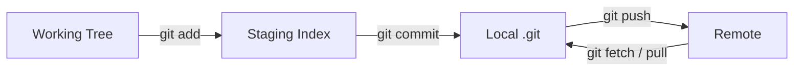

## Executive Summary

**Git** is a distributed version control system: every clone is a full repository with complete history. Work flows through the **working tree** → **staging area (index)** → **local commits** → **remotes**. This page covers the commands you use every day.

---

## Core Concepts



| Area | What it holds |
| :--- | :--- |
| **Working tree** | Files on disk you edit |
| **Staging (index)** | Snapshot for the next commit |
| **Repository (.git)** | Commits, branches, tags, objects |
| **Remote** | Another repo copy (origin, upstream) |

| State | `git status` shows |
| :--- | :--- |
| Untracked | New file, never added |
| Modified | Changed but not staged |
| Staged | Ready to commit |
| Clean | Matches last commit |

---

## Quick Reference — Most Used Commands

| Task | Command |
| :--- | :--- |
| Initialize repo | `git init` |
| Check status | `git status` / `git status -sb` |
| Stage file | `git add <file>` / `git add .` |
| Unstage | `git restore --staged <file>` |
| Commit | `git commit -m "message"` |
| Amend last commit | `git commit --amend` |
| View log | `git log --oneline -20` |
| View diff | `git diff` / `git diff --staged` |
| Discard local changes | `git restore <file>` |
| Show file at commit | `git show <rev>:<path>` |

```bash
# First-time setup
git config --global user.name "Jane Doe"
git config --global user.email "jane@example.com"
git config --global init.defaultBranch main
git config --global pull.rebase false   # or true for rebase pulls

# Everyday loop
git status -sb
git add -p                  # stage hunks interactively
git commit -m "feat: add login endpoint"
git push -u origin feature/login
```

---

## Examples

### Inspect what changed

```bash
git diff                    # unstaged vs index
git diff --staged           # staged vs HEAD
git diff main..feature/x    # branch comparison
git log --oneline --graph --all -15
```

### Undo before commit

```bash
git restore src/App.java              # discard working changes
git restore --staged src/App.java     # unstage, keep edits
```

### `.gitignore` essentials

```gitignore
target/
node_modules/
.env
*.log
.idea/
.DS_Store
```

---

## Best Practices

- Commit **small, logical units** with imperative messages (`fix:`, `feat:`, `docs:`).
- Run `git status` before every commit; use `git add -p` to avoid accidental files.
- Never commit secrets — use `.gitignore` + secret scanning in CI.
- Set `pull.rebase` explicitly team-wide to avoid surprise merge commits.
- Prefer `git restore` over legacy `git checkout -- file` (Git 2.23+).

---

## Common Interview Questions


**Q:** What is the difference between Git and SVN?

**A:** Git is **distributed** — every developer has the full history locally, commits are local until pushed, branching is cheap. SVN is **centralized** — most operations need the server; branches/tags are heavier.



**Q:** Explain the three trees in Git.

**A:** **Working tree** (files you edit), **index/staging** (proposed next commit), **HEAD** (last commit on current branch). `git add` moves changes working→index; `git commit` moves index→repository.



**Q:** What does `git commit --amend` do?

**A:** Replaces the **latest commit** with a new one (new SHA). Safe for unpushed commits; **never amend** commits already shared on a remote without team coordination.


---

## Related Topics

- [Repository](/git-cheatsheet/repository/) — `.git` directory structure
- [Clone](/git-cheatsheet/clone/) — get a remote copy locally
- [Branch](/git-cheatsheet/branch/) — parallel lines of development
- [Git Cheatsheet Index](/git-cheatsheet/)
