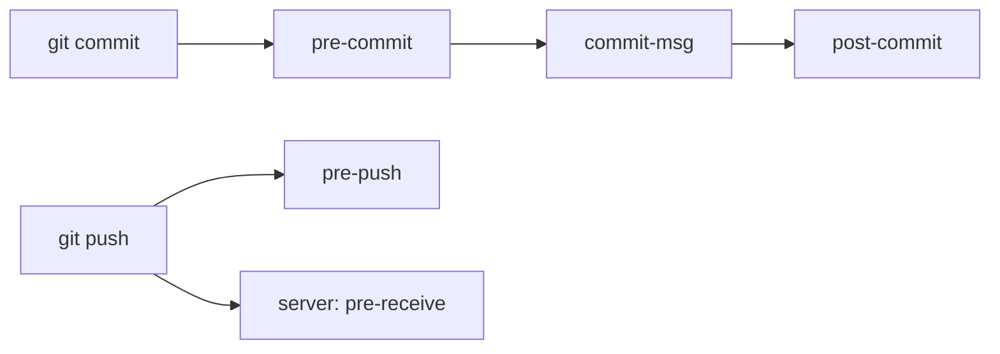

## Executive Summary

**Git hooks** are scripts Git runs on events (commit, push, merge). **Client hooks** live in `.git/hooks/` (or managed via tools). **Server hooks** run on the remote (pre-receive, update). Hooks enforce quality locally; **CI** enforces on the server — use both.

---

## Core Concepts



| Client hook | When | Typical use |
| :--- | :--- | :--- |
| `pre-commit` | Before commit recorded | Lint, format, secrets scan |
| `commit-msg` | After message entered | Conventional commit check |
| `pre-push` | Before push | Run unit tests |
| `post-checkout` | After branch switch | Install deps, warn |
| `prepare-commit-msg` | Before editor opens | Template injection |

| Server hook | When | Typical use |
| :--- | :--- | :--- |
| `pre-receive` | Push received | Block force-push to main |
| `update` | Per ref update | Access control |
| `post-receive` | After push accepted | Deploy, notify |

---

## Quick Reference

| Task | Command / path |
| :--- | :--- |
| Hook directory | `.git/hooks/` |
| Enable hook | Rename `pre-commit.sample` → `pre-commit`, `chmod +x` |
| Skip hooks (emergency) | `git commit --no-verify` |
| List in repo | `ls .git/hooks` |
| Shared hooks (config) | `git config core.hooksPath .githooks` |
| Sample pre-commit | see Examples |

```bash
# bypass all client hooks — use sparingly
git commit --no-verify -m "emergency hotfix"
git push --no-verify
```

---

## Examples

### Simple pre-commit (block conflict markers)

```bash
#!/bin/sh
# .git/hooks/pre-commit
if git grep -n '<<<<<<<' -- ':!*.md'; then
  echo "Error: conflict markers found"
  exit 1
fi
```

### commit-msg — conventional commits

```bash
#!/bin/sh
# .git/hooks/commit-msg
commit_regex='^(feat|fix|docs|chore|refactor|test)(\(.+\))?: .+'
if ! grep -qE "$commit_regex" "$1"; then
  echo "Bad commit message. Use: type(scope): description"
  exit 1
fi
```

### Team-shared hooks via `core.hooksPath`

```bash
mkdir -p .githooks
# add scripts to .githooks/pre-commit
git config core.hooksPath .githooks
chmod +x .githooks/*
# commit .githooks/ to repo — team gets hooks on clone
```

### Husky (Node projects)

```json
// package.json
{
  "scripts": {
    "prepare": "husky"
  }
}
```

```bash
npx husky add .husky/pre-commit "npm test"
```

### Server-side (bare repo) — block non-fast-forward to main

```bash
#!/bin/sh
# hooks/pre-receive
while read oldrev newrev ref; do
  if [ "$ref" = "refs/heads/main" ]; then
    if [ "$oldrev" != "0000000000000000000000000000000000000000" ]; then
      # block force push if not ancestor
      merge_base=$(git merge-base $oldrev $newrev)
      if [ "$merge_base" != "$oldrev" ]; then
        echo "Force push to main denied"
        exit 1
      fi
    fi
  fi
done
```

---

## Best Practices

- **Client hooks are bypassable** (`--no-verify`) — never rely on them alone; enforce in **CI + branch protection**.
- Version-control shared hooks (`.githooks/` or Husky) so team stays consistent.
- Keep pre-commit **fast** (&lt; 10s) — slow hooks get skipped.
- Run heavy checks in **pre-push** or CI, not every commit.
- Document `--no-verify` policy — only for emergencies with approval.
- Server hooks on GitHub/GitLab often replaced by **Actions/rules** — same intent.

---

## Common Interview Questions


**Q:** Client vs server hooks?

**A:** **Client** runs on developer machine (can skip). **Server** runs on remote during push — enforces org policy. Production quality gates need server/CI enforcement.



**Q:** How to share hooks with the team?

**A:** Store scripts in repo (e.g. `.githooks/`) and set `git config core.hooksPath .githooks`, or use **Husky** / **pre-commit** framework. Hooks in `.git/hooks` are not committed by default.


---

## Related Topics

- [Git Basics](/git-cheatsheet/git-basics/) — commit workflow hooks attach to
- [Pull Request Workflow](/git-cheatsheet/pull-request-workflow/) — CI as server-side gate
- [Repository](/git-cheatsheet/repository/) — `.git/hooks` location
- [Conflict Resolution](/git-cheatsheet/conflict-resolution/) — block `<<<<<<<` in pre-commit
