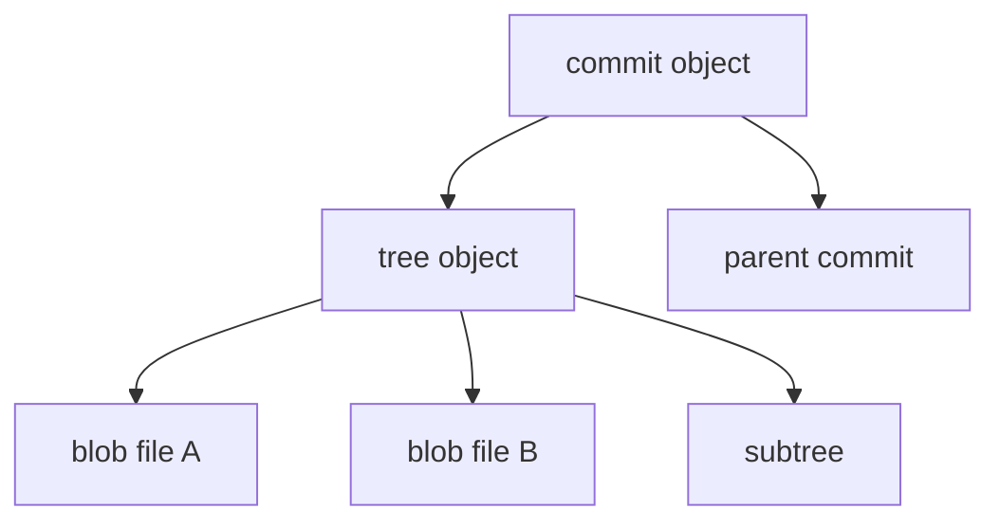

## Executive Summary

Git stores data as **content-addressed objects** in `.git/objects/`. Four types: **blob** (file), **tree** (directory), **commit** (snapshot + metadata), **tag** (annotated). **Refs** (branches, tags) are pointers to commits. Understanding internals explains immutability, SHA changes on rebase, and recovery via reflog.

---

## Core Concepts



| Object | Contains |
| :--- | :--- |
| **Blob** | File content only (no filename) |
| **Tree** | List of (mode, name, blob/tree SHA) |
| **Commit** | Tree SHA, parent(s), author, committer, message |
| **Tag** | Points to commit/object + annotated metadata |

| SHA-1 | Property |
| :--- | :--- |
| Hash of | `type + size + content` |
| Same content | Same SHA across repos |
| Rebase | New parent → new commit SHA |

| Area | Path |
| :--- | :--- |
| Objects | `.git/objects/ab/cdef...` |
| Packfiles | `.git/objects/pack/*.pack` |
| Refs | `.git/refs/heads/`, `refs/tags/` |
| Reflog | `.git/logs/HEAD`, `logs/refs/heads/main` |

---

## Quick Reference — Plumbing Commands

| Task | Command |
| :--- | :--- |
| Hash object | `git hash-object -w file.txt` |
| Cat object | `git cat-file -p <sha>` |
| Object type | `git cat-file -t <sha>` |
| Write tree | `git write-tree` |
| Commit object | `git commit-tree <tree-sha> -p <parent> -m "msg"` |
| Update ref | `git update-ref refs/heads/test <sha>` |
| List all objects | `git rev-list --objects --all` |
| Verify repo | `git fsck` |
| Pack loose objects | `git gc` |
| Reflog | `git reflog show main` |

```bash
# manual commit (plumbing demo)
echo "hello" | git hash-object -w --stdin
git update-index --add --cacheinfo 100644 <blob-sha> hello.txt
TREE=$(git write-tree)
COMMIT=$(echo "manual" | git commit-tree $TREE -p HEAD)
git update-ref refs/heads/manual-demo $COMMIT
```

---

## Examples

### Inspect commit structure

```bash
git cat-file -p HEAD
# tree ...
# parent ...
# author ...
# committer ...
# message

git ls-tree -r HEAD | head
```

### Find which commit introduced a blob

```bash
git log --all --full-history -- path/to/file.java
git rev-list --objects --all | grep <short-sha>
```

### Reflog recovery

```bash
git reflog
# abc1234 HEAD@{2}: commit: lost work
git reset --hard HEAD@{2}
```

### Packfile stats

```bash
git count-objects -vH
```

---

## Best Practices

- **Reflog** is local safety net — default 90 days; don't disable casually.
- `git gc` runs automatically but run after large imports/migrations.
- Use `git fsck` when seeing corruption errors before aggressive fixes.
- Understand **why SHAs change** — explains team policies on rebase.
- For backups, clone or `git bundle create repo.bundle --all`.

---

## Common Interview Questions


**Q:** How does Git store file versions?

**A:** Each version is a **blob** object (content only). **Trees** map paths to blob SHAs. A **commit** points to a root tree + parent commit(s). Unchanged files **reuse** same blob SHA across commits.



**Q:** Why is Git called a content-addressable filesystem?

**A:** Objects are retrieved by **hash of their content** (SHA-1/SHA-256). Identical content → identical hash → stored once (deduplication).



**Q:** What is the reflog?

**A:** Append-only log of **where refs pointed** locally (checkout, commit, reset, rebase). Not pushed to remote — recovers "lost" commits after reset.


---

## Related Topics

- [Repository](/git-cheatsheet/repository/) — `.git` layout
- [Reset](/git-cheatsheet/reset/) — reflog recovery
- [Rebase](/git-cheatsheet/rebase/) — why SHAs rewrite
- [Git Hooks](/git-cheatsheet/git-hooks/) — scripts at ref updates
