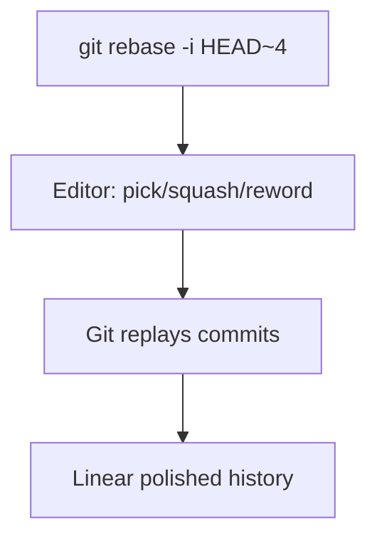

## Executive Summary

**Interactive rebase** (`git rebase -i`) lets you rewrite a series of **local** commits: squash WIP commits, reword messages, reorder, or drop mistakes. Use before opening a PR to present a clean history. Only on commits **not yet shared**.

---

## Core Concepts



| Command (in todo list) | Action |
| :--- | :--- |
| `pick` | Keep commit as-is |
| `reword` | Change commit message |
| `edit` | Pause to amend commit |
| `squash` | Merge into previous; combined message |
| `fixup` | Merge into previous; discard this message |
| `drop` | Remove commit |
| `exec` | Run shell command between commits |

| Range syntax | Meaning |
| :--- | :--- |
| `HEAD~3` | Last 3 commits |
| `--onto main feature~5 feature` | Transplant slice onto main |
| `main..feature` | Commits on feature not in main |

---

## Quick Reference

| Task | Command |
| :--- | :--- |
| Interactive last N | `git rebase -i HEAD~N` |
| Onto another base | `git rebase -i --onto main feature~3 feature` |
| Autosquash | `git commit --fixup=<sha>` then `git rebase -i --autosquash` |
| Abort | `git rebase --abort` |
| Continue after edit | `git commit --amend && git rebase --continue` |

```bash
git rebase -i HEAD~5
# in editor:
# pick a1b2c3d feat: add API
# squash d4e5f6a WIP
# squash g7h8i9j fix typo
# reword j0k1l2m final message polish
```

---

## Examples

### Squash WIP commits before PR

```bash
git rebase -i origin/main
# mark all but first as 'squash' or 'fixup'
git push --force-with-lease
```

### Fixup workflow (auto-order fixups)

```bash
git commit --fixup=abc1234        # while working
git commit --fixup=abc1234
git rebase -i --autosquash HEAD~6
```

### Edit old commit (add forgotten file)

```bash
git rebase -i HEAD~3
# change 'pick' to 'edit' on target commit
git add forgotten.properties
git commit --amend --no-edit
git rebase --continue
```

### Split a commit (advanced)

```bash
git rebase -i HEAD~2
# mark commit as 'edit'
git reset HEAD^
git add -p
git commit -m "part 1"
git add .
git commit -m "part 2"
git rebase --continue
```

---

## Best Practices

- Clean up history **before** first push or while branch is yours alone.
- Use `fixup` for noise commits; `squash` when message should merge.
- Set `GIT_SEQUENCE_EDITOR` in scripts for automation (CI rarely uses interactive).
- If rebase stops on conflict, fix → `git add` → `git rebase --continue`.
- `git reflog` is your safety net — note SHA before risky rebases.

---

## Common Interview Questions


**Q:** squash vs fixup?

**A:** Both combine a commit into the previous one. **Squash** opens editor to merge commit messages. **Fixup** discards the squashed commit's message — keeps parent message only.



**Q:** When should you NOT use interactive rebase?

**A:** On **shared/pushed** commits others may have pulled — rewriting SHAs breaks their history. Use merge or revert on public branches instead.


---

## Related Topics

- [Rebase](/git-cheatsheet/rebase/) — non-interactive rebase
- [Reset](/git-cheatsheet/reset/) — undo rebase via reflog
- [Pull Request Workflow](/git-cheatsheet/pull-request-workflow/)
- [Git Basics](/git-cheatsheet/git-basics/) — amend and commit
