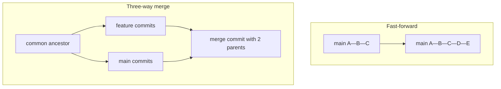

## Executive Summary

`git merge` integrates another branch into your current branch. Git may **fast-forward** (no divergence) or create a **merge commit** (three-way merge). Conflicts require manual resolution in the working tree.

---

## Core Concepts



| Merge type | When | Result |
| :--- | :--- | :--- |
| **Fast-forward** | No commits on current branch since diverge | Linear history |
| **Three-way** | Both branches moved | Merge commit (2 parents) |
| **Squash merge** | `git merge --squash` | One staged commit, no merge commit |

| Strategy | Flag | Use |
| :--- | :--- | :--- |
| Recursive (default) | — | Most merges |
| Ours | `-s ours` | Keep our tree, record their history |
| Octopus | `-s octopus` | 3+ branches (rare) |

---

## Quick Reference

| Task | Command |
| :--- | :--- |
| Merge branch | `git merge feature/x` |
| No fast-forward | `git merge --no-ff feature/x` |
| Squash | `git merge --squash feature/x` then commit |
| Abort | `git merge --abort` |
| Continue after fix | `git add . && git merge --continue` |
| Log merges only | `git log --merges` |
| Who merged | `git log --first-parent main` |

```bash
git switch main
git pull --ff-only
git merge --no-ff feature/billing -m "Merge branch 'feature/billing'"
git push origin main
```

---

## Examples

### Standard feature merge (preserve branch topology)

```bash
git switch main
git merge --no-ff feature/api-v2
# resolve conflicts if any
git push origin main
```

### Squash merge (one commit on main)

```bash
git switch main
git merge --squash feature/spike
git commit -m "feat: add spike findings as single commit"
```

### Merge remote tracking branch

```bash
git fetch origin
git merge origin/main          # same as git pull without rebase
```

### Inspect merge parents

```bash
git show --summary HEAD        # Merge: branch-a into branch-b
git log --graph --oneline -10
```

---

## Best Practices

- Update target branch (`main`) **before** merging feature branches.
- Use `--no-ff` on long-lived integration branches to preserve context (team preference).
- Prefer **squash merge on PR** for noisy feature history on trunk (trunk-based teams).
- Never merge with uncommitted changes — commit or stash first.
- After conflict resolution, run tests before `git merge --continue`.

---

## Common Interview Questions


**Q:** Fast-forward vs three-way merge?

**A:** **FF:** target branch tip is ancestor of source — pointer moves forward, no merge commit. **Three-way:** both branches diverged — Git uses common ancestor + both tips to build merge commit with two parents.



**Q:** Merge vs rebase?

**A:** **Merge** preserves exact history and creates merge commits. **Rebase** replays commits on a new base — linear history but rewrites SHAs. Never rebase shared/public branches without agreement.


---

## Related Topics

- [Conflict Resolution](/git-cheatsheet/conflict-resolution/) — fix merge conflicts
- [Rebase](/git-cheatsheet/rebase/) — alternative integration
- [Branch](/git-cheatsheet/branch/) — branch before merge
- [Pull Request Workflow](/git-cheatsheet/pull-request-workflow/) — merge via PR
