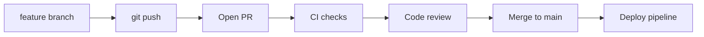
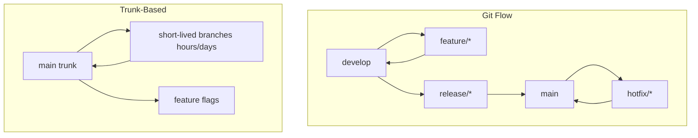

## Executive Summary

The **pull request (PR)** workflow integrates changes via review before merge to a protected branch. Standard loop: branch → commit → push → open PR → CI + review → merge → delete branch. Choose **Git Flow** or **trunk-based development** based on release cadence and team size.

---

## Core Concepts



| Merge option (GitHub/GitLab) | Result |
| :--- | :--- |
| **Merge commit** | Preserves branch history + merge node |
| **Squash and merge** | One commit on target branch |
| **Rebase and merge** | Linear commits replayed on tip |

| PR hygiene | Practice |
| :--- | :--- |
| Scope | One logical change per PR |
| Size | &lt; 400 lines changed when possible |
| Description | What, why, how to test |
| Linked issue | Ticket ID in title/body |

---

## Quick Reference — PR Git Commands

| Step | Command |
| :--- | :--- |
| Start feature | `git switch main && git pull --ff-only` |
| Branch | `git switch -c feature/JIRA-42-desc` |
| Push + track | `git push -u origin HEAD` |
| Update from main | `git fetch origin && git rebase origin/main` |
| After review fixes | `git commit --amend` or new commits |
| Force push PR branch | `git push --force-with-lease` |
| Post-merge cleanup | `git switch main && git pull && git branch -d feature/...` |

```bash
# typical day
git switch -c fix/checkout-race
git commit -m "fix: guard inventory check with lock"
git push -u origin fix/checkout-race
# open PR in UI → wait for CI → address review → merge
```

---

## Git Flow vs Trunk-Based Development



| Dimension | Git Flow | Trunk-Based Development |
| :--- | :--- | :--- |
| **Main branch** | `main` + long-lived `develop` | Single `main` (trunk) always deployable |
| **Branch lifetime** | Weeks (features, releases) | Hours to few days |
| **Releases** | `release/*` branches, versioned | Continuous from trunk; tags for releases |
| **Incomplete features** | Hide in feature branch | **Feature flags** in trunk |
| **Merge style** | Merge to develop, then release | Small PRs, often squash to trunk |
| **Best for** | Scheduled releases, multiple versions | CI/CD, SaaS, high deploy frequency |
| **Risk** | Integration pain merging to develop | Requires discipline + strong CI |

### Git Flow — when it fits

- Multiple supported **release versions** in production.
- Formal **release trains** (monthly/quarterly).
- Teams need clear separation between "integrated" (`develop`) and "released" (`main`).

### Trunk-based — when it fits

- **Continuous delivery** — deploy main multiple times per day.
- Strong **automated tests** and feature flags.
- Small teams or mature platform engineering.

{}
Most greenfield SaaS teams adopt **trunk-based** with short branches. Git Flow remains common in enterprises with long release cycles — pick one model per repo and document it in CONTRIBUTING.md.
{}

---

## Examples

### PR with rebase workflow

```bash
git switch feature/api
git fetch origin
git rebase origin/main
git push --force-with-lease
# PR stays open; CI re-runs
```

### Draft PR early feedback

```bash
git push -u origin spike/new-cache
# mark as Draft in GitHub — signal WIP
```

### Merge after approval (local simulation)

```bash
git switch main
git pull --ff-only
git merge --no-ff feature/JIRA-42 -m "Merge PR #128"
git push origin main
```

---

## Best Practices

- Protect **main** — require PR, passing CI, 1+ approval, no direct push.
- Keep PRs **small and focused** — easier review, faster merge, less conflict.
- Rebase or update from main **daily** on long-running branches.
- Use **conventional commits** in PR titles for automated changelogs.
- Delete merged branches (local + remote) to reduce clutter.
- Document merge strategy (squash vs merge commit) in team handbook.

---

## Common Interview Questions


**Q:** Git Flow vs trunk-based — key trade-off?

**A:** **Git Flow** isolates work on long-lived branches but delays integration. **Trunk-based** integrates continuously to `main` — needs feature flags and strong CI but reduces merge hell and enables CD.



**Q:** Squash merge pros/cons?

**A:** **Pro:** clean linear history on main, one commit per PR. **Con:** loses granular commit history from feature branch — harder to bisect within a PR.



**Q:** What should a good PR include?

**A:** Clear description, linked ticket, test plan, screenshots/logs if UI/ops change, small diff, passing CI, and explicit reviewers. Self-review the diff before requesting others.


---

## Related Topics

- [Branch](/git-cheatsheet/branch/) — create feature branches
- [Merge](/git-cheatsheet/merge/) — merge strategies
- [Rebase](/git-cheatsheet/rebase/) — keep PR branch current
- [Conflict Resolution](/git-cheatsheet/conflict-resolution/)
- [Remote](/git-cheatsheet/remote/) — push PR branch
