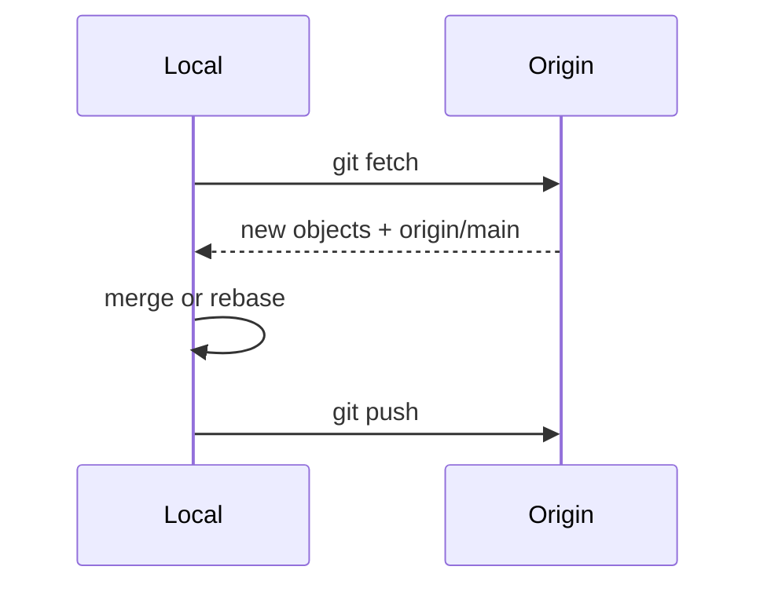

## Executive Summary

A **remote** is a named link to another repository (usually `origin`). **Fetch** downloads objects without merging; **pull** fetches + integrates; **push** uploads local commits. Tracking branches connect local branches to `origin/*` refs.

---

## Core Concepts



| Command | Network | Updates working tree |
| :--- | :---: | :---: |
| `git fetch` | ✓ | No |
| `git pull` | ✓ | Yes (merge/rebase) |
| `git push` | ✓ | No |

| Remote name | Typical role |
| :--- | :--- |
| `origin` | Your canonical upstream (clone source) |
| `upstream` | Original repo when working from a fork |
| `deploy` | Push-to-deploy target (optional) |

---

## Quick Reference

| Task | Command |
| :--- | :--- |
| List remotes | `git remote -v` |
| Add remote | `git remote add origin <url>` |
| Change URL | `git remote set-url origin <url>` |
| Remove | `git remote remove origin` |
| Fetch all | `git fetch --all --prune` |
| Fetch one | `git fetch origin` |
| Push branch | `git push -u origin feature/x` |
| Push tags | `git push origin --tags` |
| Delete remote branch | `git push origin --delete feature/x` |
| Pull | `git pull` / `git pull --rebase` |

```bash
git remote add upstream git@github.com:org/original.git
git fetch upstream
git merge upstream/main
```

---

## Examples

### Fork workflow (OSS contribution)

```bash
git clone git@github.com:you/fork.git
git remote add upstream git@github.com:org/project.git
git fetch upstream
git switch -c feature/fix
git push -u origin feature/fix
# open PR: you/fork → org/project
```

### Push with lease (safe force)

```bash
git push --force-with-lease origin feature/api
```

### Push current branch (Git 2.37+)

```bash
git config --global push.autoSetupRemote true
git push    # first push creates upstream
```

### Mirror to backup remote

```bash
git remote add backup git@backup:mirrors/app.git
git push --mirror backup
```

---

## Best Practices

- Use **SSH** or credential manager — avoid passwords in URLs.
- `git fetch --prune` removes stale `origin/*` after remote branch deletes.
- Set upstream on first push: `-u` so `git pull`/`git push` work without args.
- **Never force-push** `main`/`master` — branch protection on hosting platform.
- Separate **read** (fetch) from **integrate** (merge/rebase) when learning — clearer than blind `pull`.

---

## Common Interview Questions


**Q:** `git fetch` vs `git pull`?

**A:** **Fetch** updates remote-tracking refs only (`origin/main`) — your branch unchanged. **Pull** = fetch + merge (or rebase) into current branch.



**Q:** What is `--force-with-lease`?

**A:** Force push **only if** remote ref matches what you last fetched — prevents overwriting teammates' pushes you haven't seen.


---

## Related Topics

- [Clone](/git-cheatsheet/clone/) — initial remote setup
- [Branch](/git-cheatsheet/branch/) — push local branches
- [Pull Request Workflow](/git-cheatsheet/pull-request-workflow/)
- [Tag](/git-cheatsheet/tag/) — push release tags
