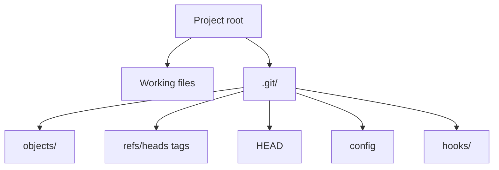

## Executive Summary

A **Git repository** is a directory containing a `.git` folder that stores all objects, refs, and configuration. A **working copy** repo has files + `.git`; a **bare** repo has only `.git` contents (used on servers). Understanding repo layout helps with recovery, hooks, and internals debugging.

---

## Core Concepts



| Path | Purpose |
| :--- | :--- |
| `.git/objects/` | Blobs, trees, commits (content-addressed) |
| `.git/refs/heads/` | Branch tips (`main`, `feature/x`) |
| `.git/refs/tags/` | Tag pointers |
| `.git/HEAD` | Current branch or detached commit |
| `.git/config` | Repo-local settings + remotes |
| `.git/index` | Staging area binary snapshot |
| `.git/hooks/` | Scripts run on Git events |

| Repo type | Use case |
| :--- | :--- |
| **Non-bare** (default) | Local development — has working tree |
| **Bare** (`git init --bare`) | Central push target — no editable checkout |

---

## Quick Reference

| Task | Command |
| :--- | :--- |
| Create repo | `git init` |
| Create bare repo | `git init --bare repo.git` |
| Show repo root | `git rev-parse --show-toplevel` |
| List remotes | `git remote -v` |
| Repo config | `git config --list --local` |
| Global config | `git config --global --list` |
| Where is setting from? | `git config --show-origin user.email` |
| Verify object DB | `git fsck` |
| Garbage collect | `git gc --prune=now` |

```bash
# Initialize with main as default branch
git init -b main

# Clone into bare central repo (server)
git init --bare /srv/git/myapp.git

# Inspect HEAD and current branch
cat .git/HEAD                    # ref: refs/heads/main
git symbolic-ref HEAD
```

---

## Examples

### Local vs global config

```bash
git config user.email "dev@team.com"           # this repo only
git config --global core.editor "code --wait"
git config --global core.autocrlf input        # Windows: false or true
```

### Shallow clone (CI / large repos)

```bash
git clone --depth 1 https://github.com/org/huge-repo.git
git fetch --unshallow   # deepen when full history needed
```

### Submodule pointer (repo contains other repos)

```bash
git submodule add https://github.com/org/lib.git vendor/lib
git submodule update --init --recursive
```

---

## Best Practices

- Keep **secrets out of `.git`** — use environment variables or secret managers.
- Use **bare repos** on servers; developers never commit directly on the server working tree.
- Run `git fsck` after disk issues or corrupted packfiles before force operations.
- Pin `core.autocrlf` consistently across the team to avoid line-ending churn.
- Store large binaries with **Git LFS** instead of bloating the object database.

---

## Common Interview Questions


**Q:** What is inside the `.git` directory?

**A:** The entire repository metadata: **objects** (commits/trees/blobs), **refs** (branches/tags), **HEAD**, **index** (staging), **config**, **hooks**, and **logs** (reflog). The working tree files live outside `.git`.



**Q:** Bare vs non-bare repository?

**A:** **Non-bare** has a checkout — you edit files and commit. **Bare** has no working tree — only Git data; `git push` targets bare repos on servers because pushing to a checked-out branch can overwrite live files.


---

## Related Topics

- [Git Basics](/git-cheatsheet/git-basics/) — daily workflow
- [Clone](/git-cheatsheet/clone/) — create a working copy from remote
- [Git Internals](/git-cheatsheet/git-internals/) — objects, SHA-1, packfiles
- [Git Hooks](/git-cheatsheet/git-hooks/) — `.git/hooks` automation
