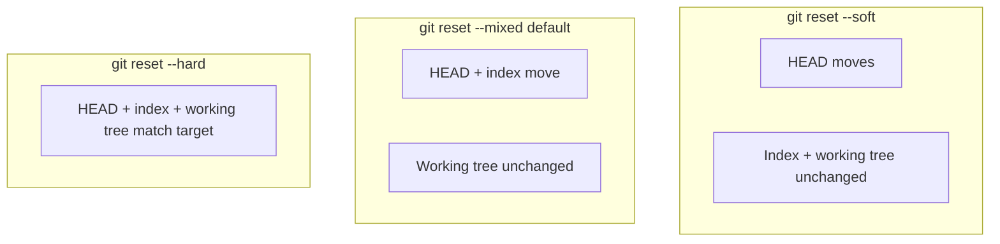

## Executive Summary

`git reset` moves the current branch pointer and optionally updates the **index** and **working tree**. Choose **soft**, **mixed** (default), or **hard** based on how much you want to undo. Use `git reflog` to recover from mistakes.

---

## Core Concepts



| Mode | Moves HEAD | Resets index | Resets working tree |
| :--- | :---: | :---: | :---: |
| `--soft` | ✓ | | |
| `--mixed` (default) | ✓ | ✓ | |
| `--hard` | ✓ | ✓ | ✓ |

| vs Revert | Reset | Revert |
| :--- | :--- | :--- |
| History | Rewrites (local) | Adds new inverse commit |
| Shared branches | Dangerous | Safe |

---

## Quick Reference

| Task | Command |
| :--- | :--- |
| Undo last commit, keep changes staged | `git reset --soft HEAD~1` |
| Undo last commit, keep changes unstaged | `git reset HEAD~1` |
| Discard last commit + edits | `git reset --hard HEAD~1` |
| Reset to remote | `git reset --hard origin/main` |
| Unstage file | `git reset HEAD <file>` |
| Recover via reflog | `git reset --hard HEAD@{2}` |

```bash
git reflog                         # find lost commits
git reset --hard abc1234
```

---

## Examples

### Undo last commit but keep work

```bash
git reset --soft HEAD~1
# changes still staged — recommit when ready
```

### Unstage everything

```bash
git reset HEAD
# equivalent: git restore --staged .
```

### Align local main with remote (destructive)

```bash
git fetch origin
git switch main
git reset --hard origin/main
```

### Remove bad commit from feature branch (not pushed)

```bash
git reset --hard HEAD~3
git push --force-with-lease
```

{}
`git reset --hard` **permanently discards** uncommitted working tree changes. Stash first if unsure.
{}

---

## Best Practices

- Prefer **`git revert`** on shared/public branches instead of reset + force push.
- Always check `git status` and `git log -3` before `--hard`.
- Use **reflog** (`git reflog`, 90-day default) before panic — commits are often recoverable.
- `git reset --hard origin/main` is common for discarding bad local merges on main — never on unpushed unique work.
- Document team policy: who may force-push and when.

---

## Common Interview Questions


**Q:** Difference between `git reset` and `git revert`?

**A:** **Reset** moves branch pointer backward — commits can become unreachable. **Revert** creates a **new commit** that undoes a prior one — safe for published history.



**Q:** What does `git reset --mixed HEAD~1` do?

**A:** Moves **HEAD** one commit back, resets **index** to match, leaves **working tree** files modified (unstaged). Default mode.


---

## Related Topics

- [Revert](/git-cheatsheet/revert/) — safe undo on shared branches
- [Rebase](/git-cheatsheet/rebase/) — recover with reflog after bad rebase
- [Stash](/git-cheatsheet/stash/) — save work before hard reset
- [Git Internals](/git-cheatsheet/git-internals/) — reflog storage
