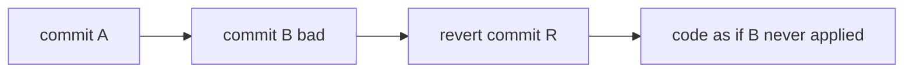

## Executive Summary

`git revert` creates a **new commit** that applies the **inverse** of a previous commit. History is preserved — ideal for `main`, release branches, and any shared remote. Use for production rollbacks without rewriting SHAs.

---

## Core Concepts



| Operation | History | Shared branch safe? |
| :--- | :--- | :--- |
| `git revert` | Adds commit | ✓ Yes |
| `git reset --hard` | Removes commits | ✗ No (needs force push) |

| Flag | Use |
| :--- | :--- |
| `-m 1` | Revert a **merge commit** (parent 1 = mainline) |
| `--no-commit` | Stage inverse without committing |
| `-n` | Same as `--no-commit` |

---

## Quick Reference

| Task | Command |
| :--- | :--- |
| Revert one commit | `git revert <sha>` |
| Revert without auto-commit | `git revert -n <sha>` |
| Revert merge | `git revert -m 1 <merge-sha>` |
| Revert range | `git revert A..B` |
| Abort conflicted revert | `git revert --abort` |
| Continue | `git revert --continue` |

```bash
git switch main
git revert f1a2b3c -m "revert: faulty deploy config"
git push origin main
```

---

## Examples

### Revert bad deploy on main

```bash
git log --oneline -5
git revert abc1234
git push origin main
# deploy pipeline picks up revert commit
```

### Revert a merge commit

```bash
# merge commit has two parents; -m 1 keeps first parent line (usually main)
git revert -m 1 def5678
```

### Revert multiple commits (oldest first)

```bash
git revert --no-commit HEAD~3..HEAD
git commit -m "revert: roll back feature X"
```

### Revert of a revert (re-apply feature)

```bash
git revert <revert-commit-sha>
```

---

## Best Practices

- Default choice for **production** and **main** — no force push required.
- Revert **merge commits** with `-m 1` (verify correct parent with `git show <sha>`).
- For multi-commit features, revert in **reverse chronological** order or revert the merge.
- Pair revert commits with **incident tickets** and deployment runbooks.
- CI should run full test suite on revert PRs — inverse patches can conflict subtly.

---

## Common Interview Questions


**Q:** Why revert instead of reset on main?

**A:** **Reset** rewrites history — everyone else must reset/rebase. **Revert** is forward-only — `git pull` works normally; audit trail shows what was undone and when.



**Q:** How to revert a merge commit?

**A:** `git revert -m 1 <merge-sha>` — `-m 1` selects the **first parent** (typically the branch you merged into). Wrong parent reverses the wrong side.


---

## Related Topics

- [Reset](/git-cheatsheet/reset/) — local history rewrite
- [Cherry Pick](/git-cheatsheet/cherry-pick/) — alternative for selective undo
- [Pull Request Workflow](/git-cheatsheet/pull-request-workflow/)
- [Tag](/git-cheatsheet/tag/) — tag before/after revert releases
