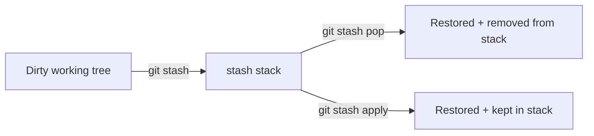

## Executive Summary

`git stash` temporarily shelves **uncommitted** changes (staged and unstaged) so you can switch branches or pull cleanly. Stashes are **stack-based** ref logs — not for long-term storage. Prefer small stashes and named messages.

---

## Core Concepts



| Command | Stashes | Restores | Removes from stack |
| :--- | :--- | :--- | :--- |
| `git stash push` | ✓ | — | — |
| `git stash pop` | — | ✓ | ✓ |
| `git stash apply` | — | ✓ | |
| `git stash drop` | — | — | ✓ |

| Include | Flag |
| :--- | :--- |
| Untracked files | `-u` / `--include-untracked` |
| Ignored files | `-a` / `--all` |
| Message | `git stash push -m "wip oauth"` |
| Keep staged | `--keep-index` |

---

## Quick Reference

| Task | Command |
| :--- | :--- |
| Stash all | `git stash` / `git stash push` |
| Named stash | `git stash push -m "message"` |
| List | `git stash list` |
| Show diff | `git stash show -p stash@{0}` |
| Pop latest | `git stash pop` |
| Apply latest | `git stash apply` |
| Pop specific | `git stash pop stash@{2}` |
| Drop | `git stash drop stash@{0}` |
| Clear all | `git stash clear` |
| Stash single file | `git stash push -m "x" -- path/file` |

```bash
git stash push -u -m "WIP before hotfix"
git switch hotfix/INC-1
# ... fix ...
git switch feature/big-refactor
git stash pop
```

---

## Examples

### Interrupt feature for urgent fix

```bash
git stash push -m "half-done refactor"
git switch main && git pull --ff-only
git switch -c hotfix/payment
# ... commit fix ...
git switch feature/refactor
git stash pop
```

### Stash only staged changes

```bash
git stash push --staged -m "staged only"
```

### Branch from stash

```bash
git stash branch experiment stash@{0}
```

### Recover dropped stash

```bash
git fsck --unreachable | grep commit
git show <sha>
git stash apply <sha>
```

---

## Best Practices

- Add **`-m` message** — `stash@{0}` is meaningless in a week.
- Don't use stash as **backup** — commit to a WIP branch instead for important work.
- `pop` can cause conflicts — resolve like merge, then `git stash drop` if already applied.
- Include untracked (`-u`) when new files would block `switch`.
- Clear old stashes: `git stash list` + periodic `drop`/`clear`.

---

## Common Interview Questions


**Q:** Where are stashes stored?

**A:** As **commit objects** reachable from `refs/stash` (and reflog). They're local — **not pushed** to remote by default.



**Q:** `git stash pop` vs `git stash apply`?

**A:** **Pop** applies and **removes** from stack. **Apply** keeps stash entry — useful for applying same patch to multiple branches.


---

## Related Topics

- [Branch](/git-cheatsheet/branch/) — switch after stash
- [Reset](/git-cheatsheet/reset/) — stash before `--hard`
- [Rebase](/git-cheatsheet/rebase/) — `--autostash` alternative
- [Conflict Resolution](/git-cheatsheet/conflict-resolution/)
