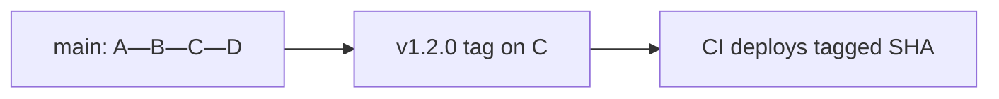

## Executive Summary

**Tags** mark specific commits — typically **releases**. **Annotated tags** store metadata (author, date, message) and are preferred for releases. **Lightweight tags** are simple pointers. Tags are not pushed by default with `git push`.

---

## Core Concepts



| Type | Command | Stored data |
| :--- | :--- | :--- |
| **Lightweight** | `git tag v1.0` | Ref only |
| **Annotated** | `git tag -a v1.0 -m "..."` | Tagger, date, message, GPG optional |

| Semver | Example | Meaning |
| :--- | :--- | :--- |
| MAJOR | `v2.0.0` | Breaking changes |
| MINOR | `v1.3.0` | Features, backward compatible |
| PATCH | `v1.3.2` | Bug fixes |

---

## Quick Reference

| Task | Command |
| :--- | :--- |
| List tags | `git tag` / `git tag -l "v1.*"` |
| Annotated tag | `git tag -a v1.0.0 -m "Release 1.0.0"` |
| Tag old commit | `git tag -a v0.9 sha` |
| Show tag | `git show v1.0.0` |
| Push one tag | `git push origin v1.0.0` |
| Push all tags | `git push origin --tags` |
| Delete local | `git tag -d v1.0.0` |
| Delete remote | `git push origin --delete v1.0.0` |
| Checkout tag | `git switch --detach v1.0.0` |

```bash
git tag -a v2.4.1 -m "Hotfix: payment timeout"
git push origin v2.4.1
```

---

## Examples

### Release from main

```bash
git switch main
git pull --ff-only
git tag -a v3.0.0 -m "Release 3.0.0 — API v3"
git push origin v3.0.0
# CI pipeline triggers on tag push
```

### Signed tag (GPG)

```bash
git tag -s v1.0.0 -m "Signed release"
git tag -v v1.0.0              # verify
```

### Sort tags by version (not lexicographic)

```bash
git tag -l "v*" --sort=-v:refname | head
```

### Branch from tag for hotfix

```bash
git switch -c hotfix/2.4.2 v2.4.1
```

---

## Best Practices

- Use **annotated tags** for releases — visible in `git show` and CI.
- Follow **semver** consistently; document in CHANGELOG.
- Push tags explicitly — `git push` alone does not push tags.
- Protect tags on GitHub/GitLab (no delete/overwrite without approval).
- Never move a tag already deployed — create new patch version instead.

---

## Common Interview Questions


**Q:** Lightweight vs annotated tag?

**A:** **Lightweight** = branch-like pointer, no metadata. **Annotated** = full Git object with tagger, date, message — preferred for releases and GPG signing.



**Q:** Tag vs branch?

**A:** **Branches** move with new commits. **Tags** are **immutable** markers (by convention) for a specific commit — typically releases.


---

## Related Topics

- [Cherry Pick](/git-cheatsheet/cherry-pick/) — backport to tagged release branch
- [Remote](/git-cheatsheet/remote/) — push tags to origin
- [Revert](/git-cheatsheet/revert/) — revert after bad release tag
- [Pull Request Workflow](/git-cheatsheet/pull-request-workflow/)
