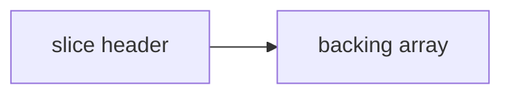
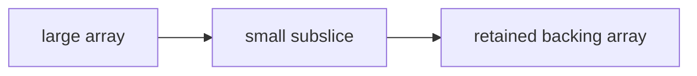
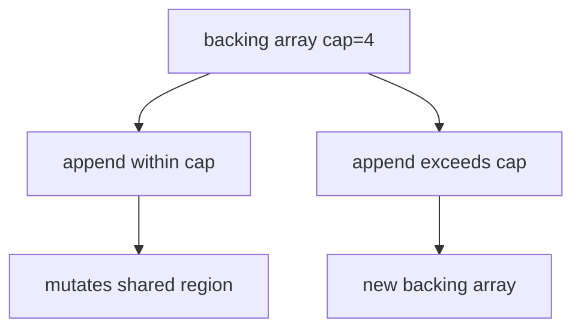

## At a Glance

- Slices are **views** over an array: `(pointer, len, cap)`. **`append`** may reallocate. Slices are reference-like but not pointers.

---

## Reference Tables



| Field | Meaning |
| :--- | :--- |
| `len` | Visible elements |
| `cap` | From ptr to end of backing array |
| `append` | Grows cap ~2x when needed |

| Op | Code |
| :--- | :--- |
| Make | `s := make([]int, 0, 64)` |
| Subslice | `s[low:high]` shares backing array |
| Copy | `copy(dst, src)` |
| Clear (1.21+) | `clear(s)` |

---

## Snippets

```go
s := []int{1, 2, 3}
s = append(s, 4)

sub := s[1:3] // shares backing array
sub[0] = 99   // mutates s[1]

// avoid leak: sub = append(sub[:0:0], sub...)
```

---

## Internals & Gotchas

- Subslices retain backing array → memory leaks if large array, small slice kept.
- `append` to subsliced header may overwrite shared region if cap allows.
- `nil` slice vs empty slice: JSON `null` vs `[]` if you care.

---

## Production Notes

- Preallocate when size known; watch subslice leaks on large backing arrays.

---

## How do you diagnose memory leaks that are actually slice backing-array retention?

### Short Answer
Slices are views (ptr,len,cap); subslices alias backing arrays. Maps are not safe for concurrent use without sync.

### Detailed Explanation
append may reallocate and copy when cap exhausted. Subslices of large arrays can leak memory if a small slice is retained. Map growth and iteration have defined but subtle semantics.

### Internal Working




Map writes are not atomic across goroutines — runtime detects concurrent map writes and panics. Slice headers are small but point to shared storage.

### Production Notes
Preallocate slices when size is known. Copy or reslice with full slice expression to detach from large backing arrays. Protect maps with mutex or sync.Map.

### Common Mistakes
Assuming append never mutates other slices sharing backing array. Using maps from multiple goroutines without synchronization.

### Follow-up Questions
How would you prove a memory leak is slice aliasing versus a true goroutine leak?

---
## Why does append sometimes mutate a shared backing array?

### Short Answer
Slices are views (ptr,len,cap); subslices alias backing arrays. Maps are not safe for concurrent use without sync.

### Detailed Explanation
append may reallocate and copy when cap exhausted. Subslices of large arrays can leak memory if a small slice is retained. Map growth and iteration have defined but subtle semantics.

### Internal Working
Map writes are not atomic across goroutines — runtime detects concurrent map writes and panics. Slice headers are small but point to shared storage.

### Production Notes
Preallocate slices when size is known. Copy or reslice with full slice expression to detach from large backing arrays. Protect maps with mutex or sync.Map.

### Common Mistakes
Assuming append never mutates other slices sharing backing array. Using maps from multiple goroutines without synchronization.

### Follow-up Questions
How would you prove a memory leak is slice aliasing versus a true goroutine leak?

---
## What is the difference between nil slice and empty slice for JSON encoding?

### Short Answer
Slices are views (ptr,len,cap); subslices alias backing arrays. Maps are not safe for concurrent use without sync.

### Detailed Explanation
append may reallocate and copy when cap exhausted. Subslices of large arrays can leak memory if a small slice is retained. Map growth and iteration have defined but subtle semantics.

### Internal Working
Map writes are not atomic across goroutines — runtime detects concurrent map writes and panics. Slice headers are small but point to shared storage.

### Production Notes
Preallocate slices when size is known. Copy or reslice with full slice expression to detach from large backing arrays. Protect maps with mutex or sync.Map.

### Common Mistakes
Assuming append never mutates other slices sharing backing array. Using maps from multiple goroutines without synchronization.

### Follow-up Questions
How would you prove a memory leak is slice aliasing versus a true goroutine leak?

---
<!-- interview-answers:end -->

---

## How do you diagnose memory leaks that are actually slice backing-array retention?

### Short Answer
In production Go, the decisive factor is slices are (ptr,len,cap) views; append may reallocate; subslices alias — for: How do you diagnose memory leaks that are actually slice backing-array retention.

### Detailed Explanation
Explain backing-array sharing, nil vs empty slice JSON, and copy/reslice mitigations for: How do you diagnose memory leaks that are actually slice backing-array retention.

### Internal Working
Append within cap mutates shared storage; full slice expr `[:0:0]` can detach — internals for: How do you diagnose memory leaks that are actually slice backing-array retention.

### Production Notes
Preallocate with make([]T,0,n) on hot paths related to: How do you diagnose memory leaks that are actually slice backing-array retention.

### Common Mistakes
Retaining tiny subslices of huge arrays causes silent memory leaks in: How do you diagnose memory leaks that are actually slice backing-array retention.

### Follow-up Questions
How would you prove aliasing vs true leak for: How do you diagnose memory leaks that are actually slice backing-array retention?

---
## Why does append sometimes mutate a shared backing array?

### Short Answer
The architecturally sound response is slices are (ptr,len,cap) views; append may reallocate; subslices alias — for: Why does append sometimes mutate a shared backing array.

### Detailed Explanation
Explain backing-array sharing, nil vs empty slice JSON, and copy/reslice mitigations for: Why does append sometimes mutate a shared backing array.

### Internal Working
Append within cap mutates shared storage; full slice expr `[:0:0]` can detach — internals for: Why does append sometimes mutate a shared backing array.

### Production Notes
Preallocate with make([]T,0,n) on hot paths related to: Why does append sometimes mutate a shared backing array.

### Common Mistakes
Retaining tiny subslices of huge arrays causes silent memory leaks in: Why does append sometimes mutate a shared backing array.

### Follow-up Questions
How would you prove aliasing vs true leak for: Why does append sometimes mutate a shared backing array?

---
## What is the difference between nil slice and empty slice for JSON encoding?

### Short Answer
The mechanism-first explanation is slices are (ptr,len,cap) views; append may reallocate; subslices alias — for: What is the difference between nil slice and empty slice for JSON encoding.

### Detailed Explanation
Explain backing-array sharing, nil vs empty slice JSON, and copy/reslice mitigations for: What is the difference between nil slice and empty slice for JSON encoding.

### Internal Working
Append within cap mutates shared storage; full slice expr `[:0:0]` can detach — internals for: What is the difference between nil slice and empty slice for JSON encoding.

### Production Notes
Preallocate with make([]T,0,n) on hot paths related to: What is the difference between nil slice and empty slice for JSON encoding.

### Common Mistakes
Retaining tiny subslices of huge arrays causes silent memory leaks in: What is the difference between nil slice and empty slice for JSON encoding.

### Follow-up Questions
How would you prove aliasing vs true leak for: What is the difference between nil slice and empty slice for JSON encoding?

---
<!-- interview-answers:end -->

---

## See Also

- [Previous: Arrays](/golang-cheatsheet/01-fundamentals/arrays/)
- [Next: Maps](/golang-cheatsheet/01-fundamentals/maps/)
- [Go Handbook Index](/golang-cheatsheet/)
- [Top 150 Interview Questions](/golang-cheatsheet/08-interview-guide/top-150-interview-questions/)
