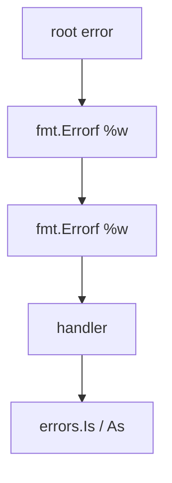

## At a Glance

- Errors are values implementing `error` (`Error() string`). Idiomatic Go returns `err` as last value. Use **`errors.Is`**, **`errors.As`**, and **`fmt.Errorf` with `%w`** for wrapping.

---

## Reference Tables

| Tool | Use |
| :--- | :--- |
| `errors.New` | Sentinel errors |
| `fmt.Errorf("...: %w", err)` | Wrap for chain |
| `errors.Is(err, target)` | Sentinel match through wrap |
| `errors.As(err, &target)` | Typed error extraction |
| `panic` / `recover` | Programmer bugs only — not control flow |

```go
var ErrNotFound = errors.New("not found")

if errors.Is(err, ErrNotFound) { }

var pathErr *os.PathError
if errors.As(err, &pathErr) { }
```

---

## Snippets

```go
func readConfig(path string) (*Config, error) {
    data, err := os.ReadFile(path)
    if err != nil {
        return nil, fmt.Errorf("read config %s: %w", path, err)
    }
    var cfg Config
    if err := json.Unmarshal(data, &cfg); err != nil {
        return nil, fmt.Errorf("parse config: %w", err)
    }
    return &cfg, nil
}
```

---

## Internals & Gotchas

- Don't compare wrapped errors with `==` to sentinel — use `errors.Is`.
- `%v` vs `%w` — only `%w` participates in unwrap chain.
- Log or return — avoid both (duplicate logs).

---

## Production Notes

- Wrap with context at boundaries; use `errors.Is/As` at handlers — never log and return same error.

---

## How does errors.Is differ from == for wrapped errors?

### Short Answer
Interfaces are implicit (type, data) pairs; typed nil breaks `== nil`. Errors use wrapping with `%w` and `errors.Is/As`.

### Detailed Explanation
An interface value is nil only when both type and data are nil. A nil pointer inside a non-nil interface type is a classic API bug. Error chains preserve cause for inspection.

### Internal Working


Method sets determine satisfaction — pointer vs value receivers matter. Error wrapping builds an unwrap chain inspected by Is/As.

### Production Notes
Keep interfaces small at boundaries. Never log and return the same error. Use sentinel errors sparingly with documented semantics.

### Common Mistakes
Comparing wrapped errors with `==`. Returning typed nil pointers in interfaces. Giant interfaces that hinder testing.

### Follow-up Questions
How would you test `errors.Is` through three layers of `%w` wrapping?

---
## When should you use errors.As versus a type switch on error?

### Short Answer
Interfaces are implicit (type, data) pairs; typed nil breaks `== nil`. Errors use wrapping with `%w` and `errors.Is/As`.

### Detailed Explanation
An interface value is nil only when both type and data are nil. A nil pointer inside a non-nil interface type is a classic API bug. Error chains preserve cause for inspection.

### Internal Working
Method sets determine satisfaction — pointer vs value receivers matter. Error wrapping builds an unwrap chain inspected by Is/As.

### Production Notes
Keep interfaces small at boundaries. Never log and return the same error. Use sentinel errors sparingly with documented semantics.

### Common Mistakes
Comparing wrapped errors with `==`. Returning typed nil pointers in interfaces. Giant interfaces that hinder testing.

### Follow-up Questions
How would you test `errors.Is` through three layers of `%w` wrapping?

---
## What is the anti-pattern of logging and returning the same error?

### Short Answer
Interfaces are implicit (type, data) pairs; typed nil breaks `== nil`. Errors use wrapping with `%w` and `errors.Is/As`.

### Detailed Explanation
An interface value is nil only when both type and data are nil. A nil pointer inside a non-nil interface type is a classic API bug. Error chains preserve cause for inspection.

### Internal Working
Method sets determine satisfaction — pointer vs value receivers matter. Error wrapping builds an unwrap chain inspected by Is/As.

### Production Notes
Keep interfaces small at boundaries. Never log and return the same error. Use sentinel errors sparingly with documented semantics.

### Common Mistakes
Comparing wrapped errors with `==`. Returning typed nil pointers in interfaces. Giant interfaces that hinder testing.

### Follow-up Questions
How would you test `errors.Is` through three layers of `%w` wrapping?

---
## How would you design error types for a multi-tenant API with retry hints?

### Short Answer
Interfaces are implicit (type, data) pairs; typed nil breaks `== nil`. Errors use wrapping with `%w` and `errors.Is/As`.

### Detailed Explanation
An interface value is nil only when both type and data are nil. A nil pointer inside a non-nil interface type is a classic API bug. Error chains preserve cause for inspection.

### Internal Working
Method sets determine satisfaction — pointer vs value receivers matter. Error wrapping builds an unwrap chain inspected by Is/As.

### Production Notes
Keep interfaces small at boundaries. Never log and return the same error. Use sentinel errors sparingly with documented semantics.

### Common Mistakes
Comparing wrapped errors with `==`. Returning typed nil pointers in interfaces. Giant interfaces that hinder testing.

### Follow-up Questions
How would you test `errors.Is` through three layers of `%w` wrapping?

---
<!-- interview-answers:end -->

---

## How does errors.Is differ from == for wrapped errors?

### Short Answer
In production Go, the decisive factor is errors are values; wrap with `%w`; inspect with Is/As — for: How does errors.Is differ from == for wrapped errors.

### Detailed Explanation
Distinguish sentinel vs typed errors; log OR return, not both, when covering: How does errors.Is differ from == for wrapped errors.

### Internal Working
Wrap chains preserve unwrap for Is/As; `%v` breaks inspection — mechanism for: How does errors.Is differ from == for wrapped errors.

### Production Notes
Map errors to HTTP/gRPC codes at boundaries for: How does errors.Is differ from == for wrapped errors.

### Common Mistakes
Comparing wrapped errors with `==` or duplicating logs fails: How does errors.Is differ from == for wrapped errors.

### Follow-up Questions
What retry taxonomy would you attach to errors in: How does errors.Is differ from == for wrapped errors?

---
## When should you use errors.As versus a type switch on error?

### Short Answer
The architecturally sound response is errors are values; wrap with `%w`; inspect with Is/As — for: When should you use errors.As versus a type switch on error.

### Detailed Explanation
Distinguish sentinel vs typed errors; log OR return, not both, when covering: When should you use errors.As versus a type switch on error.

### Internal Working
Wrap chains preserve unwrap for Is/As; `%v` breaks inspection — mechanism for: When should you use errors.As versus a type switch on error.

### Production Notes
Map errors to HTTP/gRPC codes at boundaries for: When should you use errors.As versus a type switch on error.

### Common Mistakes
Comparing wrapped errors with `==` or duplicating logs fails: When should you use errors.As versus a type switch on error.

### Follow-up Questions
What retry taxonomy would you attach to errors in: When should you use errors.As versus a type switch on error?

---
## What is the anti-pattern of logging and returning the same error?

### Short Answer
The mechanism-first explanation is errors are values; wrap with `%w`; inspect with Is/As — for: What is the anti-pattern of logging and returning the same error.

### Detailed Explanation
Distinguish sentinel vs typed errors; log OR return, not both, when covering: What is the anti-pattern of logging and returning the same error.

### Internal Working
Wrap chains preserve unwrap for Is/As; `%v` breaks inspection — mechanism for: What is the anti-pattern of logging and returning the same error.

### Production Notes
Map errors to HTTP/gRPC codes at boundaries for: What is the anti-pattern of logging and returning the same error.

### Common Mistakes
Comparing wrapped errors with `==` or duplicating logs fails: What is the anti-pattern of logging and returning the same error.

### Follow-up Questions
What retry taxonomy would you attach to errors in: What is the anti-pattern of logging and returning the same error?

---
## How would you design error types for a multi-tenant API with retry hints?

### Short Answer
In production Go, the decisive factor is errors are values; wrap with `%w`; inspect with Is/As — for: How would you design error types for a multi-tenant API with retry hints.

### Detailed Explanation
Distinguish sentinel vs typed errors; log OR return, not both, when covering: How would you design error types for a multi-tenant API with retry hints.

### Internal Working
Wrap chains preserve unwrap for Is/As; `%v` breaks inspection — mechanism for: How would you design error types for a multi-tenant API with retry hints.

### Production Notes
Map errors to HTTP/gRPC codes at boundaries for: How would you design error types for a multi-tenant API with retry hints.

### Common Mistakes
Comparing wrapped errors with `==` or duplicating logs fails: How would you design error types for a multi-tenant API with retry hints.

### Follow-up Questions
What retry taxonomy would you attach to errors in: How would you design error types for a multi-tenant API with retry hints?

---
<!-- interview-answers:end -->

---

## See Also

- [Previous: Dependency Management](/golang-cheatsheet/02-core-go/dependency-management/)
- [Next: Go Runtime](/golang-cheatsheet/03-go-internals/go-runtime/)
- [Go Handbook Index](/golang-cheatsheet/)
- [Top 150 Interview Questions](/golang-cheatsheet/08-interview-guide/top-150-interview-questions/)
