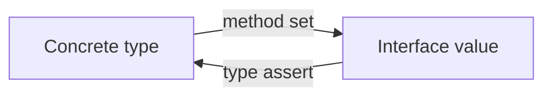

## At a Glance

- Interfaces are **implicit** — no `implements` keyword. A type satisfies an interface if it has the required methods. The **nil interface trap** (`var i io.Reader = (*bytes.Buffer)(nil)`) is a classic interview topic.

---

## Reference Tables



| Concept | Detail |
| :--- | :--- |
| Interface value | `(type, data)` pair |
| Nil interface | `var i io.Reader` — both nil |
| Typed nil | Interface holding nil pointer — **not equal to nil** |
| Empty interface | `any` / `interface{}` |
| Satisfaction | See [Methods](/golang-cheatsheet/01-fundamentals/methods/) for method-set rules |

| Operation | Code |
| :--- | :--- |
| Type assertion | `v := i.(T)` or `v, ok := i.(T)` |
| Type switch | `switch v := i.(type) { case T: }` |
| Compile-time check | `var _ io.Reader = (*MyType)(nil)` |

---

## Snippets

```go
type Reader interface {
    Read(p []byte) (n int, err error)
}

func process(r Reader) error {
    buf := make([]byte, 1024)
    _, err := r.Read(buf)
    return err
}

// nil trap
var buf *bytes.Buffer
var r io.Reader = buf
fmt.Println(r == nil) // false
```

---

## Internals & Gotchas

- Keep interfaces **small** — accept interfaces, return concrete types.
- Value receiver methods → value and pointer satisfy; pointer-only methods → only pointer satisfies.
- Don't use `any` when a specific interface documents intent.

---

## Production Notes

- Accept interfaces at API boundaries; return concrete types. Test nil-interface JSON edge cases.

---

## How does the Go compiler represent interface values internally (type, data)?

### Short Answer
Interfaces are implicit (type, data) pairs; typed nil breaks `== nil`. Errors use wrapping with `%w` and `errors.Is/As`.

### Detailed Explanation
An interface value is nil only when both type and data are nil. A nil pointer inside a non-nil interface type is a classic API bug. Error chains preserve cause for inspection.

### Internal Working
Method sets determine satisfaction — pointer vs value receivers matter. Error wrapping builds an unwrap chain inspected by Is/As.

### Production Notes
Keep interfaces small at boundaries. Never log and return the same error. Use sentinel errors sparingly with documented semantics.

### Common Mistakes
Comparing wrapped errors with `==`. Returning typed nil pointers in interfaces. Giant interfaces that hinder testing.

### Follow-up Questions
How would you test `errors.Is` through three layers of `%w` wrapping?

---
## What is the difference between nil interface and interface holding typed nil?

### Short Answer
Interfaces are implicit (type, data) pairs; typed nil breaks `== nil`. Errors use wrapping with `%w` and `errors.Is/As`.

### Detailed Explanation
An interface value is nil only when both type and data are nil. A nil pointer inside a non-nil interface type is a classic API bug. Error chains preserve cause for inspection.

### Internal Working
Method sets determine satisfaction — pointer vs value receivers matter. Error wrapping builds an unwrap chain inspected by Is/As.

### Production Notes
Keep interfaces small at boundaries. Never log and return the same error. Use sentinel errors sparingly with documented semantics.

### Common Mistakes
Comparing wrapped errors with `==`. Returning typed nil pointers in interfaces. Giant interfaces that hinder testing.

### Follow-up Questions
How would you test `errors.Is` through three layers of `%w` wrapping?

---
## What is the size cost of an interface{} holding a small value versus a pointer?

### Short Answer
Interfaces are implicit (type, data) pairs; typed nil breaks `== nil`. Errors use wrapping with `%w` and `errors.Is/As`.

### Detailed Explanation
An interface value is nil only when both type and data are nil. A nil pointer inside a non-nil interface type is a classic API bug. Error chains preserve cause for inspection.

### Internal Working
Method sets determine satisfaction — pointer vs value receivers matter. Error wrapping builds an unwrap chain inspected by Is/As.

### Production Notes
Keep interfaces small at boundaries. Never log and return the same error. Use sentinel errors sparingly with documented semantics.

### Common Mistakes
Comparing wrapped errors with `==`. Returning typed nil pointers in interfaces. Giant interfaces that hinder testing.

### Follow-up Questions
How would you test `errors.Is` through three layers of `%w` wrapping?

---
## What indicates interface nil comparison bugs in JSON API responses?

### Short Answer
Interfaces are implicit (type, data) pairs; typed nil breaks `== nil`. Errors use wrapping with `%w` and `errors.Is/As`.

### Detailed Explanation
An interface value is nil only when both type and data are nil. A nil pointer inside a non-nil interface type is a classic API bug. Error chains preserve cause for inspection.

### Internal Working
Method sets determine satisfaction — pointer vs value receivers matter. Error wrapping builds an unwrap chain inspected by Is/As.

### Production Notes
Keep interfaces small at boundaries. Never log and return the same error. Use sentinel errors sparingly with documented semantics.

### Common Mistakes
Comparing wrapped errors with `==`. Returning typed nil pointers in interfaces. Giant interfaces that hinder testing.

### Follow-up Questions
How would you test `errors.Is` through three layers of `%w` wrapping?

---
## What compile-time check ensures a type satisfies an interface?

### Short Answer
Interfaces are implicit (type, data) pairs; typed nil breaks `== nil`. Errors use wrapping with `%w` and `errors.Is/As`.

### Detailed Explanation
An interface value is nil only when both type and data are nil. A nil pointer inside a non-nil interface type is a classic API bug. Error chains preserve cause for inspection.

### Internal Working
Method sets determine satisfaction — pointer vs value receivers matter. Error wrapping builds an unwrap chain inspected by Is/As.

### Production Notes
Keep interfaces small at boundaries. Never log and return the same error. Use sentinel errors sparingly with documented semantics.

### Common Mistakes
Comparing wrapped errors with `==`. Returning typed nil pointers in interfaces. Giant interfaces that hinder testing.

### Follow-up Questions
How would you test `errors.Is` through three layers of `%w` wrapping?

---
## What is the difference between comparable and copyable types in Go generics constraints?

### Short Answer
Reflection inspects types at runtime; costly and brittle — prefer generics and compile-time interfaces when possible.

### Detailed Explanation
reflect.Value must be addressable to mutate. Field access by string breaks on refactor. Generics cover many serializer/utility cases reflection used to solve.

### Internal Working
Interface values carry type metadata; reflection walks struct tags and kinds. DeepEqual handles nested structures with defined semantics.

### Production Notes
Restrict reflection to frameworks (JSON, ORM, DI) not business hot paths. Fuzz and test tag contracts.

### Common Mistakes
Reflection in request handlers. Assuming zero values via reflection without handling pointers.

### Follow-up Questions
What would you refactor to generics instead of reflect for this use case?

---
<!-- interview-answers:end -->

---

## How does the Go compiler represent interface values internally (type, data)?

### Short Answer
The mechanism-first explanation is interfaces are implicit (type,data) pairs; typed nil breaks `== nil` — for: How does the Go compiler represent interface values internally (type, data).

### Detailed Explanation
Tie method sets (value vs pointer receivers) to satisfaction and API design for: How does the Go compiler represent interface values internally (type, data).

### Internal Working
Small interfaces at boundaries; empty interface boxes values and may allocate — internal angle on: How does the Go compiler represent interface values internally (type, data).

### Production Notes
Use compile-time `var _ IF = (*T)(nil)` checks; test JSON nil edge cases for: How does the Go compiler represent interface values internally (type, data).

### Common Mistakes
Returning typed nil pointers in interface-typed APIs is a classic bug in: How does the Go compiler represent interface values internally (type, data).

### Follow-up Questions
How would you refactor a fat interface exposed by: How does the Go compiler represent interface values internally (type, data)?

---
## What is the difference between nil interface and interface holding typed nil?

### Short Answer
The senior-level answer is interfaces are implicit (type,data) pairs; typed nil breaks `== nil` — for: What is the difference between nil interface and interface holding typed nil.

### Detailed Explanation
Tie method sets (value vs pointer receivers) to satisfaction and API design for: What is the difference between nil interface and interface holding typed nil.

### Internal Working
Small interfaces at boundaries; empty interface boxes values and may allocate — internal angle on: What is the difference between nil interface and interface holding typed nil.

### Production Notes
Use compile-time `var _ IF = (*T)(nil)` checks; test JSON nil edge cases for: What is the difference between nil interface and interface holding typed nil.

### Common Mistakes
Returning typed nil pointers in interface-typed APIs is a classic bug in: What is the difference between nil interface and interface holding typed nil.

### Follow-up Questions
How would you refactor a fat interface exposed by: What is the difference between nil interface and interface holding typed nil?

---
## What is the size cost of an interface{} holding a small value versus a pointer?

### Short Answer
The architecturally sound response is interfaces are implicit (type,data) pairs; typed nil breaks `== nil` — for: What is the size cost of an interface{} holding a small value versus a pointer.

### Detailed Explanation
Tie method sets (value vs pointer receivers) to satisfaction and API design for: What is the size cost of an interface{} holding a small value versus a pointer.

### Internal Working
Small interfaces at boundaries; empty interface boxes values and may allocate — internal angle on: What is the size cost of an interface{} holding a small value versus a pointer.

### Production Notes
Use compile-time `var _ IF = (*T)(nil)` checks; test JSON nil edge cases for: What is the size cost of an interface{} holding a small value versus a pointer.

### Common Mistakes
Returning typed nil pointers in interface-typed APIs is a classic bug in: What is the size cost of an interface{} holding a small value versus a pointer.

### Follow-up Questions
How would you refactor a fat interface exposed by: What is the size cost of an interface{} holding a small value versus a pointer?

---
## What indicates interface nil comparison bugs in JSON API responses?

### Short Answer
The architecturally sound response is interfaces are implicit (type,data) pairs; typed nil breaks `== nil` — for: What indicates interface nil comparison bugs in JSON API responses.

### Detailed Explanation
Tie method sets (value vs pointer receivers) to satisfaction and API design for: What indicates interface nil comparison bugs in JSON API responses.

### Internal Working
Small interfaces at boundaries; empty interface boxes values and may allocate — internal angle on: What indicates interface nil comparison bugs in JSON API responses.

### Production Notes
Use compile-time `var _ IF = (*T)(nil)` checks; test JSON nil edge cases for: What indicates interface nil comparison bugs in JSON API responses.

### Common Mistakes
Returning typed nil pointers in interface-typed APIs is a classic bug in: What indicates interface nil comparison bugs in JSON API responses.

### Follow-up Questions
How would you refactor a fat interface exposed by: What indicates interface nil comparison bugs in JSON API responses?

---
## What compile-time check ensures a type satisfies an interface?

### Short Answer
The architecturally sound response is interfaces are implicit (type,data) pairs; typed nil breaks `== nil` — for: What compile-time check ensures a type satisfies an interface.

### Detailed Explanation
Tie method sets (value vs pointer receivers) to satisfaction and API design for: What compile-time check ensures a type satisfies an interface.

### Internal Working
Small interfaces at boundaries; empty interface boxes values and may allocate — internal angle on: What compile-time check ensures a type satisfies an interface.

### Production Notes
Use compile-time `var _ IF = (*T)(nil)` checks; test JSON nil edge cases for: What compile-time check ensures a type satisfies an interface.

### Common Mistakes
Returning typed nil pointers in interface-typed APIs is a classic bug in: What compile-time check ensures a type satisfies an interface.

### Follow-up Questions
How would you refactor a fat interface exposed by: What compile-time check ensures a type satisfies an interface?

---
## What is the difference between comparable and copyable types in Go generics constraints?

### Short Answer
The architecturally sound response is reflection is powerful but costly and brittle — prefer generics/interfaces — for: What is the difference between comparable and copyable types in Go generics constraints.

### Detailed Explanation
Addressability, Kind, struct tags; DeepEqual semantics for: What is the difference between comparable and copyable types in Go generics constraints.

### Internal Working
Interface values carry type metadata reflection walks — cost model for: What is the difference between comparable and copyable types in Go generics constraints.

### Production Notes
Restrict reflection to frameworks/serialization, not hot handlers for: What is the difference between comparable and copyable types in Go generics constraints.

### Common Mistakes
Field rename breaks tag-based reflection silently in: What is the difference between comparable and copyable types in Go generics constraints.

### Follow-up Questions
What would you genericize instead of reflecting for: What is the difference between comparable and copyable types in Go generics constraints?

---
<!-- interview-answers:end -->

---

## See Also

- [Previous: Methods](/golang-cheatsheet/01-fundamentals/methods/)
- [Next: Pointers](/golang-cheatsheet/02-core-go/pointers/)
- [Go Handbook Index](/golang-cheatsheet/)
- [Top 150 Interview Questions](/golang-cheatsheet/08-interview-guide/top-150-interview-questions/)
