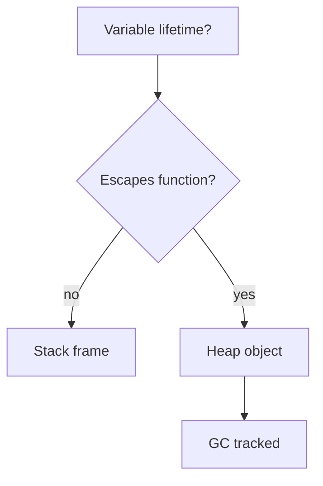

## Quick Revision

- **Escape analysis** decides stack vs heap allocation at compile time.
- Heap escape → GC pressure.
- Inspect: `go build -gcflags='-m' ./...`

## Core Concepts

| Escapes when | Example |
| :--- | :--- |
| Returned pointer to local | `func f() *T { t := T{}; return &t }` may stay stack if inlined |
| Assigned to interface | Boxing may heap-allocate |
| Closure captures variable referenced outside | Variable moves to heap |
| Size unknown at compile time | Large or dynamic |

## Internal Working



Compiler runs escape analysis per function. `-m` prints `moved to heap` decisions.

## Performance Considerations

- Reduce heap allocs in hot paths — see [Performance Optimization](/golang-cheatsheet/05-performance/performance-optimization/).
- Prefer value semantics for small structs.

## Internal Working

```bash
go build -gcflags="-m" ./...
```

Look for `moved to heap` lines. Common escape drivers:

- Returning `&local` (may stay stack if inlined and not leaked).
- Assigning to `interface{}` / `any`.
- Closure escaping outer scope.
- Sending pointer on channel stored beyond frame.

## Performance Considerations

Heap objects participate in GC scan. Reducing pointers in hot structs lowers mark cost.

## Checklists

- [ ] Run `-m` on packages with high allocs/op in benchmarks
- [ ] Compare value vs pointer receiver for hot structs


---

## What is escape analysis and who performs it in the Go toolchain?

### Short Answer
The senior-level answer is escape analysis decides stack vs heap, and escaped values drive GC pressure — for: What is escape analysis and who performs it in the Go toolchain.

### Detailed Explanation
Use `-gcflags=-m`, closure capture rules, and interface boxing to explain: What is escape analysis and who performs it in the Go toolchain.

### Internal Working
The compiler escapes locals that outlive their frame or flow to heap graphs — key to: What is escape analysis and who performs it in the Go toolchain.

### Production Notes
Prove it under load with trace plus metrics, not micro-benchmarks alone after identifying hot alloc sites for: What is escape analysis and who performs it in the Go toolchain.

### Common Mistakes
Assuming pointers always heap-allocate without checking `-m` output hurts answers to: What is escape analysis and who performs it in the Go toolchain.

### Follow-up Questions
Which refactor (value semantics, pool, prealloc) targets the escape path in: What is escape analysis and who performs it in the Go toolchain?

---
## Give examples of code patterns that force a variable to escape to the heap.

### Short Answer
In production Go, the decisive factor is tying language rules to runtime and production observability — for: Give examples of code patterns that force a variable to escape to the heap..

### Detailed Explanation
Senior answers combine mechanism, tradeoffs, and verification for: Give examples of code patterns that force a variable to escape to the heap..

### Internal Working
Go couples compile-time types with runtime scheduler/GC behavior — anchor: Give examples of code patterns that force a variable to escape to the heap..

### Production Notes
Document the tradeoff in an ADR with rollback criteria on any change suggested by: Give examples of code patterns that force a variable to escape to the heap..

### Common Mistakes
Hand-waving without profiles, tests, or happens-before reasoning fails: Give examples of code patterns that force a variable to escape to the heap..

### Follow-up Questions
What evidence would convince you your answer to: Give examples of code patterns that force a variable to escape to the heap. holds at scale?

---
## How do you use go build -gcflags=-m to inspect escape decisions?

### Short Answer
The architecturally sound response is concurrent tri-color GC paced by GOGC, where allocation rate often matters more than live heap — for: How do you use go build -gcflags=-m to inspect escape decisions.

### Detailed Explanation
Cover mark/sweep phases, short STW points, write barriers, and why finalizers are unreliable when discussing: How do you use go build -gcflags=-m to inspect escape decisions.

### Internal Working
Mutators run with barriers during mark; sweep reclaims unreachable objects — the internal story behind: How do you use go build -gcflags=-m to inspect escape decisions.

### Production Notes
Gate the change on alloc/op and p99 regression checks when tuning GOGC or investigating latency spikes related to: How do you use go build -gcflags=-m to inspect escape decisions.

### Common Mistakes
Calling runtime.GC() routinely or ignoring allocs/op while staring at heap size alone fails: How do you use go build -gcflags=-m to inspect escape decisions.

### Follow-up Questions
How would gctrace and heap profiles change your next step for: How do you use go build -gcflags=-m to inspect escape decisions?

---
## When does returning a pointer to a local variable remain stack-safe?

### Short Answer
The mechanism-first explanation is tying language rules to runtime and production observability — for: When does returning a pointer to a local variable remain stack-safe.

### Detailed Explanation
Senior answers combine mechanism, tradeoffs, and verification for: When does returning a pointer to a local variable remain stack-safe.

### Internal Working
Go couples compile-time types with runtime scheduler/GC behavior — anchor: When does returning a pointer to a local variable remain stack-safe.

### Production Notes
Validate with pprof, benchmarks, and race-detector coverage on any change suggested by: When does returning a pointer to a local variable remain stack-safe.

### Common Mistakes
Hand-waving without profiles, tests, or happens-before reasoning fails: When does returning a pointer to a local variable remain stack-safe.

### Follow-up Questions
What evidence would convince you your answer to: When does returning a pointer to a local variable remain stack-safe holds at scale?

---
## How does closure capture affect escape analysis?

### Short Answer
The senior-level answer is escape analysis decides stack vs heap, and escaped values drive GC pressure — for: How does closure capture affect escape analysis.

### Detailed Explanation
Use `-gcflags=-m`, closure capture rules, and interface boxing to explain: How does closure capture affect escape analysis.

### Internal Working
The compiler escapes locals that outlive their frame or flow to heap graphs — key to: How does closure capture affect escape analysis.

### Production Notes
Prove it under load with trace plus metrics, not micro-benchmarks alone after identifying hot alloc sites for: How does closure capture affect escape analysis.

### Common Mistakes
Assuming pointers always heap-allocate without checking `-m` output hurts answers to: How does closure capture affect escape analysis.

### Follow-up Questions
Which refactor (value semantics, pool, prealloc) targets the escape path in: How does closure capture affect escape analysis?

---
## What performance impact does heap allocation have beyond GC — cache locality, etc.?

### Short Answer
In production Go, the decisive factor is concurrent tri-color GC paced by GOGC, where allocation rate often matters more than live heap — for: What performance impact does heap allocation have beyond GC — cache locality, etc..

### Detailed Explanation
Cover mark/sweep phases, short STW points, write barriers, and why finalizers are unreliable when discussing: What performance impact does heap allocation have beyond GC — cache locality, etc..

### Internal Working
Mutators run with barriers during mark; sweep reclaims unreachable objects — the internal story behind: What performance impact does heap allocation have beyond GC — cache locality, etc..

### Production Notes
Document the tradeoff in an ADR with rollback criteria when tuning GOGC or investigating latency spikes related to: What performance impact does heap allocation have beyond GC — cache locality, etc..

### Common Mistakes
Calling runtime.GC() routinely or ignoring allocs/op while staring at heap size alone fails: What performance impact does heap allocation have beyond GC — cache locality, etc..

### Follow-up Questions
How would gctrace and heap profiles change your next step for: What performance impact does heap allocation have beyond GC — cache locality, etc.?

---
<!-- interview-answers:end -->

---

## See Also

- [Previous: Garbage Collection](/golang-cheatsheet/03-go-internals/garbage-collection/)
- [Next: Reflection](/golang-cheatsheet/03-go-internals/reflection/)
- [Go Handbook Index](/golang-cheatsheet/)
- [Top 150 Interview Questions](/golang-cheatsheet/08-interview-guide/top-150-interview-questions/)
