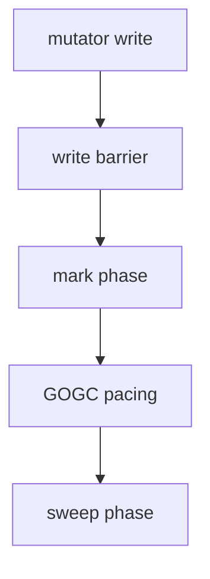

## At a Glance

- Go uses a **non-generational, concurrent tri-color mark-sweep** collector. Tuning via **`GOGC`** (default 100). **STW** pauses are short but exist.

---

## Reference Tables


| Knob | Effect |
| :--- | :--- |
| `GOGC=100` | Heap doubles before next GC cycle |
| `GOGC=off` | Disable GC (debug only) |
| `GODEBUG=gctrace=1` | Log GC events |
| `runtime.GC()` | Force GC — rarely in prod |

| Goal | Approach |
| :--- | :--- |
| Less GC CPU | Reduce allocations — pools, reuse buffers |
| Lower latency | Fewer pointers, smaller heap |
| Profile | See [Profiling](/golang-cheatsheet/05-performance/profiling/) |

---

## Snippets

```go
// prefer sync.Pool for short-lived buffers
// prefer value semantics for hot structs
// preallocate slices: make([]T, 0, n)
```

---

## Internals & Gotchas

- Finalizers (`runtime.SetFinalizer`) run unpredictably — don't rely for cleanup.
- Large heap = longer mark phase — allocation rate matters more than live set alone.
- `uintptr` is not a GC root — keep pointer alive.

---

## Production Notes

- Apply patterns from this page in code review and incident postmortems.

---

## Describe the tri-color concurrent mark-sweep GC algorithm at a high level.

### Short Answer
Go uses concurrent tri-color mark-sweep GC; GOGC controls pacing; allocation rate often dominates pause and CPU cost.

### Detailed Explanation
The collector marks reachable objects while mutators run with write barriers. STW phases exist but are short. High alloc rate increases mark work and GC CPU even if live heap is modest.

### Internal Working


Escape analysis and stack allocation reduce heap objects. uintptr is not a GC root — keeping memory alive requires a pointer the GC can trace.

### Production Notes
Use `GODEBUG=gctrace=1` sparingly in incidents. Reduce allocations (pools, prealloc) before tuning GOGC. Profile heap with pprof allocs.

### Common Mistakes
Calling runtime.GC() routinely. Using finalizers for resource cleanup. Optimizing live heap size while ignoring alloc/op in hot paths.

### Follow-up Questions
Which pprof view would you use to separate alloc rate from live heap growth?

---
## How does GOGC control GC frequency and what is the default behavior?

### Short Answer
Go uses concurrent tri-color mark-sweep GC; GOGC controls pacing; allocation rate often dominates pause and CPU cost.

### Detailed Explanation
The collector marks reachable objects while mutators run with write barriers. STW phases exist but are short. High alloc rate increases mark work and GC CPU even if live heap is modest.

### Internal Working
Escape analysis and stack allocation reduce heap objects. uintptr is not a GC root — keeping memory alive requires a pointer the GC can trace.

### Production Notes
Use `GODEBUG=gctrace=1` sparingly in incidents. Reduce allocations (pools, prealloc) before tuning GOGC. Profile heap with pprof allocs.

### Common Mistakes
Calling runtime.GC() routinely. Using finalizers for resource cleanup. Optimizing live heap size while ignoring alloc/op in hot paths.

### Follow-up Questions
Which pprof view would you use to separate alloc rate from live heap growth?

---
## What are STW phases in Go GC and how have pause times trended over releases?

### Short Answer
Go uses concurrent tri-color mark-sweep GC; GOGC controls pacing; allocation rate often dominates pause and CPU cost.

### Detailed Explanation
The collector marks reachable objects while mutators run with write barriers. STW phases exist but are short. High alloc rate increases mark work and GC CPU even if live heap is modest.

### Internal Working
Escape analysis and stack allocation reduce heap objects. uintptr is not a GC root — keeping memory alive requires a pointer the GC can trace.

### Production Notes
Use `GODEBUG=gctrace=1` sparingly in incidents. Reduce allocations (pools, prealloc) before tuning GOGC. Profile heap with pprof allocs.

### Common Mistakes
Calling runtime.GC() routinely. Using finalizers for resource cleanup. Optimizing live heap size while ignoring alloc/op in hot paths.

### Follow-up Questions
Which pprof view would you use to separate alloc rate from live heap growth?

---
## Why is allocation rate often more important than live heap size for GC latency?

### Short Answer
Go uses concurrent tri-color mark-sweep GC; GOGC controls pacing; allocation rate often dominates pause and CPU cost.

### Detailed Explanation
The collector marks reachable objects while mutators run with write barriers. STW phases exist but are short. High alloc rate increases mark work and GC CPU even if live heap is modest.

### Internal Working
Escape analysis and stack allocation reduce heap objects. uintptr is not a GC root — keeping memory alive requires a pointer the GC can trace.

### Production Notes
Use `GODEBUG=gctrace=1` sparingly in incidents. Reduce allocations (pools, prealloc) before tuning GOGC. Profile heap with pprof allocs.

### Common Mistakes
Calling runtime.GC() routinely. Using finalizers for resource cleanup. Optimizing live heap size while ignoring alloc/op in hot paths.

### Follow-up Questions
Which pprof view would you use to separate alloc rate from live heap growth?

---
## What is a write barrier in Go's GC and when does it apply?

### Short Answer
Go uses concurrent tri-color mark-sweep GC; GOGC controls pacing; allocation rate often dominates pause and CPU cost.

### Detailed Explanation
The collector marks reachable objects while mutators run with write barriers. STW phases exist but are short. High alloc rate increases mark work and GC CPU even if live heap is modest.

### Internal Working
Escape analysis and stack allocation reduce heap objects. uintptr is not a GC root — keeping memory alive requires a pointer the GC can trace.

### Production Notes
Use `GODEBUG=gctrace=1` sparingly in incidents. Reduce allocations (pools, prealloc) before tuning GOGC. Profile heap with pprof allocs.

### Common Mistakes
Calling runtime.GC() routinely. Using finalizers for resource cleanup. Optimizing live heap size while ignoring alloc/op in hot paths.

### Follow-up Questions
Which pprof view would you use to separate alloc rate from live heap growth?

---
## Why should you avoid runtime.SetFinalizer for resource cleanup?

### Short Answer
Goroutines are M:N scheduled on GOMAXPROCS logical processors (Ps); Ms map to OS threads; work stealing balances load.

### Detailed Explanation
A goroutine (G) is cheap user-space work. Ps own local run queues and require an M to execute. When a G blocks on syscall or channel, the scheduler parks it and runs other Gs. Idle Ps steal work from busy peers.

### Internal Working
The netpoller integrates network I/O with scheduling — blocked Gs on poller fds do not pin an M forever. Go 1.14+ added asynchronous preemption for tight CPU loops that never hit safe points.

### Production Notes
Set GOMAXPROCS to match CPU quota in containers. Watch runnable goroutine count, scheduling latency (trace), and avoid unbounded goroutine creation.

### Common Mistakes
Equating goroutines with OS threads. Ignoring syscall-heavy workloads that need more Ms. Setting GOMAXPROCS=1 on multi-core without a documented reason.

### Follow-up Questions
Where would you use runtime/trace to prove scheduler delay versus lock contention?

---
## What does uintptr not being a GC root mean in practice?

### Short Answer
Go uses concurrent tri-color mark-sweep GC; GOGC controls pacing; allocation rate often dominates pause and CPU cost.

### Detailed Explanation
The collector marks reachable objects while mutators run with write barriers. STW phases exist but are short. High alloc rate increases mark work and GC CPU even if live heap is modest.

### Internal Working
Escape analysis and stack allocation reduce heap objects. uintptr is not a GC root — keeping memory alive requires a pointer the GC can trace.

### Production Notes
Use `GODEBUG=gctrace=1` sparingly in incidents. Reduce allocations (pools, prealloc) before tuning GOGC. Profile heap with pprof allocs.

### Common Mistakes
Calling runtime.GC() routinely. Using finalizers for resource cleanup. Optimizing live heap size while ignoring alloc/op in hot paths.

### Follow-up Questions
Which pprof view would you use to separate alloc rate from live heap growth?

---
## How do you interpret GODEBUG=gctrace=1 output during a latency incident?

### Short Answer
Go uses concurrent tri-color mark-sweep GC; GOGC controls pacing; allocation rate often dominates pause and CPU cost.

### Detailed Explanation
The collector marks reachable objects while mutators run with write barriers. STW phases exist but are short. High alloc rate increases mark work and GC CPU even if live heap is modest.

### Internal Working
Escape analysis and stack allocation reduce heap objects. uintptr is not a GC root — keeping memory alive requires a pointer the GC can trace.

### Production Notes
Use `GODEBUG=gctrace=1` sparingly in incidents. Reduce allocations (pools, prealloc) before tuning GOGC. Profile heap with pprof allocs.

### Common Mistakes
Calling runtime.GC() routinely. Using finalizers for resource cleanup. Optimizing live heap size while ignoring alloc/op in hot paths.

### Follow-up Questions
Which pprof view would you use to separate alloc rate from live heap growth?

---
## How would you tune GOGC for a latency-sensitive versus batch workload?

### Short Answer
Go uses concurrent tri-color mark-sweep GC; GOGC controls pacing; allocation rate often dominates pause and CPU cost.

### Detailed Explanation
The collector marks reachable objects while mutators run with write barriers. STW phases exist but are short. High alloc rate increases mark work and GC CPU even if live heap is modest.

### Internal Working
Escape analysis and stack allocation reduce heap objects. uintptr is not a GC root — keeping memory alive requires a pointer the GC can trace.

### Production Notes
Use `GODEBUG=gctrace=1` sparingly in incidents. Reduce allocations (pools, prealloc) before tuning GOGC. Profile heap with pprof allocs.

### Common Mistakes
Calling runtime.GC() routinely. Using finalizers for resource cleanup. Optimizing live heap size while ignoring alloc/op in hot paths.

### Follow-up Questions
Which pprof view would you use to separate alloc rate from live heap growth?

---
## When is forcing runtime.GC() ever justified in production?

### Short Answer
Goroutines are M:N scheduled on GOMAXPROCS logical processors (Ps); Ms map to OS threads; work stealing balances load.

### Detailed Explanation
A goroutine (G) is cheap user-space work. Ps own local run queues and require an M to execute. When a G blocks on syscall or channel, the scheduler parks it and runs other Gs. Idle Ps steal work from busy peers.

### Internal Working
The netpoller integrates network I/O with scheduling — blocked Gs on poller fds do not pin an M forever. Go 1.14+ added asynchronous preemption for tight CPU loops that never hit safe points.

### Production Notes
Set GOMAXPROCS to match CPU quota in containers. Watch runnable goroutine count, scheduling latency (trace), and avoid unbounded goroutine creation.

### Common Mistakes
Equating goroutines with OS threads. Ignoring syscall-heavy workloads that need more Ms. Setting GOMAXPROCS=1 on multi-core without a documented reason.

### Follow-up Questions
Where would you use runtime/trace to prove scheduler delay versus lock contention?

---
## What symptoms distinguish GC thrashing from CPU-bound slowness?

### Short Answer
Go uses concurrent tri-color mark-sweep GC; GOGC controls pacing; allocation rate often dominates pause and CPU cost.

### Detailed Explanation
The collector marks reachable objects while mutators run with write barriers. STW phases exist but are short. High alloc rate increases mark work and GC CPU even if live heap is modest.

### Internal Working
Escape analysis and stack allocation reduce heap objects. uintptr is not a GC root — keeping memory alive requires a pointer the GC can trace.

### Production Notes
Use `GODEBUG=gctrace=1` sparingly in incidents. Reduce allocations (pools, prealloc) before tuning GOGC. Profile heap with pprof allocs.

### Common Mistakes
Calling runtime.GC() routinely. Using finalizers for resource cleanup. Optimizing live heap size while ignoring alloc/op in hot paths.

### Follow-up Questions
Which pprof view would you use to separate alloc rate from live heap growth?

---
<!-- interview-answers:end -->

---

## Describe the tri-color concurrent mark-sweep GC algorithm at a high level.

### Short Answer
The senior-level answer is concurrent tri-color GC paced by GOGC, where allocation rate often matters more than live heap — for: Describe the tri-color concurrent mark-sweep GC algorithm at a high level..

### Detailed Explanation
Cover mark/sweep phases, short STW points, write barriers, and why finalizers are unreliable when discussing: Describe the tri-color concurrent mark-sweep GC algorithm at a high level..

### Internal Working
Mutators run with barriers during mark; sweep reclaims unreachable objects — the internal story behind: Describe the tri-color concurrent mark-sweep GC algorithm at a high level..

### Production Notes
Prove it under load with trace plus metrics, not micro-benchmarks alone when tuning GOGC or investigating latency spikes related to: Describe the tri-color concurrent mark-sweep GC algorithm at a high level..

### Common Mistakes
Calling runtime.GC() routinely or ignoring allocs/op while staring at heap size alone fails: Describe the tri-color concurrent mark-sweep GC algorithm at a high level..

### Follow-up Questions
How would gctrace and heap profiles change your next step for: Describe the tri-color concurrent mark-sweep GC algorithm at a high level.?

---
## How does GOGC control GC frequency and what is the default behavior?

### Short Answer
In production Go, the decisive factor is concurrent tri-color GC paced by GOGC, where allocation rate often matters more than live heap — for: How does GOGC control GC frequency and what is the default behavior.

### Detailed Explanation
Cover mark/sweep phases, short STW points, write barriers, and why finalizers are unreliable when discussing: How does GOGC control GC frequency and what is the default behavior.

### Internal Working
Mutators run with barriers during mark; sweep reclaims unreachable objects — the internal story behind: How does GOGC control GC frequency and what is the default behavior.

### Production Notes
Document the tradeoff in an ADR with rollback criteria when tuning GOGC or investigating latency spikes related to: How does GOGC control GC frequency and what is the default behavior.

### Common Mistakes
Calling runtime.GC() routinely or ignoring allocs/op while staring at heap size alone fails: How does GOGC control GC frequency and what is the default behavior.

### Follow-up Questions
How would gctrace and heap profiles change your next step for: How does GOGC control GC frequency and what is the default behavior?

---
## What are STW phases in Go GC and how have pause times trended over releases?

### Short Answer
The architecturally sound response is concurrent tri-color GC paced by GOGC, where allocation rate often matters more than live heap — for: What are STW phases in Go GC and how have pause times trended over releases.

### Detailed Explanation
Cover mark/sweep phases, short STW points, write barriers, and why finalizers are unreliable when discussing: What are STW phases in Go GC and how have pause times trended over releases.

### Internal Working
Mutators run with barriers during mark; sweep reclaims unreachable objects — the internal story behind: What are STW phases in Go GC and how have pause times trended over releases.

### Production Notes
Gate the change on alloc/op and p99 regression checks when tuning GOGC or investigating latency spikes related to: What are STW phases in Go GC and how have pause times trended over releases.

### Common Mistakes
Calling runtime.GC() routinely or ignoring allocs/op while staring at heap size alone fails: What are STW phases in Go GC and how have pause times trended over releases.

### Follow-up Questions
How would gctrace and heap profiles change your next step for: What are STW phases in Go GC and how have pause times trended over releases?

---
## Why is allocation rate often more important than live heap size for GC latency?

### Short Answer
The mechanism-first explanation is concurrent tri-color GC paced by GOGC, where allocation rate often matters more than live heap — for: Why is allocation rate often more important than live heap size for GC latency.

### Detailed Explanation
Cover mark/sweep phases, short STW points, write barriers, and why finalizers are unreliable when discussing: Why is allocation rate often more important than live heap size for GC latency.

### Internal Working
Mutators run with barriers during mark; sweep reclaims unreachable objects — the internal story behind: Why is allocation rate often more important than live heap size for GC latency.

### Production Notes
Validate with pprof, benchmarks, and race-detector coverage when tuning GOGC or investigating latency spikes related to: Why is allocation rate often more important than live heap size for GC latency.

### Common Mistakes
Calling runtime.GC() routinely or ignoring allocs/op while staring at heap size alone fails: Why is allocation rate often more important than live heap size for GC latency.

### Follow-up Questions
How would gctrace and heap profiles change your next step for: Why is allocation rate often more important than live heap size for GC latency?

---
## What is a write barrier in Go's GC and when does it apply?

### Short Answer
The senior-level answer is concurrent tri-color GC paced by GOGC, where allocation rate often matters more than live heap — for: What is a write barrier in Go's GC and when does it apply.

### Detailed Explanation
Cover mark/sweep phases, short STW points, write barriers, and why finalizers are unreliable when discussing: What is a write barrier in Go's GC and when does it apply.

### Internal Working
Mutators run with barriers during mark; sweep reclaims unreachable objects — the internal story behind: What is a write barrier in Go's GC and when does it apply.

### Production Notes
Prove it under load with trace plus metrics, not micro-benchmarks alone when tuning GOGC or investigating latency spikes related to: What is a write barrier in Go's GC and when does it apply.

### Common Mistakes
Calling runtime.GC() routinely or ignoring allocs/op while staring at heap size alone fails: What is a write barrier in Go's GC and when does it apply.

### Follow-up Questions
How would gctrace and heap profiles change your next step for: What is a write barrier in Go's GC and when does it apply?

---
## Why should you avoid runtime.SetFinalizer for resource cleanup?

### Short Answer
In production Go, the decisive factor is that goroutines are M:N scheduled on Ps with work stealing, not 1:1 OS threads — for: Why should you avoid runtime.SetFinalizer for resource cleanup.

### Detailed Explanation
Explain G/M/P roles, blocking behavior (syscall, channel, netpoller), and how GOMAXPROCS caps parallel execution when answering: Why should you avoid runtime.SetFinalizer for resource cleanup.

### Internal Working
The runtime parks blocked Gs, retargets Ms/Ps, and uses async preemption (1.14+) to avoid starving the scheduler — central to: Why should you avoid runtime.SetFinalizer for resource cleanup.

### Production Notes
Document the tradeoff in an ADR with rollback criteria before changing GOMAXPROCS or goroutine fan-out for: Why should you avoid runtime.SetFinalizer for resource cleanup.

### Common Mistakes
Treating `go` as free threads or ignoring syscall/netpoller interaction is a common miss on: Why should you avoid runtime.SetFinalizer for resource cleanup.

### Follow-up Questions
What trace or metric would prove scheduler delay vs lock contention for: Why should you avoid runtime.SetFinalizer for resource cleanup?

---
## What does uintptr not being a GC root mean in practice?

### Short Answer
The architecturally sound response is concurrent tri-color GC paced by GOGC, where allocation rate often matters more than live heap — for: What does uintptr not being a GC root mean in practice.

### Detailed Explanation
Cover mark/sweep phases, short STW points, write barriers, and why finalizers are unreliable when discussing: What does uintptr not being a GC root mean in practice.

### Internal Working
Mutators run with barriers during mark; sweep reclaims unreachable objects — the internal story behind: What does uintptr not being a GC root mean in practice.

### Production Notes
Gate the change on alloc/op and p99 regression checks when tuning GOGC or investigating latency spikes related to: What does uintptr not being a GC root mean in practice.

### Common Mistakes
Calling runtime.GC() routinely or ignoring allocs/op while staring at heap size alone fails: What does uintptr not being a GC root mean in practice.

### Follow-up Questions
How would gctrace and heap profiles change your next step for: What does uintptr not being a GC root mean in practice?

---
## How do you interpret GODEBUG=gctrace=1 output during a latency incident?

### Short Answer
The mechanism-first explanation is concurrent tri-color GC paced by GOGC, where allocation rate often matters more than live heap — for: How do you interpret GODEBUG=gctrace=1 output during a latency incident.

### Detailed Explanation
Cover mark/sweep phases, short STW points, write barriers, and why finalizers are unreliable when discussing: How do you interpret GODEBUG=gctrace=1 output during a latency incident.

### Internal Working
Mutators run with barriers during mark; sweep reclaims unreachable objects — the internal story behind: How do you interpret GODEBUG=gctrace=1 output during a latency incident.

### Production Notes
Validate with pprof, benchmarks, and race-detector coverage when tuning GOGC or investigating latency spikes related to: How do you interpret GODEBUG=gctrace=1 output during a latency incident.

### Common Mistakes
Calling runtime.GC() routinely or ignoring allocs/op while staring at heap size alone fails: How do you interpret GODEBUG=gctrace=1 output during a latency incident.

### Follow-up Questions
How would gctrace and heap profiles change your next step for: How do you interpret GODEBUG=gctrace=1 output during a latency incident?

---
## How would you tune GOGC for a latency-sensitive versus batch workload?

### Short Answer
In production Go, the decisive factor is concurrent tri-color GC paced by GOGC, where allocation rate often matters more than live heap — for: How would you tune GOGC for a latency-sensitive versus batch workload.

### Detailed Explanation
Cover mark/sweep phases, short STW points, write barriers, and why finalizers are unreliable when discussing: How would you tune GOGC for a latency-sensitive versus batch workload.

### Internal Working
Mutators run with barriers during mark; sweep reclaims unreachable objects — the internal story behind: How would you tune GOGC for a latency-sensitive versus batch workload.

### Production Notes
Document the tradeoff in an ADR with rollback criteria when tuning GOGC or investigating latency spikes related to: How would you tune GOGC for a latency-sensitive versus batch workload.

### Common Mistakes
Calling runtime.GC() routinely or ignoring allocs/op while staring at heap size alone fails: How would you tune GOGC for a latency-sensitive versus batch workload.

### Follow-up Questions
How would gctrace and heap profiles change your next step for: How would you tune GOGC for a latency-sensitive versus batch workload?

---
## When is forcing runtime.GC() ever justified in production?

### Short Answer
The architecturally sound response is that goroutines are M:N scheduled on Ps with work stealing, not 1:1 OS threads — for: When is forcing runtime.GC() ever justified in production.

### Detailed Explanation
Explain G/M/P roles, blocking behavior (syscall, channel, netpoller), and how GOMAXPROCS caps parallel execution when answering: When is forcing runtime.GC() ever justified in production.

### Internal Working
The runtime parks blocked Gs, retargets Ms/Ps, and uses async preemption (1.14+) to avoid starving the scheduler — central to: When is forcing runtime.GC() ever justified in production.

### Production Notes
Gate the change on alloc/op and p99 regression checks before changing GOMAXPROCS or goroutine fan-out for: When is forcing runtime.GC() ever justified in production.

### Common Mistakes
Treating `go` as free threads or ignoring syscall/netpoller interaction is a common miss on: When is forcing runtime.GC() ever justified in production.

### Follow-up Questions
What trace or metric would prove scheduler delay vs lock contention for: When is forcing runtime.GC() ever justified in production?

---
## What symptoms distinguish GC thrashing from CPU-bound slowness?

### Short Answer
The architecturally sound response is concurrent tri-color GC paced by GOGC, where allocation rate often matters more than live heap — for: What symptoms distinguish GC thrashing from CPU-bound slowness.

### Detailed Explanation
Cover mark/sweep phases, short STW points, write barriers, and why finalizers are unreliable when discussing: What symptoms distinguish GC thrashing from CPU-bound slowness.

### Internal Working
Mutators run with barriers during mark; sweep reclaims unreachable objects — the internal story behind: What symptoms distinguish GC thrashing from CPU-bound slowness.

### Production Notes
Gate the change on alloc/op and p99 regression checks when tuning GOGC or investigating latency spikes related to: What symptoms distinguish GC thrashing from CPU-bound slowness.

### Common Mistakes
Calling runtime.GC() routinely or ignoring allocs/op while staring at heap size alone fails: What symptoms distinguish GC thrashing from CPU-bound slowness.

### Follow-up Questions
How would gctrace and heap profiles change your next step for: What symptoms distinguish GC thrashing from CPU-bound slowness?

---
<!-- interview-answers:end -->

---

## See Also

- [Previous: Memory Model](/golang-cheatsheet/03-go-internals/memory-model/)
- [Next: Escape Analysis](/golang-cheatsheet/03-go-internals/escape-analysis/)
- [Go Handbook Index](/golang-cheatsheet/)
- [Top 150 Interview Questions](/golang-cheatsheet/08-interview-guide/top-150-interview-questions/)
