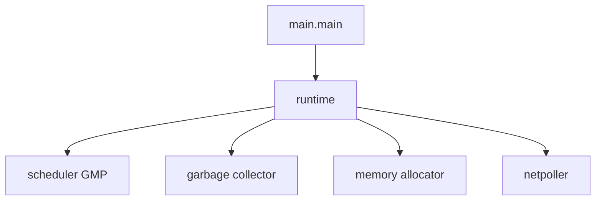
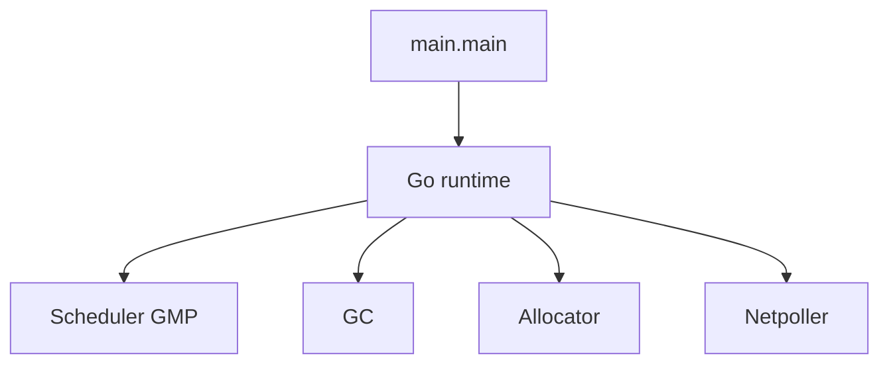

## Quick Revision

- Go binary embeds the **runtime** — scheduler, GC, memory allocator, netpoller.
- Compile: `go build` → static binary with runtime linked in.
- `main` runs after runtime init (scheduler, GC, signal handlers).

## Core Concepts

| Component | Role |
| :--- | :--- |
| **Scheduler** | M:N goroutine scheduling — [Scheduler](/golang-cheatsheet/03-go-internals/scheduler/) |
| **GC** | Concurrent mark-sweep — [Garbage Collection](/golang-cheatsheet/03-go-internals/garbage-collection/) |
| **Allocator** | Per-P caches, heap spans |
| **Netpoller** | epoll/kqueue integration for network I/O |
| **Stack management** | Growable goroutine stacks |

## Internal Working

**Startup:** OS loads binary → runtime initializes → `init()` functions → `main.main()`.

**Execution:** Goroutines scheduled on Ps; blocking syscalls detach M; network waits go to netpoller.

## Production Usage

- Pin Go version in `go.mod` and container images.
- Use `runtime.MemStats`, `runtime.NumGoroutine()` for coarse health — prefer [Observability](/golang-cheatsheet/06-production-go/observability/) for production.

## Runtime Behavior

1. OS loads binary → runtime initializes scheduler, memory allocator, GC.
2. Package `init()` functions run in dependency order.
3. `main.main` starts — typically spawns goroutines for servers/workers.
4. Process exits when main returns (or `os.Exit`) — all goroutines terminated.

## Design Tradeoffs

| Choice | Trade-off |
| :--- | :--- |
| Static binary | Simple deploy vs larger artifact than dynamic linking |
| Embedded runtime | Predictable behavior vs no external JVM-style tuning agent |
| Cooperative + preemptive scheduling | Low overhead vs rare long-run goroutine starvation pre-1.14 |

## Troubleshooting

| Symptom | Check |
| :--- | :--- |
| High RSS | Heap profile, goroutine count |
| Startup slow | `init()` side effects, large global maps |
| Mystery CPU | CPU profile, GC trace |

---

## What are the main components of the Go runtime and how do they interact at process startup?

### Short Answer
In production Go, the decisive factor is that goroutines are M:N scheduled on Ps with work stealing, not 1:1 OS threads — for: What are the main components of the Go runtime and how do they interact at process startup.

### Detailed Explanation
Explain G/M/P roles, blocking behavior (syscall, channel, netpoller), and how GOMAXPROCS caps parallel execution when answering: What are the main components of the Go runtime and how do they interact at process startup.

### Internal Working
The runtime parks blocked Gs, retargets Ms/Ps, and uses async preemption (1.14+) to avoid starving the scheduler — central to: What are the main components of the Go runtime and how do they interact at process startup.

### Production Notes
Document the tradeoff in an ADR with rollback criteria before changing GOMAXPROCS or goroutine fan-out for: What are the main components of the Go runtime and how do they interact at process startup.

### Common Mistakes
Treating `go` as free threads or ignoring syscall/netpoller interaction is a common miss on: What are the main components of the Go runtime and how do they interact at process startup.

### Follow-up Questions
What trace or metric would prove scheduler delay vs lock contention for: What are the main components of the Go runtime and how do they interact at process startup?

---
## How does the Go linker differ from a traditional dynamic linker in terms of deployment artifacts?

### Short Answer
The architecturally sound response is that goroutines are M:N scheduled on Ps with work stealing, not 1:1 OS threads — for: How does the Go linker differ from a traditional dynamic linker in terms of deployment artifacts.

### Detailed Explanation
Explain G/M/P roles, blocking behavior (syscall, channel, netpoller), and how GOMAXPROCS caps parallel execution when answering: How does the Go linker differ from a traditional dynamic linker in terms of deployment artifacts.

### Internal Working
The runtime parks blocked Gs, retargets Ms/Ps, and uses async preemption (1.14+) to avoid starving the scheduler — central to: How does the Go linker differ from a traditional dynamic linker in terms of deployment artifacts.

### Production Notes
Gate the change on alloc/op and p99 regression checks before changing GOMAXPROCS or goroutine fan-out for: How does the Go linker differ from a traditional dynamic linker in terms of deployment artifacts.

### Common Mistakes
Treating `go` as free threads or ignoring syscall/netpoller interaction is a common miss on: How does the Go linker differ from a traditional dynamic linker in terms of deployment artifacts.

### Follow-up Questions
What trace or metric would prove scheduler delay vs lock contention for: How does the Go linker differ from a traditional dynamic linker in terms of deployment artifacts?

---
<!-- interview-answers:end -->

---

## See Also

- [Previous: Error Handling](/golang-cheatsheet/02-core-go/error-handling/)
- [Next: Scheduler](/golang-cheatsheet/03-go-internals/scheduler/)
- [Go Handbook Index](/golang-cheatsheet/)
- [Top 150 Interview Questions](/golang-cheatsheet/08-interview-guide/top-150-interview-questions/)
