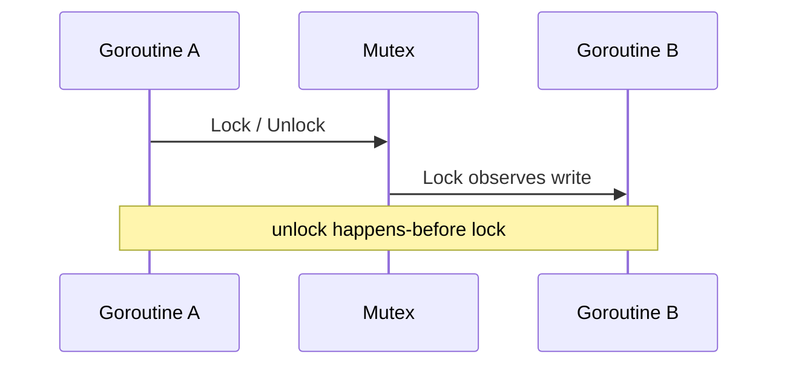

## At a Glance

- Go's **memory model** defines when reads/writes are visible across goroutines via **happens-before** edges. Data races are undefined behavior — use sync or channels.

---

## Reference Tables

| Happens-before from | Examples |
| :--- | :--- |
| Channel ops | Send happens-before receive completes |
| `sync` primitives | Unlock happens-before next Lock |
| `Once` | `Do` completion before return |
| `atomic` | Atomic ops provide synchronization |

```go
// DATA RACE — undefined
var x int
go func() { x++ }()
x++

// FIX
var mu sync.Mutex
go func() { mu.Lock(); x++; mu.Unlock() }()
```

---

## Snippets

```go
import "sync/atomic"

var count atomic.Int64
count.Add(1)
```

---

## Internals & Gotchas

- `go test -race` catches races — run in CI.
- `volatile` doesn't exist — use `atomic` or mutex.
- Compiler/CPU reordering invisible within single goroutine sequential consistency.

---

## Production Notes

- Apply patterns from this page in code review and incident postmortems.

---

## Define happens-before in the Go memory model and list three sources of edges.

### Short Answer
Visibility across goroutines is defined by happens-before; data races are undefined behavior — use channels, mutex, or atomic.

### Detailed Explanation
The memory model lists synchronization events that establish ordering: channel ops, sync primitives, Once, atomic. Without such an edge, reads/writes may race.

### Internal Working


Compiler and CPU may reorder within a goroutine but must respect happens-before. The race detector instruments memory accesses at runtime in test builds.

### Production Notes
Run `go test -race` in CI for concurrent packages. Treat race failures as release blockers for services with shared mutable state.

### Common Mistakes
Assuming 'it works on my machine' means no race. Using atomics for compound invariants that need mutex protection.

### Follow-up Questions
Show a minimal happens-before fix for a racy counter versus a channel-based design.

---
## Why is a data race undefined behavior even if the observed result seems consistent?

### Short Answer
Visibility across goroutines is defined by happens-before; data races are undefined behavior — use channels, mutex, or atomic.

### Detailed Explanation
The memory model lists synchronization events that establish ordering: channel ops, sync primitives, Once, atomic. Without such an edge, reads/writes may race.

### Internal Working
Compiler and CPU may reorder within a goroutine but must respect happens-before. The race detector instruments memory accesses at runtime in test builds.

### Production Notes
Run `go test -race` in CI for concurrent packages. Treat race failures as release blockers for services with shared mutable state.

### Common Mistakes
Assuming 'it works on my machine' means no race. Using atomics for compound invariants that need mutex protection.

### Follow-up Questions
Show a minimal happens-before fix for a racy counter versus a channel-based design.

---
## How do channel send/receive operations establish happens-before relationships?

### Short Answer
Visibility across goroutines is defined by happens-before; data races are undefined behavior — use channels, mutex, or atomic.

### Detailed Explanation
The memory model lists synchronization events that establish ordering: channel ops, sync primitives, Once, atomic. Without such an edge, reads/writes may race.

### Internal Working
Compiler and CPU may reorder within a goroutine but must respect happens-before. The race detector instruments memory accesses at runtime in test builds.

### Production Notes
Run `go test -race` in CI for concurrent packages. Treat race failures as release blockers for services with shared mutable state.

### Common Mistakes
Assuming 'it works on my machine' means no race. Using atomics for compound invariants that need mutex protection.

### Follow-up Questions
Show a minimal happens-before fix for a racy counter versus a channel-based design.

---
## When should you use sync/atomic versus a mutex for a simple counter?

### Short Answer
Visibility across goroutines is defined by happens-before; data races are undefined behavior — use channels, mutex, or atomic.

### Detailed Explanation
The memory model lists synchronization events that establish ordering: channel ops, sync primitives, Once, atomic. Without such an edge, reads/writes may race.

### Internal Working
Compiler and CPU may reorder within a goroutine but must respect happens-before. The race detector instruments memory accesses at runtime in test builds.

### Production Notes
Run `go test -race` in CI for concurrent packages. Treat race failures as release blockers for services with shared mutable state.

### Common Mistakes
Assuming 'it works on my machine' means no race. Using atomics for compound invariants that need mutex protection.

### Follow-up Questions
Show a minimal happens-before fix for a racy counter versus a channel-based design.

---
## What guarantees does sync.Once provide and how does it relate to happens-before?

### Short Answer
Visibility across goroutines is defined by happens-before; data races are undefined behavior — use channels, mutex, or atomic.

### Detailed Explanation
The memory model lists synchronization events that establish ordering: channel ops, sync primitives, Once, atomic. Without such an edge, reads/writes may race.

### Internal Working
Compiler and CPU may reorder within a goroutine but must respect happens-before. The race detector instruments memory accesses at runtime in test builds.

### Production Notes
Run `go test -race` in CI for concurrent packages. Treat race failures as release blockers for services with shared mutable state.

### Common Mistakes
Assuming 'it works on my machine' means no race. Using atomics for compound invariants that need mutex protection.

### Follow-up Questions
Show a minimal happens-before fix for a racy counter versus a channel-based design.

---
## How do you debug a production issue only reproducible under -race?

### Short Answer
Profile first (CPU, heap, goroutine); reduce allocations; validate with benchmarks and benchstat.

### Detailed Explanation
Performance work starts with measurement: pprof for hot paths, allocs/op for GC pressure, trace for scheduling delays. Optimize the dominant cost, not assumed bottlenecks.

### Internal Working
CPU profile samples on-CPU stacks. Heap profile shows in-use or allocated objects. Block/mutex profiles expose contention.

### Production Notes
Expose pprof on admin interfaces only. Compare benchmarks across Go versions with benchstat. Set GOMAXPROCS to CPU limit in K8s.

### Common Mistakes
Optimizing cold paths. Disabling GC instead of reducing allocations. Trusting micro-benchmarks without realistic input sizes.

### Follow-up Questions
What regression guard would you add in CI for alloc/op on critical handlers?

---
<!-- interview-answers:end -->

---

## Define happens-before in the Go memory model and list three sources of edges.

### Short Answer
The mechanism-first explanation is happens-before edges from channels, mutex, Once, and atomic — data races are UB — for: Define happens-before in the Go memory model and list three sources of edges..

### Detailed Explanation
List synchronization sources and why racy code can 'work' yet remain invalid when answering: Define happens-before in the Go memory model and list three sources of edges..

### Internal Working
Without a happens-before edge, reads/writes have no guaranteed visibility across goroutines — core to: Define happens-before in the Go memory model and list three sources of edges..

### Production Notes
Run `go test -race` in CI for packages touched by: Define happens-before in the Go memory model and list three sources of edges..

### Common Mistakes
Using atomics for multi-field invariants or skipping race tests on 'simple' counters fails: Define happens-before in the Go memory model and list three sources of edges..

### Follow-up Questions
Show the minimal sync fix (mutex vs channel) you would accept in review for: Define happens-before in the Go memory model and list three sources of edges..

---
## Why is a data race undefined behavior even if the observed result seems consistent?

### Short Answer
The senior-level answer is happens-before edges from channels, mutex, Once, and atomic — data races are UB — for: Why is a data race undefined behavior even if the observed result seems consistent.

### Detailed Explanation
List synchronization sources and why racy code can 'work' yet remain invalid when answering: Why is a data race undefined behavior even if the observed result seems consistent.

### Internal Working
Without a happens-before edge, reads/writes have no guaranteed visibility across goroutines — core to: Why is a data race undefined behavior even if the observed result seems consistent.

### Production Notes
Run `go test -race` in CI for packages touched by: Why is a data race undefined behavior even if the observed result seems consistent.

### Common Mistakes
Using atomics for multi-field invariants or skipping race tests on 'simple' counters fails: Why is a data race undefined behavior even if the observed result seems consistent.

### Follow-up Questions
Show the minimal sync fix (mutex vs channel) you would accept in review for: Why is a data race undefined behavior even if the observed result seems consistent.

---
## How do channel send/receive operations establish happens-before relationships?

### Short Answer
In production Go, the decisive factor is happens-before edges from channels, mutex, Once, and atomic — data races are UB — for: How do channel send/receive operations establish happens-before relationships.

### Detailed Explanation
List synchronization sources and why racy code can 'work' yet remain invalid when answering: How do channel send/receive operations establish happens-before relationships.

### Internal Working
Without a happens-before edge, reads/writes have no guaranteed visibility across goroutines — core to: How do channel send/receive operations establish happens-before relationships.

### Production Notes
Run `go test -race` in CI for packages touched by: How do channel send/receive operations establish happens-before relationships.

### Common Mistakes
Using atomics for multi-field invariants or skipping race tests on 'simple' counters fails: How do channel send/receive operations establish happens-before relationships.

### Follow-up Questions
Show the minimal sync fix (mutex vs channel) you would accept in review for: How do channel send/receive operations establish happens-before relationships.

---
## When should you use sync/atomic versus a mutex for a simple counter?

### Short Answer
The architecturally sound response is happens-before edges from channels, mutex, Once, and atomic — data races are UB — for: When should you use sync/atomic versus a mutex for a simple counter.

### Detailed Explanation
List synchronization sources and why racy code can 'work' yet remain invalid when answering: When should you use sync/atomic versus a mutex for a simple counter.

### Internal Working
Without a happens-before edge, reads/writes have no guaranteed visibility across goroutines — core to: When should you use sync/atomic versus a mutex for a simple counter.

### Production Notes
Run `go test -race` in CI for packages touched by: When should you use sync/atomic versus a mutex for a simple counter.

### Common Mistakes
Using atomics for multi-field invariants or skipping race tests on 'simple' counters fails: When should you use sync/atomic versus a mutex for a simple counter.

### Follow-up Questions
Show the minimal sync fix (mutex vs channel) you would accept in review for: When should you use sync/atomic versus a mutex for a simple counter.

---
## What guarantees does sync.Once provide and how does it relate to happens-before?

### Short Answer
The mechanism-first explanation is happens-before edges from channels, mutex, Once, and atomic — data races are UB — for: What guarantees does sync.Once provide and how does it relate to happens-before.

### Detailed Explanation
List synchronization sources and why racy code can 'work' yet remain invalid when answering: What guarantees does sync.Once provide and how does it relate to happens-before.

### Internal Working
Without a happens-before edge, reads/writes have no guaranteed visibility across goroutines — core to: What guarantees does sync.Once provide and how does it relate to happens-before.

### Production Notes
Run `go test -race` in CI for packages touched by: What guarantees does sync.Once provide and how does it relate to happens-before.

### Common Mistakes
Using atomics for multi-field invariants or skipping race tests on 'simple' counters fails: What guarantees does sync.Once provide and how does it relate to happens-before.

### Follow-up Questions
Show the minimal sync fix (mutex vs channel) you would accept in review for: What guarantees does sync.Once provide and how does it relate to happens-before.

---
## How do you debug a production issue only reproducible under -race?

### Short Answer
The mechanism-first explanation is tying language rules to runtime and production observability — for: How do you debug a production issue only reproducible under -race.

### Detailed Explanation
Senior answers combine mechanism, tradeoffs, and verification for: How do you debug a production issue only reproducible under -race.

### Internal Working
Go couples compile-time types with runtime scheduler/GC behavior — anchor: How do you debug a production issue only reproducible under -race.

### Production Notes
Validate with pprof, benchmarks, and race-detector coverage on any change suggested by: How do you debug a production issue only reproducible under -race.

### Common Mistakes
Hand-waving without profiles, tests, or happens-before reasoning fails: How do you debug a production issue only reproducible under -race.

### Follow-up Questions
What evidence would convince you your answer to: How do you debug a production issue only reproducible under -race holds at scale?

---
<!-- interview-answers:end -->

---

## See Also

- [Previous: Scheduler](/golang-cheatsheet/03-go-internals/scheduler/)
- [Next: Garbage Collection](/golang-cheatsheet/03-go-internals/garbage-collection/)
- [Go Handbook Index](/golang-cheatsheet/)
- [Top 150 Interview Questions](/golang-cheatsheet/08-interview-guide/top-150-interview-questions/)
