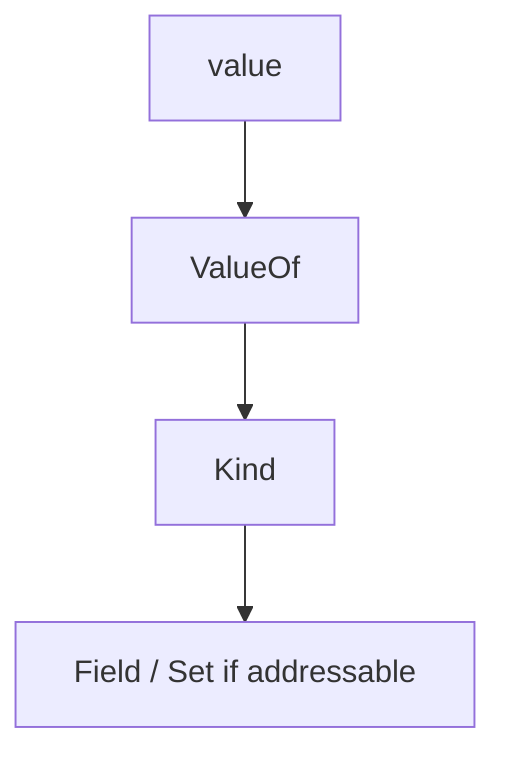

## At a Glance

- **Reflection** inspects types at runtime via `reflect.Type` and `reflect.Value`. Powerful for serializers and DI — **avoid** on hot paths; loses compile-time safety.

---

## Reference Tables

| API | Role |
| :--- | :--- |
| `reflect.TypeOf(v)` | Static type |
| `reflect.ValueOf(v)` | Runtime value |
| `Kind()` | Underlying kind — `Struct`, `Ptr`, `Slice` |
| `Field` / `Set` | Struct field access — need addressable value to Set |

```go
v := reflect.ValueOf(x)
if v.Kind() == reflect.Ptr {
    v = v.Elem()
}
for i := 0; i < v.NumField(); i++ {
    f := v.Type().Field(i)
    _ = f.Name
}
```

---

## Snippets

```go
func deepEqual(a, b any) bool {
    return reflect.DeepEqual(a, b)
}
```

---

## Internals & Gotchas

- `reflect.Value` must be **addressable** to modify.
- Breaking refactor won't compile-check reflection-based field access.
- Prefer generics (1.18+) over reflection when possible.

---

## Production Notes

- Apply patterns from this page in code review and incident postmortems.

---

## How is a reflect.Value constructed and when must the value be addressable to Set?

### Short Answer
Reflection inspects types at runtime; costly and brittle — prefer generics and compile-time interfaces when possible.

### Detailed Explanation
reflect.Value must be addressable to mutate. Field access by string breaks on refactor. Generics cover many serializer/utility cases reflection used to solve.

### Internal Working


Interface values carry type metadata; reflection walks struct tags and kinds. DeepEqual handles nested structures with defined semantics.

### Production Notes
Restrict reflection to frameworks (JSON, ORM, DI) not business hot paths. Fuzz and test tag contracts.

### Common Mistakes
Reflection in request handlers. Assuming zero values via reflection without handling pointers.

### Follow-up Questions
What would you refactor to generics instead of reflect for this use case?

---
## What is the cost of reflection on a hot path and mitigations?

### Short Answer
Reflection inspects types at runtime; costly and brittle — prefer generics and compile-time interfaces when possible.

### Detailed Explanation
reflect.Value must be addressable to mutate. Field access by string breaks on refactor. Generics cover many serializer/utility cases reflection used to solve.

### Internal Working
Interface values carry type metadata; reflection walks struct tags and kinds. DeepEqual handles nested structures with defined semantics.

### Production Notes
Restrict reflection to frameworks (JSON, ORM, DI) not business hot paths. Fuzz and test tag contracts.

### Common Mistakes
Reflection in request handlers. Assuming zero values via reflection without handling pointers.

### Follow-up Questions
What would you refactor to generics instead of reflect for this use case?

---
## When would you choose generics over reflection in Go 1.18+?

### Short Answer
Reflection inspects types at runtime; costly and brittle — prefer generics and compile-time interfaces when possible.

### Detailed Explanation
reflect.Value must be addressable to mutate. Field access by string breaks on refactor. Generics cover many serializer/utility cases reflection used to solve.

### Internal Working
Interface values carry type metadata; reflection walks struct tags and kinds. DeepEqual handles nested structures with defined semantics.

### Production Notes
Restrict reflection to frameworks (JSON, ORM, DI) not business hot paths. Fuzz and test tag contracts.

### Common Mistakes
Reflection in request handlers. Assuming zero values via reflection without handling pointers.

### Follow-up Questions
What would you refactor to generics instead of reflect for this use case?

---
## How does reflect.DeepEqual differ from == for slices and maps?

### Short Answer
Slices are views (ptr,len,cap); subslices alias backing arrays. Maps are not safe for concurrent use without sync.

### Detailed Explanation
append may reallocate and copy when cap exhausted. Subslices of large arrays can leak memory if a small slice is retained. Map growth and iteration have defined but subtle semantics.

### Internal Working
Map writes are not atomic across goroutines — runtime detects concurrent map writes and panics. Slice headers are small but point to shared storage.

### Production Notes
Preallocate slices when size is known. Copy or reslice with full slice expression to detach from large backing arrays. Protect maps with mutex or sync.Map.

### Common Mistakes
Assuming append never mutates other slices sharing backing array. Using maps from multiple goroutines without synchronization.

### Follow-up Questions
How would you prove a memory leak is slice aliasing versus a true goroutine leak?

---
## What breaks silently when refactoring struct fields accessed via reflection?

### Short Answer
Profile first (CPU, heap, goroutine); reduce allocations; validate with benchmarks and benchstat.

### Detailed Explanation
Performance work starts with measurement: pprof for hot paths, allocs/op for GC pressure, trace for scheduling delays. Optimize the dominant cost, not assumed bottlenecks.

### Internal Working
CPU profile samples on-CPU stacks. Heap profile shows in-use or allocated objects. Block/mutex profiles expose contention.

### Production Notes
Expose pprof on admin interfaces only. Compare benchmarks across Go versions with benchstat. Set GOMAXPROCS to CPU limit in K8s.

### Common Mistakes
Optimizing cold paths. Disabling GC instead of reducing allocations. Trusting micro-benchmarks without realistic input sizes.

### Follow-up Questions
What regression guard would you add in CI for alloc/op on critical handlers?

---
<!-- interview-answers:end -->

---

## How is a reflect.Value constructed and when must the value be addressable to Set?

### Short Answer
The architecturally sound response is reflection is powerful but costly and brittle — prefer generics/interfaces — for: How is a reflect.Value constructed and when must the value be addressable to Set.

### Detailed Explanation
Addressability, Kind, struct tags; DeepEqual semantics for: How is a reflect.Value constructed and when must the value be addressable to Set.

### Internal Working
Interface values carry type metadata reflection walks — cost model for: How is a reflect.Value constructed and when must the value be addressable to Set.

### Production Notes
Restrict reflection to frameworks/serialization, not hot handlers for: How is a reflect.Value constructed and when must the value be addressable to Set.

### Common Mistakes
Field rename breaks tag-based reflection silently in: How is a reflect.Value constructed and when must the value be addressable to Set.

### Follow-up Questions
What would you genericize instead of reflecting for: How is a reflect.Value constructed and when must the value be addressable to Set?

---
## What is the cost of reflection on a hot path and mitigations?

### Short Answer
The mechanism-first explanation is reflection is powerful but costly and brittle — prefer generics/interfaces — for: What is the cost of reflection on a hot path and mitigations.

### Detailed Explanation
Addressability, Kind, struct tags; DeepEqual semantics for: What is the cost of reflection on a hot path and mitigations.

### Internal Working
Interface values carry type metadata reflection walks — cost model for: What is the cost of reflection on a hot path and mitigations.

### Production Notes
Restrict reflection to frameworks/serialization, not hot handlers for: What is the cost of reflection on a hot path and mitigations.

### Common Mistakes
Field rename breaks tag-based reflection silently in: What is the cost of reflection on a hot path and mitigations.

### Follow-up Questions
What would you genericize instead of reflecting for: What is the cost of reflection on a hot path and mitigations?

---
## When would you choose generics over reflection in Go 1.18+?

### Short Answer
The senior-level answer is reflection is powerful but costly and brittle — prefer generics/interfaces — for: When would you choose generics over reflection in Go 1.18+.

### Detailed Explanation
Addressability, Kind, struct tags; DeepEqual semantics for: When would you choose generics over reflection in Go 1.18+.

### Internal Working
Interface values carry type metadata reflection walks — cost model for: When would you choose generics over reflection in Go 1.18+.

### Production Notes
Restrict reflection to frameworks/serialization, not hot handlers for: When would you choose generics over reflection in Go 1.18+.

### Common Mistakes
Field rename breaks tag-based reflection silently in: When would you choose generics over reflection in Go 1.18+.

### Follow-up Questions
What would you genericize instead of reflecting for: When would you choose generics over reflection in Go 1.18+?

---
## How does reflect.DeepEqual differ from == for slices and maps?

### Short Answer
In production Go, the decisive factor is slices are (ptr,len,cap) views; append may reallocate; subslices alias — for: How does reflect.DeepEqual differ from == for slices and maps.

### Detailed Explanation
Explain backing-array sharing, nil vs empty slice JSON, and copy/reslice mitigations for: How does reflect.DeepEqual differ from == for slices and maps.

### Internal Working
Append within cap mutates shared storage; full slice expr `[:0:0]` can detach — internals for: How does reflect.DeepEqual differ from == for slices and maps.

### Production Notes
Preallocate with make([]T,0,n) on hot paths related to: How does reflect.DeepEqual differ from == for slices and maps.

### Common Mistakes
Retaining tiny subslices of huge arrays causes silent memory leaks in: How does reflect.DeepEqual differ from == for slices and maps.

### Follow-up Questions
How would you prove aliasing vs true leak for: How does reflect.DeepEqual differ from == for slices and maps?

---
## What breaks silently when refactoring struct fields accessed via reflection?

### Short Answer
The architecturally sound response is profile first (CPU, heap, goroutine), then reduce allocs and contention — for: What breaks silently when refactoring struct fields accessed via reflection.

### Detailed Explanation
Use benchstat, `-benchmem`, block/mutex profiles as appropriate for: What breaks silently when refactoring struct fields accessed via reflection.

### Internal Working
Flat vs cum in pprof; allocs/op drives GC — internal tools for: What breaks silently when refactoring struct fields accessed via reflection.

### Production Notes
Gate the change on alloc/op and p99 regression checks on changes affecting: What breaks silently when refactoring struct fields accessed via reflection.

### Common Mistakes
Optimizing cold paths or micro-benchmarking without realistic inputs misleads: What breaks silently when refactoring struct fields accessed via reflection.

### Follow-up Questions
Which single profile view would you open first for: What breaks silently when refactoring struct fields accessed via reflection?

---
<!-- interview-answers:end -->

---

## See Also

- [Previous: Escape Analysis](/golang-cheatsheet/03-go-internals/escape-analysis/)
- [Next: Goroutines](/golang-cheatsheet/04-concurrency/goroutines/)
- [Go Handbook Index](/golang-cheatsheet/)
- [Top 150 Interview Questions](/golang-cheatsheet/08-interview-guide/top-150-interview-questions/)
