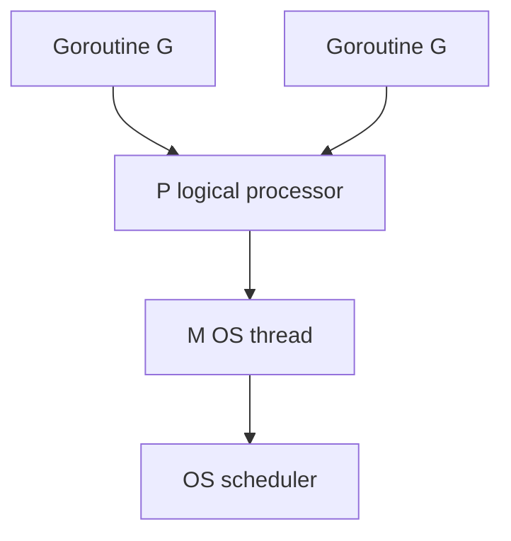

## Quick Revision

- **G** = goroutine, **M** = OS thread, **P** = logical processor (local run queue).
- **GOMAXPROCS** = number of Ps (default `runtime.NumCPU()`).
- Work stealing balances load across Ps.

## Core Concepts

| Concept | Detail |
| :--- | :--- |
| Local run queue | Each P has a queue of Gs |
| Global queue | Overflow and idle Ps steal from here |
| Work stealing | Idle P steals half of another P's queue |
| Syscall block | M may block; P can run other Gs |
| Preemption | Async preemption (Go 1.14+) for tight loops |

## Internal Working

**Blocking:** Channel/mutex → G parks; scheduler runs another G on P.
**Network:** G registers with netpoller; wakes when fd ready.

## Performance Considerations

- CPU-bound: `GOMAXPROCS` ≈ CPU quota in containers.
- Don't spawn unbounded Gs — see [Concurrency Patterns](/golang-cheatsheet/04-concurrency/concurrency-patterns/).

## Common Mistakes

- Setting `GOMAXPROCS` to 1 on multi-core hosts without reason.
- Assuming `go` keyword creates an OS thread.

## Runtime Behavior

- **Runnable** Gs sit on P local queues or global queue.
- **Running** G executes on an M bound to a P.
- **Blocked** G is parked (channel, mutex, syscall, network).
- On syscall block, M may detach from P; P runs other Gs on another M.

## Design Tradeoffs

| Knob | Effect |
| :--- | :--- |
| `GOMAXPROCS` | Upper bound on parallel OS-thread execution of Go code |
| More goroutines than CPUs | OK for I/O bound; oversubscription hurts CPU-bound |
| GOMAXPROCS > CPU quota | Throttling and latency inflation in cgroups |

## Architect Notes

Scheduler behavior explains why **CPU-bound worker count** should track cores, while **I/O-bound** workloads can use larger goroutine counts with bounded semaphores.

---

## Explain the GMP scheduler model — what role does each of G, M, and P play?

### Short Answer
The mechanism-first explanation is that goroutines are M:N scheduled on Ps with work stealing, not 1:1 OS threads — for: Explain the GMP scheduler model — what role does each of G, M, and P play.

### Detailed Explanation
Explain G/M/P roles, blocking behavior (syscall, channel, netpoller), and how GOMAXPROCS caps parallel execution when answering: Explain the GMP scheduler model — what role does each of G, M, and P play.

### Internal Working
The runtime parks blocked Gs, retargets Ms/Ps, and uses async preemption (1.14+) to avoid starving the scheduler — central to: Explain the GMP scheduler model — what role does each of G, M, and P play.

### Production Notes
Validate with pprof, benchmarks, and race-detector coverage before changing GOMAXPROCS or goroutine fan-out for: Explain the GMP scheduler model — what role does each of G, M, and P play.

### Common Mistakes
Treating `go` as free threads or ignoring syscall/netpoller interaction is a common miss on: Explain the GMP scheduler model — what role does each of G, M, and P play.

### Follow-up Questions
What trace or metric would prove scheduler delay vs lock contention for: Explain the GMP scheduler model — what role does each of G, M, and P play?

---
## What is work stealing in the Go scheduler and when does it occur?

### Short Answer
The senior-level answer is that goroutines are M:N scheduled on Ps with work stealing, not 1:1 OS threads — for: What is work stealing in the Go scheduler and when does it occur.

### Detailed Explanation
Explain G/M/P roles, blocking behavior (syscall, channel, netpoller), and how GOMAXPROCS caps parallel execution when answering: What is work stealing in the Go scheduler and when does it occur.

### Internal Working
The runtime parks blocked Gs, retargets Ms/Ps, and uses async preemption (1.14+) to avoid starving the scheduler — central to: What is work stealing in the Go scheduler and when does it occur.

### Production Notes
Prove it under load with trace plus metrics, not micro-benchmarks alone before changing GOMAXPROCS or goroutine fan-out for: What is work stealing in the Go scheduler and when does it occur.

### Common Mistakes
Treating `go` as free threads or ignoring syscall/netpoller interaction is a common miss on: What is work stealing in the Go scheduler and when does it occur.

### Follow-up Questions
What trace or metric would prove scheduler delay vs lock contention for: What is work stealing in the Go scheduler and when does it occur?

---
## How did goroutine preemption change from Go 1.13 to Go 1.14+ and why does it matter?

### Short Answer
In production Go, the decisive factor is that goroutines are M:N scheduled on Ps with work stealing, not 1:1 OS threads — for: How did goroutine preemption change from Go 1.13 to Go 1.14+ and why does it matter.

### Detailed Explanation
Explain G/M/P roles, blocking behavior (syscall, channel, netpoller), and how GOMAXPROCS caps parallel execution when answering: How did goroutine preemption change from Go 1.13 to Go 1.14+ and why does it matter.

### Internal Working
The runtime parks blocked Gs, retargets Ms/Ps, and uses async preemption (1.14+) to avoid starving the scheduler — central to: How did goroutine preemption change from Go 1.13 to Go 1.14+ and why does it matter.

### Production Notes
Document the tradeoff in an ADR with rollback criteria before changing GOMAXPROCS or goroutine fan-out for: How did goroutine preemption change from Go 1.13 to Go 1.14+ and why does it matter.

### Common Mistakes
Treating `go` as free threads or ignoring syscall/netpoller interaction is a common miss on: How did goroutine preemption change from Go 1.13 to Go 1.14+ and why does it matter.

### Follow-up Questions
What trace or metric would prove scheduler delay vs lock contention for: How did goroutine preemption change from Go 1.13 to Go 1.14+ and why does it matter?

---
## What happens when a goroutine blocks on a syscall — how is the M released?

### Short Answer
The architecturally sound response is tying language rules to runtime and production observability — for: What happens when a goroutine blocks on a syscall — how is the M released.

### Detailed Explanation
Senior answers combine mechanism, tradeoffs, and verification for: What happens when a goroutine blocks on a syscall — how is the M released.

### Internal Working
Go couples compile-time types with runtime scheduler/GC behavior — anchor: What happens when a goroutine blocks on a syscall — how is the M released.

### Production Notes
Gate the change on alloc/op and p99 regression checks on any change suggested by: What happens when a goroutine blocks on a syscall — how is the M released.

### Common Mistakes
Hand-waving without profiles, tests, or happens-before reasoning fails: What happens when a goroutine blocks on a syscall — how is the M released.

### Follow-up Questions
What evidence would convince you your answer to: What happens when a goroutine blocks on a syscall — how is the M released holds at scale?

---
## How does GOMAXPROCS affect parallelism versus concurrency in a CPU-bound service?

### Short Answer
The mechanism-first explanation is that goroutines are M:N scheduled on Ps with work stealing, not 1:1 OS threads — for: How does GOMAXPROCS affect parallelism versus concurrency in a CPU-bound service.

### Detailed Explanation
Explain G/M/P roles, blocking behavior (syscall, channel, netpoller), and how GOMAXPROCS caps parallel execution when answering: How does GOMAXPROCS affect parallelism versus concurrency in a CPU-bound service.

### Internal Working
The runtime parks blocked Gs, retargets Ms/Ps, and uses async preemption (1.14+) to avoid starving the scheduler — central to: How does GOMAXPROCS affect parallelism versus concurrency in a CPU-bound service.

### Production Notes
Validate with pprof, benchmarks, and race-detector coverage before changing GOMAXPROCS or goroutine fan-out for: How does GOMAXPROCS affect parallelism versus concurrency in a CPU-bound service.

### Common Mistakes
Treating `go` as free threads or ignoring syscall/netpoller interaction is a common miss on: How does GOMAXPROCS affect parallelism versus concurrency in a CPU-bound service.

### Follow-up Questions
What trace or metric would prove scheduler delay vs lock contention for: How does GOMAXPROCS affect parallelism versus concurrency in a CPU-bound service?

---
## What is the netpoller and how does it integrate with channel and network I/O blocking?

### Short Answer
The senior-level answer is that goroutines are M:N scheduled on Ps with work stealing, not 1:1 OS threads — for: What is the netpoller and how does it integrate with channel and network I/O blocking.

### Detailed Explanation
Explain G/M/P roles, blocking behavior (syscall, channel, netpoller), and how GOMAXPROCS caps parallel execution when answering: What is the netpoller and how does it integrate with channel and network I/O blocking.

### Internal Working
The runtime parks blocked Gs, retargets Ms/Ps, and uses async preemption (1.14+) to avoid starving the scheduler — central to: What is the netpoller and how does it integrate with channel and network I/O blocking.

### Production Notes
Prove it under load with trace plus metrics, not micro-benchmarks alone before changing GOMAXPROCS or goroutine fan-out for: What is the netpoller and how does it integrate with channel and network I/O blocking.

### Common Mistakes
Treating `go` as free threads or ignoring syscall/netpoller interaction is a common miss on: What is the netpoller and how does it integrate with channel and network I/O blocking.

### Follow-up Questions
What trace or metric would prove scheduler delay vs lock contention for: What is the netpoller and how does it integrate with channel and network I/O blocking?

---
## Why do goroutine stacks start small and grow — what are the tradeoffs?

### Short Answer
In production Go, the decisive factor is tying language rules to runtime and production observability — for: Why do goroutine stacks start small and grow — what are the tradeoffs.

### Detailed Explanation
Senior answers combine mechanism, tradeoffs, and verification for: Why do goroutine stacks start small and grow — what are the tradeoffs.

### Internal Working
Go couples compile-time types with runtime scheduler/GC behavior — anchor: Why do goroutine stacks start small and grow — what are the tradeoffs.

### Production Notes
Document the tradeoff in an ADR with rollback criteria on any change suggested by: Why do goroutine stacks start small and grow — what are the tradeoffs.

### Common Mistakes
Hand-waving without profiles, tests, or happens-before reasoning fails: Why do goroutine stacks start small and grow — what are the tradeoffs.

### Follow-up Questions
What evidence would convince you your answer to: Why do goroutine stacks start small and grow — what are the tradeoffs holds at scale?

---
## What is a local run queue versus the global run queue in the scheduler?

### Short Answer
The architecturally sound response is that goroutines are M:N scheduled on Ps with work stealing, not 1:1 OS threads — for: What is a local run queue versus the global run queue in the scheduler.

### Detailed Explanation
Explain G/M/P roles, blocking behavior (syscall, channel, netpoller), and how GOMAXPROCS caps parallel execution when answering: What is a local run queue versus the global run queue in the scheduler.

### Internal Working
The runtime parks blocked Gs, retargets Ms/Ps, and uses async preemption (1.14+) to avoid starving the scheduler — central to: What is a local run queue versus the global run queue in the scheduler.

### Production Notes
Gate the change on alloc/op and p99 regression checks before changing GOMAXPROCS or goroutine fan-out for: What is a local run queue versus the global run queue in the scheduler.

### Common Mistakes
Treating `go` as free threads or ignoring syscall/netpoller interaction is a common miss on: What is a local run queue versus the global run queue in the scheduler.

### Follow-up Questions
What trace or metric would prove scheduler delay vs lock contention for: What is a local run queue versus the global run queue in the scheduler?

---
## How does the runtime handle stack growth during deep recursion?

### Short Answer
The mechanism-first explanation is that goroutines are M:N scheduled on Ps with work stealing, not 1:1 OS threads — for: How does the runtime handle stack growth during deep recursion.

### Detailed Explanation
Explain G/M/P roles, blocking behavior (syscall, channel, netpoller), and how GOMAXPROCS caps parallel execution when answering: How does the runtime handle stack growth during deep recursion.

### Internal Working
The runtime parks blocked Gs, retargets Ms/Ps, and uses async preemption (1.14+) to avoid starving the scheduler — central to: How does the runtime handle stack growth during deep recursion.

### Production Notes
Validate with pprof, benchmarks, and race-detector coverage before changing GOMAXPROCS or goroutine fan-out for: How does the runtime handle stack growth during deep recursion.

### Common Mistakes
Treating `go` as free threads or ignoring syscall/netpoller interaction is a common miss on: How does the runtime handle stack growth during deep recursion.

### Follow-up Questions
What trace or metric would prove scheduler delay vs lock contention for: How does the runtime handle stack growth during deep recursion?

---
## What GOMAXPROCS setting is appropriate for container CPU limits?

### Short Answer
The senior-level answer is that goroutines are M:N scheduled on Ps with work stealing, not 1:1 OS threads — for: What GOMAXPROCS setting is appropriate for container CPU limits.

### Detailed Explanation
Explain G/M/P roles, blocking behavior (syscall, channel, netpoller), and how GOMAXPROCS caps parallel execution when answering: What GOMAXPROCS setting is appropriate for container CPU limits.

### Internal Working
The runtime parks blocked Gs, retargets Ms/Ps, and uses async preemption (1.14+) to avoid starving the scheduler — central to: What GOMAXPROCS setting is appropriate for container CPU limits.

### Production Notes
Prove it under load with trace plus metrics, not micro-benchmarks alone before changing GOMAXPROCS or goroutine fan-out for: What GOMAXPROCS setting is appropriate for container CPU limits.

### Common Mistakes
Treating `go` as free threads or ignoring syscall/netpoller interaction is a common miss on: What GOMAXPROCS setting is appropriate for container CPU limits.

### Follow-up Questions
What trace or metric would prove scheduler delay vs lock contention for: What GOMAXPROCS setting is appropriate for container CPU limits?

---
<!-- interview-answers:end -->

---

## See Also

- [Previous: Go Runtime](/golang-cheatsheet/03-go-internals/go-runtime/)
- [Next: Memory Model](/golang-cheatsheet/03-go-internals/memory-model/)
- [Go Handbook Index](/golang-cheatsheet/)
- [Top 150 Interview Questions](/golang-cheatsheet/08-interview-guide/top-150-interview-questions/)
