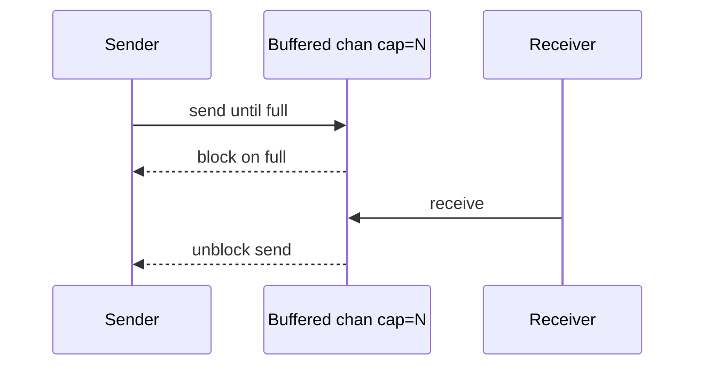

## At a Glance

- Channels coordinate goroutines — **typed conduits**. Unbuffered = synchronous handoff; buffered = async up to capacity. **Close** signals no more sends; receivers drain then get zero value + `ok=false`.

---

## Reference Tables

| Type | Behavior |
| :--- | :--- |
| `chan T` | Unbuffered — send blocks until recv |
| `chan T` (cap>0) | Buffered — blocks when full |
| Close | `close(ch)` — only sender should close |
| Range | `for v := range ch` until closed |

```go
ch := make(chan int)       // unbuffered
buf := make(chan int, 10)  // buffered

ch <- 1
v := <-ch

close(ch)
v, ok := <-ch // ok false when drained
```

---

## Snippets

For **fan-in**, **fan-out**, and **pipelines**, see [Concurrency Patterns](/golang-cheatsheet/04-concurrency/concurrency-patterns/).


---

## Internals & Gotchas

- Send on closed channel **panics**.
- Close from non-sender side is a bug.
- `nil` channel blocks forever on send/recv — useful in `select`.

---

## Production Notes

- Document channel ownership (who closes). Prefer context cancel for shutdown.

---

## What is the difference between buffered and unbuffered channels semantically?

### Short Answer
Prefer clear ownership: channels for orchestration, mutex for shared state; always bound concurrency and propagate context.

### Detailed Explanation
Go encourages sharing memory by communicating, but mutexes are often simpler for caches and counters. Combine WaitGroup, context, and buffered channels for backpressure.

### Internal Working


Unbuffered channels synchronize; buffered channels decouple up to capacity. nil channels block forever in select — useful for disabling cases.

### Production Notes
Define goroutine lifecycle: who starts, who stops, how errors return. Implement graceful shutdown with context cancel and server drain.

### Common Mistakes
Leaked goroutines blocked on channels. Closing channels from the receiver side. select+default spin loops.

### Follow-up Questions
When would you choose errgroup with context over a raw WaitGroup?

---
## Who should close a channel and what happens on send to a closed channel?

### Short Answer
Prefer clear ownership: channels for orchestration, mutex for shared state; always bound concurrency and propagate context.

### Detailed Explanation
Go encourages sharing memory by communicating, but mutexes are often simpler for caches and counters. Combine WaitGroup, context, and buffered channels for backpressure.

### Internal Working
Unbuffered channels synchronize; buffered channels decouple up to capacity. nil channels block forever in select — useful for disabling cases.

### Production Notes
Define goroutine lifecycle: who starts, who stops, how errors return. Implement graceful shutdown with context cancel and server drain.

### Common Mistakes
Leaked goroutines blocked on channels. Closing channels from the receiver side. select+default spin loops.

### Follow-up Questions
When would you choose errgroup with context over a raw WaitGroup?

---
## What stack patterns indicate a goroutine blocked on channel receive forever?

### Short Answer
Prefer clear ownership: channels for orchestration, mutex for shared state; always bound concurrency and propagate context.

### Detailed Explanation
Go encourages sharing memory by communicating, but mutexes are often simpler for caches and counters. Combine WaitGroup, context, and buffered channels for backpressure.

### Internal Working
Unbuffered channels synchronize; buffered channels decouple up to capacity. nil channels block forever in select — useful for disabling cases.

### Production Notes
Define goroutine lifecycle: who starts, who stops, how errors return. Implement graceful shutdown with context cancel and server drain.

### Common Mistakes
Leaked goroutines blocked on channels. Closing channels from the receiver side. select+default spin loops.

### Follow-up Questions
When would you choose errgroup with context over a raw WaitGroup?

---
## What causes 'fatal error: all goroutines are asleep - deadlock!'?

### Short Answer
Interfaces are implicit (type, data) pairs; typed nil breaks `== nil`. Errors use wrapping with `%w` and `errors.Is/As`.

### Detailed Explanation
An interface value is nil only when both type and data are nil. A nil pointer inside a non-nil interface type is a classic API bug. Error chains preserve cause for inspection.

### Internal Working
Method sets determine satisfaction — pointer vs value receivers matter. Error wrapping builds an unwrap chain inspected by Is/As.

### Production Notes
Keep interfaces small at boundaries. Never log and return the same error. Use sentinel errors sparingly with documented semantics.

### Common Mistakes
Comparing wrapped errors with `==`. Returning typed nil pointers in interfaces. Giant interfaces that hinder testing.

### Follow-up Questions
How would you test `errors.Is` through three layers of `%w` wrapping?

---
<!-- interview-answers:end -->

---

## What is the difference between buffered and unbuffered channels semantically?

### Short Answer
In production Go, the decisive factor is bound concurrency, define goroutine exit, and choose mutex vs channel deliberately — for: What is the difference between buffered and unbuffered channels semantically.

### Detailed Explanation
Channels orchestrate; mutexes protect shared state; WaitGroup/ctx coordinate lifecycle — apply to: What is the difference between buffered and unbuffered channels semantically.

### Internal Working
Unbuffered channels rendezvous; buffered channels decouple until full; nil chans disable select cases — internals for: What is the difference between buffered and unbuffered channels semantically.

### Production Notes
Propagate context, add backpressure, and test with `-race` when implementing: What is the difference between buffered and unbuffered channels semantically.

### Common Mistakes
Leaked goroutines, send-on-closed-channel panics, and select spin loops are frequent failures in: What is the difference between buffered and unbuffered channels semantically.

### Follow-up Questions
How would you structure shutdown so: What is the difference between buffered and unbuffered channels semantically cannot hang the process?

---
## Who should close a channel and what happens on send to a closed channel?

### Short Answer
The architecturally sound response is bound concurrency, define goroutine exit, and choose mutex vs channel deliberately — for: Who should close a channel and what happens on send to a closed channel.

### Detailed Explanation
Channels orchestrate; mutexes protect shared state; WaitGroup/ctx coordinate lifecycle — apply to: Who should close a channel and what happens on send to a closed channel.

### Internal Working
Unbuffered channels rendezvous; buffered channels decouple until full; nil chans disable select cases — internals for: Who should close a channel and what happens on send to a closed channel.

### Production Notes
Propagate context, add backpressure, and test with `-race` when implementing: Who should close a channel and what happens on send to a closed channel.

### Common Mistakes
Leaked goroutines, send-on-closed-channel panics, and select spin loops are frequent failures in: Who should close a channel and what happens on send to a closed channel.

### Follow-up Questions
How would you structure shutdown so: Who should close a channel and what happens on send to a closed channel cannot hang the process?

---
## What stack patterns indicate a goroutine blocked on channel receive forever?

### Short Answer
The senior-level answer is bound concurrency, define goroutine exit, and choose mutex vs channel deliberately — for: What stack patterns indicate a goroutine blocked on channel receive forever.

### Detailed Explanation
Channels orchestrate; mutexes protect shared state; WaitGroup/ctx coordinate lifecycle — apply to: What stack patterns indicate a goroutine blocked on channel receive forever.

### Internal Working
Unbuffered channels rendezvous; buffered channels decouple until full; nil chans disable select cases — internals for: What stack patterns indicate a goroutine blocked on channel receive forever.

### Production Notes
Propagate context, add backpressure, and test with `-race` when implementing: What stack patterns indicate a goroutine blocked on channel receive forever.

### Common Mistakes
Leaked goroutines, send-on-closed-channel panics, and select spin loops are frequent failures in: What stack patterns indicate a goroutine blocked on channel receive forever.

### Follow-up Questions
How would you structure shutdown so: What stack patterns indicate a goroutine blocked on channel receive forever cannot hang the process?

---
## What causes 'fatal error: all goroutines are asleep - deadlock!'?

### Short Answer
The senior-level answer is errors are values; wrap with `%w`; inspect with Is/As — for: What causes 'fatal error: all goroutines are asleep - deadlock!'.

### Detailed Explanation
Distinguish sentinel vs typed errors; log OR return, not both, when covering: What causes 'fatal error: all goroutines are asleep - deadlock!'.

### Internal Working
Wrap chains preserve unwrap for Is/As; `%v` breaks inspection — mechanism for: What causes 'fatal error: all goroutines are asleep - deadlock!'.

### Production Notes
Map errors to HTTP/gRPC codes at boundaries for: What causes 'fatal error: all goroutines are asleep - deadlock!'.

### Common Mistakes
Comparing wrapped errors with `==` or duplicating logs fails: What causes 'fatal error: all goroutines are asleep - deadlock!'.

### Follow-up Questions
What retry taxonomy would you attach to errors in: What causes 'fatal error: all goroutines are asleep - deadlock!'?

---
<!-- interview-answers:end -->

---

## See Also

- [Previous: Goroutines](/golang-cheatsheet/04-concurrency/goroutines/)
- [Next: Select](/golang-cheatsheet/04-concurrency/select/)
- [Go Handbook Index](/golang-cheatsheet/)
- [Top 150 Interview Questions](/golang-cheatsheet/08-interview-guide/top-150-interview-questions/)
