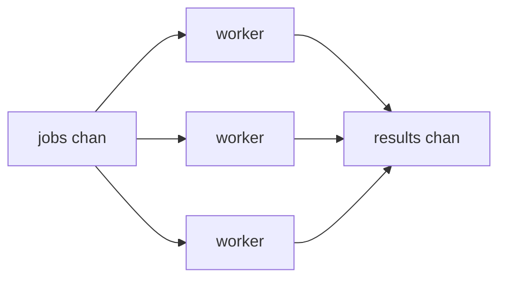
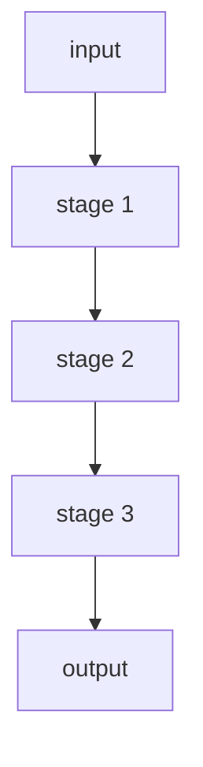

## Quick Revision

- **Worker pool** — fixed goroutines + job channel.
- **Fan-out** — distribute work; **fan-in** — merge results.
- **Pipeline** — staged channel processing.
- **Backpressure** — bounded buffers or semaphores.

## Core Concepts

| Pattern | Use when |
| :--- | :--- |
| Worker pool | Bounded parallelism for CPU/IO work |
| Fan-out/in | Parallel map-reduce style |
| Pipeline | Sequential stages with overlap |
| Semaphore | Limit in-flight requests |
| Context cancel | Stop all stages on deadline |

## Production Usage

- Always bound concurrency — unbounded `go` causes OOM.
- Propagate [Context](/golang-cheatsheet/04-concurrency/context/) through pipeline stages.
- Prefer [Mutex](/golang-cheatsheet/04-concurrency/mutex/) when sharing simple state beats channel choreography.

## Common Mistakes

- Fan-in without WaitGroup before close.
- Missing backpressure on fast producer / slow consumer.

## Internal Working





**Worker pool sketch:**

```go
func workerPool(ctx context.Context, jobs <-chan Job, n int) <-chan Result {
    out := make(chan Result)
    var wg sync.WaitGroup
    for i := 0; i < n; i++ {
        wg.Add(1)
        go func() {
            defer wg.Done()
            for {
                select {
                case <-ctx.Done():
                    return
                case j, ok := <-jobs:
                    if !ok {
                        return
                    }
                    out <- process(j)
                }
            }
        }()
    }
    go func() { wg.Wait(); close(out) }()
    return out
}
```

**Backpressure:** size `jobs` channel to limit queued work; use semaphore for in-flight HTTP calls.

## Performance Considerations

Pool size ≈ CPU cores for CPU work; higher for I/O with bounded semaphore.

## Troubleshooting

| Symptom | Likely cause |
| :--- | :--- |
| Goroutine count grows forever | Missing ctx cancel or blocked send |
| Deadlock | WaitGroup mismatch, send without receiver |


---

## How do you implement a worker pool with bounded concurrency?

### Short Answer
The mechanism-first explanation is bound concurrency, define goroutine exit, and choose mutex vs channel deliberately — for: How do you implement a worker pool with bounded concurrency.

### Detailed Explanation
Channels orchestrate; mutexes protect shared state; WaitGroup/ctx coordinate lifecycle — apply to: How do you implement a worker pool with bounded concurrency.

### Internal Working
Unbuffered channels rendezvous; buffered channels decouple until full; nil chans disable select cases — internals for: How do you implement a worker pool with bounded concurrency.

### Production Notes
Propagate context, add backpressure, and test with `-race` when implementing: How do you implement a worker pool with bounded concurrency.

### Common Mistakes
Leaked goroutines, send-on-closed-channel panics, and select spin loops are frequent failures in: How do you implement a worker pool with bounded concurrency.

### Follow-up Questions
How would you structure shutdown so: How do you implement a worker pool with bounded concurrency cannot hang the process?

---
## Explain fan-out fan-in and a failure mode if a stage blocks.

### Short Answer
The senior-level answer is bound concurrency, define goroutine exit, and choose mutex vs channel deliberately — for: Explain fan-out fan-in and a failure mode if a stage blocks..

### Detailed Explanation
Channels orchestrate; mutexes protect shared state; WaitGroup/ctx coordinate lifecycle — apply to: Explain fan-out fan-in and a failure mode if a stage blocks..

### Internal Working
Unbuffered channels rendezvous; buffered channels decouple until full; nil chans disable select cases — internals for: Explain fan-out fan-in and a failure mode if a stage blocks..

### Production Notes
Propagate context, add backpressure, and test with `-race` when implementing: Explain fan-out fan-in and a failure mode if a stage blocks..

### Common Mistakes
Leaked goroutines, send-on-closed-channel panics, and select spin loops are frequent failures in: Explain fan-out fan-in and a failure mode if a stage blocks..

### Follow-up Questions
How would you structure shutdown so: Explain fan-out fan-in and a failure mode if a stage blocks. cannot hang the process?

---
## How do pipelines compose channels and where does backpressure belong?

### Short Answer
In production Go, the decisive factor is bound concurrency, define goroutine exit, and choose mutex vs channel deliberately — for: How do pipelines compose channels and where does backpressure belong.

### Detailed Explanation
Channels orchestrate; mutexes protect shared state; WaitGroup/ctx coordinate lifecycle — apply to: How do pipelines compose channels and where does backpressure belong.

### Internal Working
Unbuffered channels rendezvous; buffered channels decouple until full; nil chans disable select cases — internals for: How do pipelines compose channels and where does backpressure belong.

### Production Notes
Propagate context, add backpressure, and test with `-race` when implementing: How do pipelines compose channels and where does backpressure belong.

### Common Mistakes
Leaked goroutines, send-on-closed-channel panics, and select spin loops are frequent failures in: How do pipelines compose channels and where does backpressure belong.

### Follow-up Questions
How would you structure shutdown so: How do pipelines compose channels and where does backpressure belong cannot hang the process?

---
## How do you cancel a pipeline of goroutines cleanly using context?

### Short Answer
The architecturally sound response is bound concurrency, define goroutine exit, and choose mutex vs channel deliberately — for: How do you cancel a pipeline of goroutines cleanly using context.

### Detailed Explanation
Channels orchestrate; mutexes protect shared state; WaitGroup/ctx coordinate lifecycle — apply to: How do you cancel a pipeline of goroutines cleanly using context.

### Internal Working
Unbuffered channels rendezvous; buffered channels decouple until full; nil chans disable select cases — internals for: How do you cancel a pipeline of goroutines cleanly using context.

### Production Notes
Propagate context, add backpressure, and test with `-race` when implementing: How do you cancel a pipeline of goroutines cleanly using context.

### Common Mistakes
Leaked goroutines, send-on-closed-channel panics, and select spin loops are frequent failures in: How do you cancel a pipeline of goroutines cleanly using context.

### Follow-up Questions
How would you structure shutdown so: How do you cancel a pipeline of goroutines cleanly using context cannot hang the process?

---
## What is the share-memory-by-communicating idiom and its limits?

### Short Answer
The mechanism-first explanation is tying language rules to runtime and production observability — for: What is the share-memory-by-communicating idiom and its limits.

### Detailed Explanation
Senior answers combine mechanism, tradeoffs, and verification for: What is the share-memory-by-communicating idiom and its limits.

### Internal Working
Go couples compile-time types with runtime scheduler/GC behavior — anchor: What is the share-memory-by-communicating idiom and its limits.

### Production Notes
Validate with pprof, benchmarks, and race-detector coverage on any change suggested by: What is the share-memory-by-communicating idiom and its limits.

### Common Mistakes
Hand-waving without profiles, tests, or happens-before reasoning fails: What is the share-memory-by-communicating idiom and its limits.

### Follow-up Questions
What evidence would convince you your answer to: What is the share-memory-by-communicating idiom and its limits holds at scale?

---
## What is a semaphore pattern using buffered channels versus sync.Mutex?

### Short Answer
In production Go, the decisive factor is bound concurrency, define goroutine exit, and choose mutex vs channel deliberately — for: What is a semaphore pattern using buffered channels versus sync.Mutex.

### Detailed Explanation
Channels orchestrate; mutexes protect shared state; WaitGroup/ctx coordinate lifecycle — apply to: What is a semaphore pattern using buffered channels versus sync.Mutex.

### Internal Working
Unbuffered channels rendezvous; buffered channels decouple until full; nil chans disable select cases — internals for: What is a semaphore pattern using buffered channels versus sync.Mutex.

### Production Notes
Propagate context, add backpressure, and test with `-race` when implementing: What is a semaphore pattern using buffered channels versus sync.Mutex.

### Common Mistakes
Leaked goroutines, send-on-closed-channel panics, and select spin loops are frequent failures in: What is a semaphore pattern using buffered channels versus sync.Mutex.

### Follow-up Questions
How would you structure shutdown so: What is a semaphore pattern using buffered channels versus sync.Mutex cannot hang the process?

---
<!-- interview-answers:end -->

---

## See Also

- [Previous: Context](/golang-cheatsheet/04-concurrency/context/)
- [Next: Performance Optimization](/golang-cheatsheet/05-performance/performance-optimization/)
- [Go Handbook Index](/golang-cheatsheet/)
- [Top 150 Interview Questions](/golang-cheatsheet/08-interview-guide/top-150-interview-questions/)
