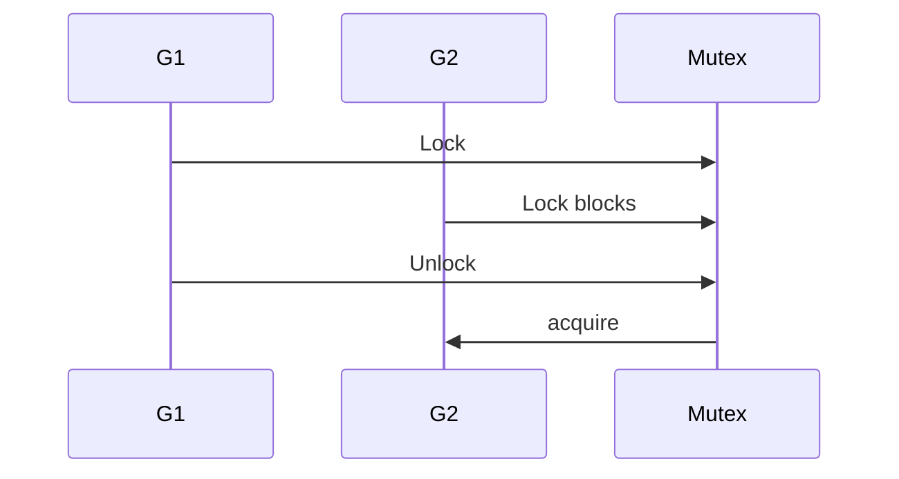

## At a Glance

- `sync.Mutex` provides **exclusive** lock. Prefer **`defer mu.Unlock()`** immediately after `Lock()`. Protect shared mutable state — not individual reads if `RWMutex` fits.

---

## Reference Tables

| API | Use |
| :--- | :--- |
| `Lock()` / `Unlock()` | Exclusive access |
| `TryLock()` (1.18+) | Non-blocking attempt |
| Copy | Mutex must not be copied after first use |

```go
type SafeMap struct {
    mu sync.Mutex
    m  map[string]int
}

func (s *SafeMap) Inc(key string) {
    s.mu.Lock()
    defer s.mu.Unlock()
    s.m[key]++
}
```

---

## Snippets

```go
var mu sync.Mutex
var balance int

func deposit(amount int) {
    mu.Lock()
    defer mu.Unlock()
    balance += amount
}
```

---

## Internals & Gotchas

- Lock ordering across goroutines → deadlock — establish global order.
- Holding lock during I/O blocks all waiters — copy data and release.
- Don't embed mutex in exported struct if callers might copy struct.

---

## Production Notes

- Apply patterns from this page in code review and incident postmortems.

---

## When is sync.Mutex preferable to a channel for protecting shared state?

### Short Answer
Prefer clear ownership: channels for orchestration, mutex for shared state; always bound concurrency and propagate context.

### Detailed Explanation
Go encourages sharing memory by communicating, but mutexes are often simpler for caches and counters. Combine WaitGroup, context, and buffered channels for backpressure.

### Internal Working


Unbuffered channels synchronize; buffered channels decouple up to capacity. nil channels block forever in select — useful for disabling cases.

### Production Notes
Define goroutine lifecycle: who starts, who stops, how errors return. Implement graceful shutdown with context cancel and server drain.

### Common Mistakes
Leaked goroutines blocked on channels. Closing channels from the receiver side. select+default spin loops.

### Follow-up Questions
When would you choose errgroup with context over a raw WaitGroup?

---
## How does lock ordering prevent deadlocks in nested critical sections?

### Short Answer
Anchor the answer in Go runtime semantics, observable behavior, and production tradeoffs for mutex.

### Detailed Explanation
Senior interviews expect mechanism-first reasoning: what the language/runtime guarantees, what it does not, and how that shows up under load or failure.

### Internal Working
Go couples language rules (types, interfaces, concurrency primitives) with a runtime scheduler, GC, and memory model. Correct answers connect API behavior to these subsystems.

### Production Notes
Validate assumptions with `go test -race`, benchmarks, and pprof before changing architecture. Pin Go versions and document SLO impact of concurrency/GC choices.

### Common Mistakes
Hand-waving 'Go is fast' without allocation, scheduling, or cancellation analysis. Copying patterns without bounding goroutines or defining shutdown behavior.

### Follow-up Questions
What observable metric or test would prove your design handles this mutex concern in production?

---
## Why must sync.Mutex not be copied after first use?

### Short Answer
Prefer clear ownership: channels for orchestration, mutex for shared state; always bound concurrency and propagate context.

### Detailed Explanation
Go encourages sharing memory by communicating, but mutexes are often simpler for caches and counters. Combine WaitGroup, context, and buffered channels for backpressure.

### Internal Working
Unbuffered channels synchronize; buffered channels decouple up to capacity. nil channels block forever in select — useful for disabling cases.

### Production Notes
Define goroutine lifecycle: who starts, who stops, how errors return. Implement graceful shutdown with context cancel and server drain.

### Common Mistakes
Leaked goroutines blocked on channels. Closing channels from the receiver side. select+default spin loops.

### Follow-up Questions
When would you choose errgroup with context over a raw WaitGroup?

---
## How do you debug a deadlock involving sync.Mutex lock ordering?

### Short Answer
Prefer clear ownership: channels for orchestration, mutex for shared state; always bound concurrency and propagate context.

### Detailed Explanation
Go encourages sharing memory by communicating, but mutexes are often simpler for caches and counters. Combine WaitGroup, context, and buffered channels for backpressure.

### Internal Working
Unbuffered channels synchronize; buffered channels decouple up to capacity. nil channels block forever in select — useful for disabling cases.

### Production Notes
Define goroutine lifecycle: who starts, who stops, how errors return. Implement graceful shutdown with context cancel and server drain.

### Common Mistakes
Leaked goroutines blocked on channels. Closing channels from the receiver side. select+default spin loops.

### Follow-up Questions
When would you choose errgroup with context over a raw WaitGroup?

---
<!-- interview-answers:end -->

---

## When is sync.Mutex preferable to a channel for protecting shared state?

### Short Answer
The mechanism-first explanation is bound concurrency, define goroutine exit, and choose mutex vs channel deliberately — for: When is sync.Mutex preferable to a channel for protecting shared state.

### Detailed Explanation
Channels orchestrate; mutexes protect shared state; WaitGroup/ctx coordinate lifecycle — apply to: When is sync.Mutex preferable to a channel for protecting shared state.

### Internal Working
Unbuffered channels rendezvous; buffered channels decouple until full; nil chans disable select cases — internals for: When is sync.Mutex preferable to a channel for protecting shared state.

### Production Notes
Propagate context, add backpressure, and test with `-race` when implementing: When is sync.Mutex preferable to a channel for protecting shared state.

### Common Mistakes
Leaked goroutines, send-on-closed-channel panics, and select spin loops are frequent failures in: When is sync.Mutex preferable to a channel for protecting shared state.

### Follow-up Questions
How would you structure shutdown so: When is sync.Mutex preferable to a channel for protecting shared state cannot hang the process?

---
## How does lock ordering prevent deadlocks in nested critical sections?

### Short Answer
The senior-level answer is triage with pprof goroutine/heap, traces, logs, and race detector — for: How does lock ordering prevent deadlocks in nested critical sections.

### Detailed Explanation
Isolate symptom (leak, deadlock, OOM, latency) before config churn for: How does lock ordering prevent deadlocks in nested critical sections.

### Internal Working
Stack labels show blocked chan/mutex/select; GC thrash shows in gctrace — signals for: How does lock ordering prevent deadlocks in nested critical sections.

### Production Notes
Reproduce under load; capture profiles at peak for: How does lock ordering prevent deadlocks in nested critical sections.

### Common Mistakes
Shotgun GOMAXPROCS/GC toggles without evidence worsens: How does lock ordering prevent deadlocks in nested critical sections.

### Follow-up Questions
What is your first reversible mitigation in the first 30 minutes for: How does lock ordering prevent deadlocks in nested critical sections?

---
## Why must sync.Mutex not be copied after first use?

### Short Answer
In production Go, the decisive factor is bound concurrency, define goroutine exit, and choose mutex vs channel deliberately — for: Why must sync.Mutex not be copied after first use.

### Detailed Explanation
Channels orchestrate; mutexes protect shared state; WaitGroup/ctx coordinate lifecycle — apply to: Why must sync.Mutex not be copied after first use.

### Internal Working
Unbuffered channels rendezvous; buffered channels decouple until full; nil chans disable select cases — internals for: Why must sync.Mutex not be copied after first use.

### Production Notes
Propagate context, add backpressure, and test with `-race` when implementing: Why must sync.Mutex not be copied after first use.

### Common Mistakes
Leaked goroutines, send-on-closed-channel panics, and select spin loops are frequent failures in: Why must sync.Mutex not be copied after first use.

### Follow-up Questions
How would you structure shutdown so: Why must sync.Mutex not be copied after first use cannot hang the process?

---
## How do you debug a deadlock involving sync.Mutex lock ordering?

### Short Answer
In production Go, the decisive factor is bound concurrency, define goroutine exit, and choose mutex vs channel deliberately — for: How do you debug a deadlock involving sync.Mutex lock ordering.

### Detailed Explanation
Channels orchestrate; mutexes protect shared state; WaitGroup/ctx coordinate lifecycle — apply to: How do you debug a deadlock involving sync.Mutex lock ordering.

### Internal Working
Unbuffered channels rendezvous; buffered channels decouple until full; nil chans disable select cases — internals for: How do you debug a deadlock involving sync.Mutex lock ordering.

### Production Notes
Propagate context, add backpressure, and test with `-race` when implementing: How do you debug a deadlock involving sync.Mutex lock ordering.

### Common Mistakes
Leaked goroutines, send-on-closed-channel panics, and select spin loops are frequent failures in: How do you debug a deadlock involving sync.Mutex lock ordering.

### Follow-up Questions
How would you structure shutdown so: How do you debug a deadlock involving sync.Mutex lock ordering cannot hang the process?

---
<!-- interview-answers:end -->

---

## See Also

- [Previous: Select](/golang-cheatsheet/04-concurrency/select/)
- [Next: Rwmutex](/golang-cheatsheet/04-concurrency/rwmutex/)
- [Go Handbook Index](/golang-cheatsheet/)
- [Top 150 Interview Questions](/golang-cheatsheet/08-interview-guide/top-150-interview-questions/)
