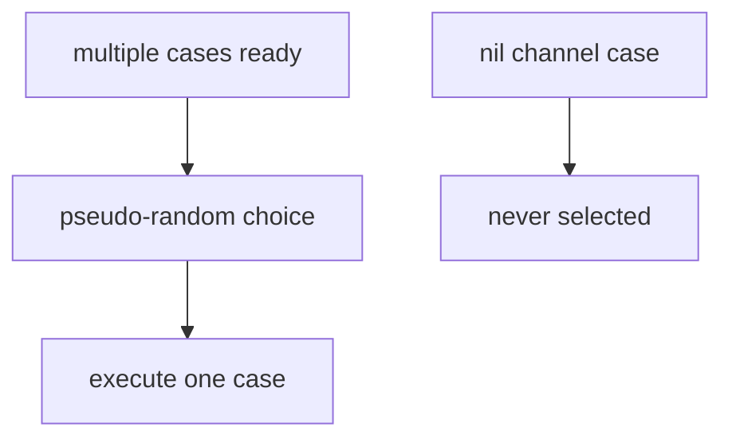

## At a Glance

- `select` waits on multiple channel operations — like `switch` for channels. Use **`default`** for non-blocking tries; combine with `time.After` for timeouts.

---

## Reference Tables

| Case | Behavior |
| :--- | :--- |
| Ready channel op | One chosen pseudo-randomly if multiple ready |
| `default` | Runs if nothing ready |
| `nil` channel | Never selected |
| Empty select | Blocks forever |

```go
select {
case v := <-ch:
    use(v)
case ch <- x:
    // sent
case <-ctx.Done():
    return ctx.Err()
default:
    // non-blocking
}
```

---

## Snippets

```go
timeout := time.After(2 * time.Second)
select {
case res := <-resultCh:
    return res, nil
case <-timeout:
    return nil, errors.New("timeout")
}
```

---

## Internals & Gotchas

- `select` with only `default` in a loop can spin CPU — add sleep or block elsewhere.
- Don't mix receiving zero values without checking `ok` after close.

---

## Production Notes

- Apply patterns from this page in code review and incident postmortems.

---

## Why is a nil channel useful inside select?

### Short Answer
Prefer clear ownership: channels for orchestration, mutex for shared state; always bound concurrency and propagate context.

### Detailed Explanation
Go encourages sharing memory by communicating, but mutexes are often simpler for caches and counters. Combine WaitGroup, context, and buffered channels for backpressure.

### Internal Working


Unbuffered channels synchronize; buffered channels decouple up to capacity. nil channels block forever in select — useful for disabling cases.

### Production Notes
Define goroutine lifecycle: who starts, who stops, how errors return. Implement graceful shutdown with context cancel and server drain.

### Common Mistakes
Leaked goroutines blocked on channels. Closing channels from the receiver side. select+default spin loops.

### Follow-up Questions
When would you choose errgroup with context over a raw WaitGroup?

---
## How does select choose among multiple ready cases?

### Short Answer
Prefer clear ownership: channels for orchestration, mutex for shared state; always bound concurrency and propagate context.

### Detailed Explanation
Go encourages sharing memory by communicating, but mutexes are often simpler for caches and counters. Combine WaitGroup, context, and buffered channels for backpressure.

### Internal Working
Unbuffered channels synchronize; buffered channels decouple up to capacity. nil channels block forever in select — useful for disabling cases.

### Production Notes
Define goroutine lifecycle: who starts, who stops, how errors return. Implement graceful shutdown with context cancel and server drain.

### Common Mistakes
Leaked goroutines blocked on channels. Closing channels from the receiver side. select+default spin loops.

### Follow-up Questions
When would you choose errgroup with context over a raw WaitGroup?

---
## What is the risk of select with only default in a tight loop?

### Short Answer
Prefer clear ownership: channels for orchestration, mutex for shared state; always bound concurrency and propagate context.

### Detailed Explanation
Go encourages sharing memory by communicating, but mutexes are often simpler for caches and counters. Combine WaitGroup, context, and buffered channels for backpressure.

### Internal Working
Unbuffered channels synchronize; buffered channels decouple up to capacity. nil channels block forever in select — useful for disabling cases.

### Production Notes
Define goroutine lifecycle: who starts, who stops, how errors return. Implement graceful shutdown with context cancel and server drain.

### Common Mistakes
Leaked goroutines blocked on channels. Closing channels from the receiver side. select+default spin loops.

### Follow-up Questions
When would you choose errgroup with context over a raw WaitGroup?

---
## How do you implement timeouts without leaking goroutines?

### Short Answer
Anchor the answer in Go runtime semantics, observable behavior, and production tradeoffs for select.

### Detailed Explanation
Senior interviews expect mechanism-first reasoning: what the language/runtime guarantees, what it does not, and how that shows up under load or failure.

### Internal Working
Go couples language rules (types, interfaces, concurrency primitives) with a runtime scheduler, GC, and memory model. Correct answers connect API behavior to these subsystems.

### Production Notes
Validate assumptions with `go test -race`, benchmarks, and pprof before changing architecture. Pin Go versions and document SLO impact of concurrency/GC choices.

### Common Mistakes
Hand-waving 'Go is fast' without allocation, scheduling, or cancellation analysis. Copying patterns without bounding goroutines or defining shutdown behavior.

### Follow-up Questions
What observable metric or test would prove your design handles this select concern in production?

---
## What causes select fair starvation and how do you reproduce it?

### Short Answer
Prefer clear ownership: channels for orchestration, mutex for shared state; always bound concurrency and propagate context.

### Detailed Explanation
Go encourages sharing memory by communicating, but mutexes are often simpler for caches and counters. Combine WaitGroup, context, and buffered channels for backpressure.

### Internal Working
Unbuffered channels synchronize; buffered channels decouple up to capacity. nil channels block forever in select — useful for disabling cases.

### Production Notes
Define goroutine lifecycle: who starts, who stops, how errors return. Implement graceful shutdown with context cancel and server drain.

### Common Mistakes
Leaked goroutines blocked on channels. Closing channels from the receiver side. select+default spin loops.

### Follow-up Questions
When would you choose errgroup with context over a raw WaitGroup?

---
<!-- interview-answers:end -->

---

## Why is a nil channel useful inside select?

### Short Answer
The mechanism-first explanation is bound concurrency, define goroutine exit, and choose mutex vs channel deliberately — for: Why is a nil channel useful inside select.

### Detailed Explanation
Channels orchestrate; mutexes protect shared state; WaitGroup/ctx coordinate lifecycle — apply to: Why is a nil channel useful inside select.

### Internal Working
Unbuffered channels rendezvous; buffered channels decouple until full; nil chans disable select cases — internals for: Why is a nil channel useful inside select.

### Production Notes
Propagate context, add backpressure, and test with `-race` when implementing: Why is a nil channel useful inside select.

### Common Mistakes
Leaked goroutines, send-on-closed-channel panics, and select spin loops are frequent failures in: Why is a nil channel useful inside select.

### Follow-up Questions
How would you structure shutdown so: Why is a nil channel useful inside select cannot hang the process?

---
## How does select choose among multiple ready cases?

### Short Answer
The senior-level answer is bound concurrency, define goroutine exit, and choose mutex vs channel deliberately — for: How does select choose among multiple ready cases.

### Detailed Explanation
Channels orchestrate; mutexes protect shared state; WaitGroup/ctx coordinate lifecycle — apply to: How does select choose among multiple ready cases.

### Internal Working
Unbuffered channels rendezvous; buffered channels decouple until full; nil chans disable select cases — internals for: How does select choose among multiple ready cases.

### Production Notes
Propagate context, add backpressure, and test with `-race` when implementing: How does select choose among multiple ready cases.

### Common Mistakes
Leaked goroutines, send-on-closed-channel panics, and select spin loops are frequent failures in: How does select choose among multiple ready cases.

### Follow-up Questions
How would you structure shutdown so: How does select choose among multiple ready cases cannot hang the process?

---
## What is the risk of select with only default in a tight loop?

### Short Answer
In production Go, the decisive factor is bound concurrency, define goroutine exit, and choose mutex vs channel deliberately — for: What is the risk of select with only default in a tight loop.

### Detailed Explanation
Channels orchestrate; mutexes protect shared state; WaitGroup/ctx coordinate lifecycle — apply to: What is the risk of select with only default in a tight loop.

### Internal Working
Unbuffered channels rendezvous; buffered channels decouple until full; nil chans disable select cases — internals for: What is the risk of select with only default in a tight loop.

### Production Notes
Propagate context, add backpressure, and test with `-race` when implementing: What is the risk of select with only default in a tight loop.

### Common Mistakes
Leaked goroutines, send-on-closed-channel panics, and select spin loops are frequent failures in: What is the risk of select with only default in a tight loop.

### Follow-up Questions
How would you structure shutdown so: What is the risk of select with only default in a tight loop cannot hang the process?

---
## How do you implement timeouts without leaking goroutines?

### Short Answer
The architecturally sound response is tying language rules to runtime and production observability — for: How do you implement timeouts without leaking goroutines.

### Detailed Explanation
Senior answers combine mechanism, tradeoffs, and verification for: How do you implement timeouts without leaking goroutines.

### Internal Working
Go couples compile-time types with runtime scheduler/GC behavior — anchor: How do you implement timeouts without leaking goroutines.

### Production Notes
Gate the change on alloc/op and p99 regression checks on any change suggested by: How do you implement timeouts without leaking goroutines.

### Common Mistakes
Hand-waving without profiles, tests, or happens-before reasoning fails: How do you implement timeouts without leaking goroutines.

### Follow-up Questions
What evidence would convince you your answer to: How do you implement timeouts without leaking goroutines holds at scale?

---
## What causes select fair starvation and how do you reproduce it?

### Short Answer
The architecturally sound response is bound concurrency, define goroutine exit, and choose mutex vs channel deliberately — for: What causes select fair starvation and how do you reproduce it.

### Detailed Explanation
Channels orchestrate; mutexes protect shared state; WaitGroup/ctx coordinate lifecycle — apply to: What causes select fair starvation and how do you reproduce it.

### Internal Working
Unbuffered channels rendezvous; buffered channels decouple until full; nil chans disable select cases — internals for: What causes select fair starvation and how do you reproduce it.

### Production Notes
Propagate context, add backpressure, and test with `-race` when implementing: What causes select fair starvation and how do you reproduce it.

### Common Mistakes
Leaked goroutines, send-on-closed-channel panics, and select spin loops are frequent failures in: What causes select fair starvation and how do you reproduce it.

### Follow-up Questions
How would you structure shutdown so: What causes select fair starvation and how do you reproduce it cannot hang the process?

---
<!-- interview-answers:end -->

---

## See Also

- [Previous: Channels](/golang-cheatsheet/04-concurrency/channels/)
- [Next: Mutex](/golang-cheatsheet/04-concurrency/mutex/)
- [Go Handbook Index](/golang-cheatsheet/)
- [Top 150 Interview Questions](/golang-cheatsheet/08-interview-guide/top-150-interview-questions/)
