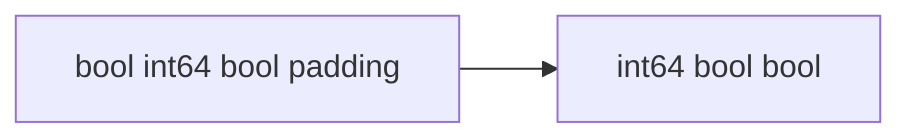

## Quick Revision

- `make([]T, 0, cap)` avoids repeated growth.
- Reorder struct fields to reduce padding.
- Fewer pointers in heap graph → faster GC mark phase.

## Performance Considerations

Link alloc rate to [Garbage Collection](/golang-cheatsheet/03-go-internals/garbage-collection/).

## Internal Working



Struct padding example — reorder fields to reduce size:

```go
type Bad struct {
    a bool    // 1 + 7 pad
    b int64   // 8
    c bool    // 1 + 7 pad
} // 24 bytes

type Good struct {
    b int64   // 8
    a bool    // 1
    c bool    // 1 + 5 pad
} // 16 bytes
```

## Production Usage

Align optimization with GC: fewer pointers → faster mark phase.


---

## How does preallocating slices with make([]T, 0, n) reduce GC pressure?

### Short Answer
The architecturally sound response is concurrent tri-color GC paced by GOGC, where allocation rate often matters more than live heap — for: How does preallocating slices with make([]T, 0, n) reduce GC pressure.

### Detailed Explanation
Cover mark/sweep phases, short STW points, write barriers, and why finalizers are unreliable when discussing: How does preallocating slices with make([]T, 0, n) reduce GC pressure.

### Internal Working
Mutators run with barriers during mark; sweep reclaims unreachable objects — the internal story behind: How does preallocating slices with make([]T, 0, n) reduce GC pressure.

### Production Notes
Gate the change on alloc/op and p99 regression checks when tuning GOGC or investigating latency spikes related to: How does preallocating slices with make([]T, 0, n) reduce GC pressure.

### Common Mistakes
Calling runtime.GC() routinely or ignoring allocs/op while staring at heap size alone fails: How does preallocating slices with make([]T, 0, n) reduce GC pressure.

### Follow-up Questions
How would gctrace and heap profiles change your next step for: How does preallocating slices with make([]T, 0, n) reduce GC pressure?

---
## How can struct field ordering affect memory padding and cache lines?

### Short Answer
The mechanism-first explanation is profile first (CPU, heap, goroutine), then reduce allocs and contention — for: How can struct field ordering affect memory padding and cache lines.

### Detailed Explanation
Use benchstat, `-benchmem`, block/mutex profiles as appropriate for: How can struct field ordering affect memory padding and cache lines.

### Internal Working
Flat vs cum in pprof; allocs/op drives GC — internal tools for: How can struct field ordering affect memory padding and cache lines.

### Production Notes
Validate with pprof, benchmarks, and race-detector coverage on changes affecting: How can struct field ordering affect memory padding and cache lines.

### Common Mistakes
Optimizing cold paths or micro-benchmarking without realistic inputs misleads: How can struct field ordering affect memory padding and cache lines.

### Follow-up Questions
Which single profile view would you open first for: How can struct field ordering affect memory padding and cache lines?

---
## When should you prefer value semantics over pointers for small structs?

### Short Answer
The senior-level answer is tying language rules to runtime and production observability — for: When should you prefer value semantics over pointers for small structs.

### Detailed Explanation
Senior answers combine mechanism, tradeoffs, and verification for: When should you prefer value semantics over pointers for small structs.

### Internal Working
Go couples compile-time types with runtime scheduler/GC behavior — anchor: When should you prefer value semantics over pointers for small structs.

### Production Notes
Prove it under load with trace plus metrics, not micro-benchmarks alone on any change suggested by: When should you prefer value semantics over pointers for small structs.

### Common Mistakes
Hand-waving without profiles, tests, or happens-before reasoning fails: When should you prefer value semantics over pointers for small structs.

### Follow-up Questions
What evidence would convince you your answer to: When should you prefer value semantics over pointers for small structs holds at scale?

---
## What runbook steps apply when OOMKilled in Kubernetes for a Go pod?

### Short Answer
The senior-level answer is triage with pprof goroutine/heap, traces, logs, and race detector — for: What runbook steps apply when OOMKilled in Kubernetes for a Go pod.

### Detailed Explanation
Isolate symptom (leak, deadlock, OOM, latency) before config churn for: What runbook steps apply when OOMKilled in Kubernetes for a Go pod.

### Internal Working
Stack labels show blocked chan/mutex/select; GC thrash shows in gctrace — signals for: What runbook steps apply when OOMKilled in Kubernetes for a Go pod.

### Production Notes
Reproduce under load; capture profiles at peak for: What runbook steps apply when OOMKilled in Kubernetes for a Go pod.

### Common Mistakes
Shotgun GOMAXPROCS/GC toggles without evidence worsens: What runbook steps apply when OOMKilled in Kubernetes for a Go pod.

### Follow-up Questions
What is your first reversible mitigation in the first 30 minutes for: What runbook steps apply when OOMKilled in Kubernetes for a Go pod?

---
<!-- interview-answers:end -->

---

## See Also

- [Previous: Benchmarking](/golang-cheatsheet/05-performance/benchmarking/)
- [Next: Logging](/golang-cheatsheet/06-production-go/logging/)
- [Go Handbook Index](/golang-cheatsheet/)
- [Top 150 Interview Questions](/golang-cheatsheet/08-interview-guide/top-150-interview-questions/)
