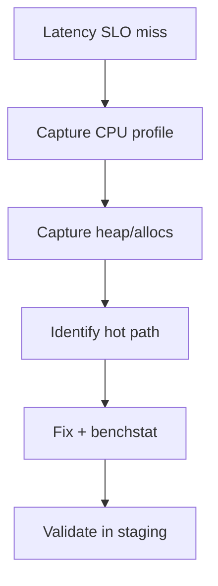

## Quick Revision

- CPU: `go tool pprof http://localhost:6060/debug/pprof/profile`
- Heap: `/debug/pprof/heap`
- Goroutine: `/debug/pprof/goroutine`
- Trace: `runtime/trace`

## Core Concepts



| Profile | Shows |
| :--- | :--- |
| CPU | Hot functions |
| heap / allocs | In-use or allocated objects |
| goroutine | Stack traces per G |
| block / mutex | Contention |

## Production Usage

Import `_ "net/http/pprof"` on admin port only; protect with network policy.

## Core Concepts

| Profile | Endpoint / flag | Shows |
| :--- | :--- | :--- |
| CPU | `/debug/pprof/profile?seconds=30` | On-CPU stacks |
| Heap | `/debug/pprof/heap` | In-use objects |
| Allocs | `/debug/pprof/allocs` | Allocation sites |
| Goroutine | `/debug/pprof/goroutine` | Stack per G |
| Block | `runtime.SetBlockProfileRate` | Blocking on sync |
| Mutex | `runtime.SetMutexProfileFraction` | Mutex contention |
| Trace | `go tool trace` | Scheduler, STW, goroutine events |

## Production Usage

```go
import _ "net/http/pprof"

go func() {
    http.ListenAndServe("localhost:6060", nil)
}()
```

Bind admin port to loopback or private network only.

## Troubleshooting

Compare **flat** vs **cum** in `go tool pprof` — flat is time in function; cum includes callees.


---

## What are the first three steps you take when a Go service misses latency SLO?

### Short Answer
The architecturally sound response is tying language rules to runtime and production observability — for: What are the first three steps you take when a Go service misses latency SLO.

### Detailed Explanation
Senior answers combine mechanism, tradeoffs, and verification for: What are the first three steps you take when a Go service misses latency SLO.

### Internal Working
Go couples compile-time types with runtime scheduler/GC behavior — anchor: What are the first three steps you take when a Go service misses latency SLO.

### Production Notes
Gate the change on alloc/op and p99 regression checks on any change suggested by: What are the first three steps you take when a Go service misses latency SLO.

### Common Mistakes
Hand-waving without profiles, tests, or happens-before reasoning fails: What are the first three steps you take when a Go service misses latency SLO.

### Follow-up Questions
What evidence would convince you your answer to: What are the first three steps you take when a Go service misses latency SLO holds at scale?

---
## How do you capture a CPU profile from a production process safely?

### Short Answer
The mechanism-first explanation is profile first (CPU, heap, goroutine), then reduce allocs and contention — for: How do you capture a CPU profile from a production process safely.

### Detailed Explanation
Use benchstat, `-benchmem`, block/mutex profiles as appropriate for: How do you capture a CPU profile from a production process safely.

### Internal Working
Flat vs cum in pprof; allocs/op drives GC — internal tools for: How do you capture a CPU profile from a production process safely.

### Production Notes
Validate with pprof, benchmarks, and race-detector coverage on changes affecting: How do you capture a CPU profile from a production process safely.

### Common Mistakes
Optimizing cold paths or micro-benchmarking without realistic inputs misleads: How do you capture a CPU profile from a production process safely.

### Follow-up Questions
Which single profile view would you open first for: How do you capture a CPU profile from a production process safely?

---
## What does a flat versus cum column mean in pprof CPU output?

### Short Answer
The senior-level answer is profile first (CPU, heap, goroutine), then reduce allocs and contention — for: What does a flat versus cum column mean in pprof CPU output.

### Detailed Explanation
Use benchstat, `-benchmem`, block/mutex profiles as appropriate for: What does a flat versus cum column mean in pprof CPU output.

### Internal Working
Flat vs cum in pprof; allocs/op drives GC — internal tools for: What does a flat versus cum column mean in pprof CPU output.

### Production Notes
Prove it under load with trace plus metrics, not micro-benchmarks alone on changes affecting: What does a flat versus cum column mean in pprof CPU output.

### Common Mistakes
Optimizing cold paths or micro-benchmarking without realistic inputs misleads: What does a flat versus cum column mean in pprof CPU output.

### Follow-up Questions
Which single profile view would you open first for: What does a flat versus cum column mean in pprof CPU output?

---
## How do you distinguish alloc_objects from inuse_space in heap profiles?

### Short Answer
In production Go, the decisive factor is profile first (CPU, heap, goroutine), then reduce allocs and contention — for: How do you distinguish alloc_objects from inuse_space in heap profiles.

### Detailed Explanation
Use benchstat, `-benchmem`, block/mutex profiles as appropriate for: How do you distinguish alloc_objects from inuse_space in heap profiles.

### Internal Working
Flat vs cum in pprof; allocs/op drives GC — internal tools for: How do you distinguish alloc_objects from inuse_space in heap profiles.

### Production Notes
Document the tradeoff in an ADR with rollback criteria on changes affecting: How do you distinguish alloc_objects from inuse_space in heap profiles.

### Common Mistakes
Optimizing cold paths or micro-benchmarking without realistic inputs misleads: How do you distinguish alloc_objects from inuse_space in heap profiles.

### Follow-up Questions
Which single profile view would you open first for: How do you distinguish alloc_objects from inuse_space in heap profiles?

---
## When would you use goroutine profile versus trace?

### Short Answer
The architecturally sound response is profile first (CPU, heap, goroutine), then reduce allocs and contention — for: When would you use goroutine profile versus trace.

### Detailed Explanation
Use benchstat, `-benchmem`, block/mutex profiles as appropriate for: When would you use goroutine profile versus trace.

### Internal Working
Flat vs cum in pprof; allocs/op drives GC — internal tools for: When would you use goroutine profile versus trace.

### Production Notes
Gate the change on alloc/op and p99 regression checks on changes affecting: When would you use goroutine profile versus trace.

### Common Mistakes
Optimizing cold paths or micro-benchmarking without realistic inputs misleads: When would you use goroutine profile versus trace.

### Follow-up Questions
Which single profile view would you open first for: When would you use goroutine profile versus trace?

---
## How does runtime/trace help diagnose scheduler latency?

### Short Answer
The mechanism-first explanation is that goroutines are M:N scheduled on Ps with work stealing, not 1:1 OS threads — for: How does runtime/trace help diagnose scheduler latency.

### Detailed Explanation
Explain G/M/P roles, blocking behavior (syscall, channel, netpoller), and how GOMAXPROCS caps parallel execution when answering: How does runtime/trace help diagnose scheduler latency.

### Internal Working
The runtime parks blocked Gs, retargets Ms/Ps, and uses async preemption (1.14+) to avoid starving the scheduler — central to: How does runtime/trace help diagnose scheduler latency.

### Production Notes
Validate with pprof, benchmarks, and race-detector coverage before changing GOMAXPROCS or goroutine fan-out for: How does runtime/trace help diagnose scheduler latency.

### Common Mistakes
Treating `go` as free threads or ignoring syscall/netpoller interaction is a common miss on: How does runtime/trace help diagnose scheduler latency.

### Follow-up Questions
What trace or metric would prove scheduler delay vs lock contention for: How does runtime/trace help diagnose scheduler latency?

---
## How do you profile mutex contention with block profile?

### Short Answer
The mechanism-first explanation is bound concurrency, define goroutine exit, and choose mutex vs channel deliberately — for: How do you profile mutex contention with block profile.

### Detailed Explanation
Channels orchestrate; mutexes protect shared state; WaitGroup/ctx coordinate lifecycle — apply to: How do you profile mutex contention with block profile.

### Internal Working
Unbuffered channels rendezvous; buffered channels decouple until full; nil chans disable select cases — internals for: How do you profile mutex contention with block profile.

### Production Notes
Propagate context, add backpressure, and test with `-race` when implementing: How do you profile mutex contention with block profile.

### Common Mistakes
Leaked goroutines, send-on-closed-channel panics, and select spin loops are frequent failures in: How do you profile mutex contention with block profile.

### Follow-up Questions
How would you structure shutdown so: How do you profile mutex contention with block profile cannot hang the process?

---
## How do you find allocation hotspots from pprof allocs profile?

### Short Answer
The mechanism-first explanation is profile first (CPU, heap, goroutine), then reduce allocs and contention — for: How do you find allocation hotspots from pprof allocs profile.

### Detailed Explanation
Use benchstat, `-benchmem`, block/mutex profiles as appropriate for: How do you find allocation hotspots from pprof allocs profile.

### Internal Working
Flat vs cum in pprof; allocs/op drives GC — internal tools for: How do you find allocation hotspots from pprof allocs profile.

### Production Notes
Validate with pprof, benchmarks, and race-detector coverage on changes affecting: How do you find allocation hotspots from pprof allocs profile.

### Common Mistakes
Optimizing cold paths or micro-benchmarking without realistic inputs misleads: How do you find allocation hotspots from pprof allocs profile.

### Follow-up Questions
Which single profile view would you open first for: How do you find allocation hotspots from pprof allocs profile?

---
## How do you triage a sudden spike in goroutine count from /debug/pprof/goroutine?

### Short Answer
The mechanism-first explanation is profile first (CPU, heap, goroutine), then reduce allocs and contention — for: How do you triage a sudden spike in goroutine count from /debug/pprof/goroutine.

### Detailed Explanation
Use benchstat, `-benchmem`, block/mutex profiles as appropriate for: How do you triage a sudden spike in goroutine count from /debug/pprof/goroutine.

### Internal Working
Flat vs cum in pprof; allocs/op drives GC — internal tools for: How do you triage a sudden spike in goroutine count from /debug/pprof/goroutine.

### Production Notes
Validate with pprof, benchmarks, and race-detector coverage on changes affecting: How do you triage a sudden spike in goroutine count from /debug/pprof/goroutine.

### Common Mistakes
Optimizing cold paths or micro-benchmarking without realistic inputs misleads: How do you triage a sudden spike in goroutine count from /debug/pprof/goroutine.

### Follow-up Questions
Which single profile view would you open first for: How do you triage a sudden spike in goroutine count from /debug/pprof/goroutine?

---
## How do you find which HTTP handler allocates the most per request?

### Short Answer
The mechanism-first explanation is profile first (CPU, heap, goroutine), then reduce allocs and contention — for: How do you find which HTTP handler allocates the most per request.

### Detailed Explanation
Use benchstat, `-benchmem`, block/mutex profiles as appropriate for: How do you find which HTTP handler allocates the most per request.

### Internal Working
Flat vs cum in pprof; allocs/op drives GC — internal tools for: How do you find which HTTP handler allocates the most per request.

### Production Notes
Validate with pprof, benchmarks, and race-detector coverage on changes affecting: How do you find which HTTP handler allocates the most per request.

### Common Mistakes
Optimizing cold paths or micro-benchmarking without realistic inputs misleads: How do you find which HTTP handler allocates the most per request.

### Follow-up Questions
Which single profile view would you open first for: How do you find which HTTP handler allocates the most per request?

---
## What pprof signs suggest mutex contention as the bottleneck?

### Short Answer
The senior-level answer is bound concurrency, define goroutine exit, and choose mutex vs channel deliberately — for: What pprof signs suggest mutex contention as the bottleneck.

### Detailed Explanation
Channels orchestrate; mutexes protect shared state; WaitGroup/ctx coordinate lifecycle — apply to: What pprof signs suggest mutex contention as the bottleneck.

### Internal Working
Unbuffered channels rendezvous; buffered channels decouple until full; nil chans disable select cases — internals for: What pprof signs suggest mutex contention as the bottleneck.

### Production Notes
Propagate context, add backpressure, and test with `-race` when implementing: What pprof signs suggest mutex contention as the bottleneck.

### Common Mistakes
Leaked goroutines, send-on-closed-channel panics, and select spin loops are frequent failures in: What pprof signs suggest mutex contention as the bottleneck.

### Follow-up Questions
How would you structure shutdown so: What pprof signs suggest mutex contention as the bottleneck cannot hang the process?

---
<!-- interview-answers:end -->

---

## See Also

- [Previous: Performance Optimization](/golang-cheatsheet/05-performance/performance-optimization/)
- [Next: Benchmarking](/golang-cheatsheet/05-performance/benchmarking/)
- [Go Handbook Index](/golang-cheatsheet/)
- [Top 150 Interview Questions](/golang-cheatsheet/08-interview-guide/top-150-interview-questions/)
