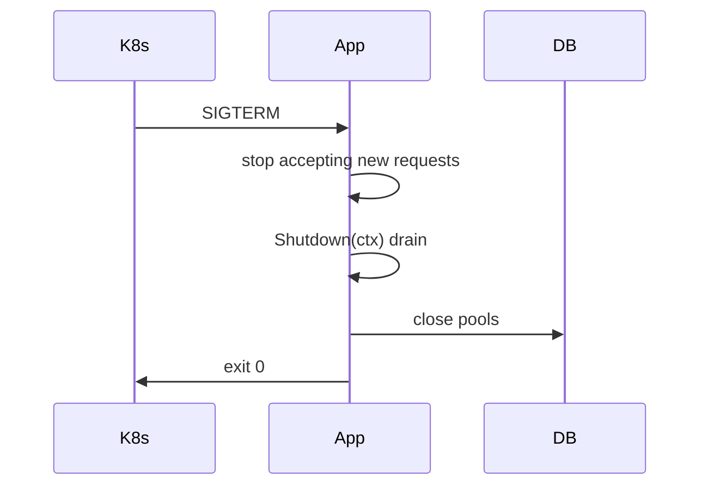

## Quick Revision

- Listen for `SIGTERM` / `SIGINT`.
- `server.Shutdown(ctx)` stops accepting; drains in-flight.
- Cancel root context; close DB pools.

## Production Usage

- Shutdown timeout < K8s `terminationGracePeriodSeconds`.
- See [Context](/golang-cheatsheet/04-concurrency/context/) for cancellation tree.

## Core Concepts



```go
srv := &http.Server{Addr: ":8080", Handler: mux}
go func() { srv.ListenAndServe() }()

stop := make(chan os.Signal, 1)
signal.Notify(stop, syscall.SIGINT, syscall.SIGTERM)
<-stop

ctx, cancel := context.WithTimeout(context.Background(), 30*time.Second)
defer cancel()
_ = srv.Shutdown(ctx)
```

## Production Usage

- Stop accepting new work first.
- Wait for in-flight requests (Shutdown).
- Cancel background workers via context.
- Close DB/redis connections.

## Common Mistakes

- Shutdown timeout longer than K8s grace period.
- Not closing subscribers/consumers.


---

## Describe graceful shutdown for net/http.Server on SIGTERM in Kubernetes.

### Short Answer
In production Go, the decisive factor is context carries cancel/deadline; pass as first param; never store in structs — for: Describe graceful shutdown for net/http.Server on SIGTERM in Kubernetes..

### Detailed Explanation
Link context trees to HTTP/gRPC shutdown and SIGTERM handling when discussing: Describe graceful shutdown for net/http.Server on SIGTERM in Kubernetes..

### Internal Working
Cancel propagates to children; deadlines map to timer-driven cancel — mechanism behind: Describe graceful shutdown for net/http.Server on SIGTERM in Kubernetes..

### Production Notes
Align Shutdown timeout with K8s grace period for: Describe graceful shutdown for net/http.Server on SIGTERM in Kubernetes..

### Common Mistakes
Using context.Background() in libraries or leaking WithoutCancel scopes breaks: Describe graceful shutdown for net/http.Server on SIGTERM in Kubernetes..

### Follow-up Questions
What metric proves drain completed before exit for: Describe graceful shutdown for net/http.Server on SIGTERM in Kubernetes.?

---
## How long should Shutdown context timeout be relative to pod terminationGracePeriodSeconds?

### Short Answer
The architecturally sound response is context carries cancel/deadline; pass as first param; never store in structs — for: How long should Shutdown context timeout be relative to pod terminationGracePeriodSeconds.

### Detailed Explanation
Link context trees to HTTP/gRPC shutdown and SIGTERM handling when discussing: How long should Shutdown context timeout be relative to pod terminationGracePeriodSeconds.

### Internal Working
Cancel propagates to children; deadlines map to timer-driven cancel — mechanism behind: How long should Shutdown context timeout be relative to pod terminationGracePeriodSeconds.

### Production Notes
Align Shutdown timeout with K8s grace period for: How long should Shutdown context timeout be relative to pod terminationGracePeriodSeconds.

### Common Mistakes
Using context.Background() in libraries or leaking WithoutCancel scopes breaks: How long should Shutdown context timeout be relative to pod terminationGracePeriodSeconds.

### Follow-up Questions
What metric proves drain completed before exit for: How long should Shutdown context timeout be relative to pod terminationGracePeriodSeconds?

---
## What resources must be closed on shutdown besides HTTP listeners?

### Short Answer
The mechanism-first explanation is context carries cancel/deadline; pass as first param; never store in structs — for: What resources must be closed on shutdown besides HTTP listeners.

### Detailed Explanation
Link context trees to HTTP/gRPC shutdown and SIGTERM handling when discussing: What resources must be closed on shutdown besides HTTP listeners.

### Internal Working
Cancel propagates to children; deadlines map to timer-driven cancel — mechanism behind: What resources must be closed on shutdown besides HTTP listeners.

### Production Notes
Align Shutdown timeout with K8s grace period for: What resources must be closed on shutdown besides HTTP listeners.

### Common Mistakes
Using context.Background() in libraries or leaking WithoutCancel scopes breaks: What resources must be closed on shutdown besides HTTP listeners.

### Follow-up Questions
What metric proves drain completed before exit for: What resources must be closed on shutdown besides HTTP listeners?

---
<!-- interview-answers:end -->

---

## See Also

- [Previous: Observability](/golang-cheatsheet/06-production-go/observability/)
- [Next: Production Checklists](/golang-cheatsheet/06-production-go/production-checklists/)
- [Go Handbook Index](/golang-cheatsheet/)
- [Top 150 Interview Questions](/golang-cheatsheet/08-interview-guide/top-150-interview-questions/)
