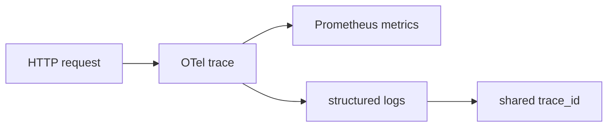

## Quick Revision

- **Metrics:** Prometheus `/metrics` — RED (rate, errors, duration).
- **Tracing:** OpenTelemetry SDK — propagate W3C tracecontext.
- **Logs:** link trace_id for correlation.

## Production Usage

- Alert on SLO burn rate, goroutine count, GC pause, error rate.

## Core Concepts

| Pillar | Go tooling |
| :--- | :--- |
| Metrics | Prometheus client_golang |
| Traces | OpenTelemetry Go SDK |
| Logs | slog + trace_id injection |

## Production Usage

Export RED metrics: request rate, errors, duration histograms. Propagate `traceparent` header through HTTP/gRPC middleware.

## Architect Notes

Observability is part of the **public contract** of a service — define required fields and cardinality limits before launch.

---

## How do you propagate trace and span IDs from OpenTelemetry into logs?

### Short Answer
The senior-level answer is structured logs, metrics, traces, safe config, and graceful shutdown are baseline — for: How do you propagate trace and span IDs from OpenTelemetry into logs.

### Detailed Explanation
Correlate trace_id across logs/metrics; validate config at startup; drain on SIGTERM for: How do you propagate trace and span IDs from OpenTelemetry into logs.

### Internal Working
OTel SDK exports spans; Prometheus RED metrics; slog JSON logs — stack for: How do you propagate trace and span IDs from OpenTelemetry into logs.

### Production Notes
Run staticcheck/govulncheck; protect pprof admin ports for: How do you propagate trace and span IDs from OpenTelemetry into logs.

### Common Mistakes
Missing readiness vs liveness or logging secrets breaks production answers to: How do you propagate trace and span IDs from OpenTelemetry into logs.

### Follow-up Questions
What alert would fire first if: How do you propagate trace and span IDs from OpenTelemetry into logs regresses in prod?

---
## What metrics would you expose from a standard Go HTTP server?

### Short Answer
In production Go, the decisive factor is structured logs, metrics, traces, safe config, and graceful shutdown are baseline — for: What metrics would you expose from a standard Go HTTP server.

### Detailed Explanation
Correlate trace_id across logs/metrics; validate config at startup; drain on SIGTERM for: What metrics would you expose from a standard Go HTTP server.

### Internal Working
OTel SDK exports spans; Prometheus RED metrics; slog JSON logs — stack for: What metrics would you expose from a standard Go HTTP server.

### Production Notes
Run staticcheck/govulncheck; protect pprof admin ports for: What metrics would you expose from a standard Go HTTP server.

### Common Mistakes
Missing readiness vs liveness or logging secrets breaks production answers to: What metrics would you expose from a standard Go HTTP server.

### Follow-up Questions
What alert would fire first if: What metrics would you expose from a standard Go HTTP server regresses in prod?

---
## How do you configure RED versus USE metrics for Go microservices?

### Short Answer
The architecturally sound response is structured logs, metrics, traces, safe config, and graceful shutdown are baseline — for: How do you configure RED versus USE metrics for Go microservices.

### Detailed Explanation
Correlate trace_id across logs/metrics; validate config at startup; drain on SIGTERM for: How do you configure RED versus USE metrics for Go microservices.

### Internal Working
OTel SDK exports spans; Prometheus RED metrics; slog JSON logs — stack for: How do you configure RED versus USE metrics for Go microservices.

### Production Notes
Run staticcheck/govulncheck; protect pprof admin ports for: How do you configure RED versus USE metrics for Go microservices.

### Common Mistakes
Missing readiness vs liveness or logging secrets breaks production answers to: How do you configure RED versus USE metrics for Go microservices.

### Follow-up Questions
What alert would fire first if: How do you configure RED versus USE metrics for Go microservices regresses in prod?

---
## What alerting rules catch goroutine leaks before OOM?

### Short Answer
In production Go, the decisive factor is bound concurrency, define goroutine exit, and choose mutex vs channel deliberately — for: What alerting rules catch goroutine leaks before OOM.

### Detailed Explanation
Channels orchestrate; mutexes protect shared state; WaitGroup/ctx coordinate lifecycle — apply to: What alerting rules catch goroutine leaks before OOM.

### Internal Working
Unbuffered channels rendezvous; buffered channels decouple until full; nil chans disable select cases — internals for: What alerting rules catch goroutine leaks before OOM.

### Production Notes
Propagate context, add backpressure, and test with `-race` when implementing: What alerting rules catch goroutine leaks before OOM.

### Common Mistakes
Leaked goroutines, send-on-closed-channel panics, and select spin loops are frequent failures in: What alerting rules catch goroutine leaks before OOM.

### Follow-up Questions
How would you structure shutdown so: What alerting rules catch goroutine leaks before OOM cannot hang the process?

---
<!-- interview-answers:end -->

---

## See Also

- [Previous: Configuration Management](/golang-cheatsheet/06-production-go/configuration-management/)
- [Next: Graceful Shutdown](/golang-cheatsheet/06-production-go/graceful-shutdown/)
- [Go Handbook Index](/golang-cheatsheet/)
- [Top 150 Interview Questions](/golang-cheatsheet/08-interview-guide/top-150-interview-questions/)
