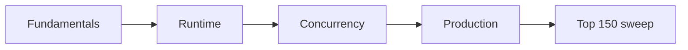

# Go Interview Revision Path

| Block | Time | Focus |
| :--- | :--- | :--- |
| **1** | 2h | [Interfaces](/golang-cheatsheet/02-core-go/interfaces/) · [Slices](/golang-cheatsheet/01-fundamentals/slices/) · [Errors](/golang-cheatsheet/02-core-go/error-handling/) |
| **2** | 2h | [Scheduler](/golang-cheatsheet/03-go-internals/scheduler/) · [Memory Model](/golang-cheatsheet/03-go-internals/memory-model/) · [GC](/golang-cheatsheet/03-go-internals/garbage-collection/) |
| **3** | 2h | [Channels](/golang-cheatsheet/04-concurrency/channels/) · [Context](/golang-cheatsheet/04-concurrency/context/) · [Patterns](/golang-cheatsheet/04-concurrency/concurrency-patterns/) |
| **4** | 2h | [Profiling](/golang-cheatsheet/05-performance/profiling/) · [Graceful Shutdown](/golang-cheatsheet/06-production-go/graceful-shutdown/) |
| **5** | 2h | [Top 150 Questions](/golang-cheatsheet/08-interview-guide/top-150-interview-questions/) |

