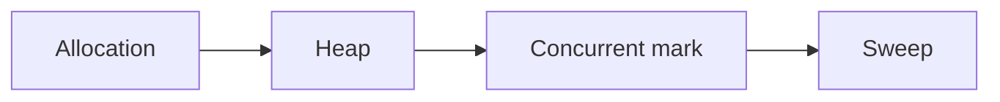

## At a Glance

- Go uses a **non-generational, concurrent tri-color mark-sweep** collector. Tuning via **`GOGC`** (default 100). **STW** pauses are short but exist.

---

## Reference Tables



| Knob | Effect |
| :--- | :--- |
| `GOGC=100` | Heap doubles before next GC cycle |
| `GOGC=off` | Disable GC (debug only) |
| `GODEBUG=gctrace=1` | Log GC events |
| `runtime.GC()` | Force GC — rarely in prod |

| Goal | Approach |
| :--- | :--- |
| Less GC CPU | Reduce allocations — pools, reuse buffers |
| Lower latency | Fewer pointers, smaller heap |
| Profile | `pprof` heap/allocs |

---

## Snippets

```go
// prefer sync.Pool for short-lived buffers
// prefer value semantics for hot structs
// preallocate slices: make([]T, 0, n)
```

---

## Internals & Gotchas

- Finalizers (`runtime.SetFinalizer`) run unpredictably — don't rely for cleanup.
- Large heap = longer mark phase — allocation rate matters more than live set alone.
- `uintptr` is not a GC root — keep pointer alive.

---

## Production Notes

- See [Effective Go](https://go.dev/doc/effective_go) for idioms.

---

## See Also

- [Previous: Memory Model](/golang-cheatsheet/memory-model/)
- [Next: Modules](/golang-cheatsheet/go-modules/)
- [Go Cheat Sheet Index](/golang-cheatsheet/)
