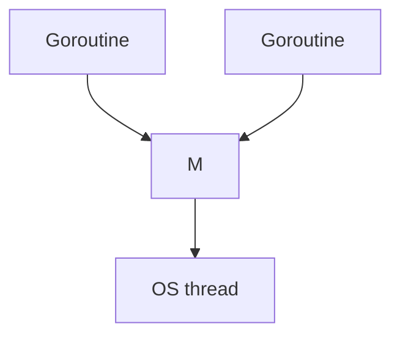

## At a Glance

- **Goroutines** are lightweight threads scheduled by the Go runtime on OS threads (`GOMAXPROCS`). Start with `go f()`. Always know **how they exit** and how errors propagate.

---

## Reference Tables



| Concept | Detail |
| :--- | :--- |
| Stack | Starts small, grows/shrinks |
| Scheduler | M:N — work stealing |
| `GOMAXPROCS` | Default `runtime.NumCPU()` |
| Leak | Blocked forever on send/recv |

```go
go func() {
    if err := work(); err != nil {
        log.Printf("work: %v", err)
    }
}()

// wait for completion
var wg sync.WaitGroup
wg.Add(1)
go func() { defer wg.Done(); work() }()
wg.Wait()
```

---

## Snippets

```go
errCh := make(chan error, 1)
go func() {
    errCh <- doWork()
}()
if err := <-errCh; err != nil {
    return err
}
```

---

## Internals & Gotchas

- Main exiting kills all goroutines — no graceful shutdown by default.
- Panic in goroutine crashes process unless recovered.
- Unbounded `go` spawn → OOM; use worker pools or semaphores.

---

## Production Notes

- See [Effective Go](https://go.dev/doc/effective_go) for idioms.

---

## See Also

- [Previous: Maps](/golang-cheatsheet/maps/)
- [Next: Channels](/golang-cheatsheet/channels/)
- [Go Cheat Sheet Index](/golang-cheatsheet/)
