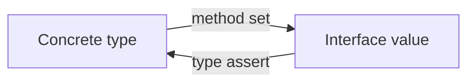

## At a Glance

- Interfaces are **implicit** — no `implements` keyword. A type satisfies an interface if it has the required methods. The **nil interface trap** (`var i io.Reader = (*bytes.Buffer)(nil)`) is a classic interview topic.

---

## Reference Tables



| Concept | Detail |
| :--- | :--- |
| Interface value | `(type, data)` pair |
| Nil interface | `var i io.Reader` — both nil |
| Typed nil | Interface holding nil pointer — **not equal to nil** |
| Empty interface | `any` / `interface{}` |
| Satisfaction | Pointer vs value receiver affects method set |

| Operation | Code |
| :--- | :--- |
| Type assertion | `v := i.(T)` or `v, ok := i.(T)` |
| Type switch | `switch v := i.(type) { case T: }` |
| Compile-time check | `var _ io.Reader = (*MyType)(nil)` |

---

## Snippets

```go
type Reader interface {
    Read(p []byte) (n int, err error)
}

func process(r Reader) error {
    buf := make([]byte, 1024)
    _, err := r.Read(buf)
    return err
}

// nil trap
var buf *bytes.Buffer
var r io.Reader = buf
fmt.Println(r == nil) // false
```

---

## Internals & Gotchas

- Keep interfaces **small** — accept interfaces, return concrete types.
- Value receiver methods → value and pointer satisfy; pointer-only methods → only pointer satisfies.
- Don't use `any` when a specific interface documents intent.

---

## Production Notes

- See [Effective Go](https://go.dev/doc/effective_go) for idioms.

---

## See Also

- [Previous: Structs](/golang-cheatsheet/structs/)
- [Next: Pointers](/golang-cheatsheet/pointers/)
- [Go Cheat Sheet Index](/golang-cheatsheet/)
