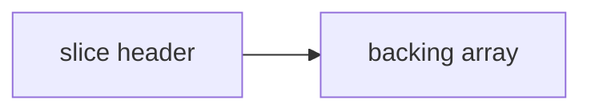

## At a Glance

- Slices are **views** over an array: `(pointer, len, cap)`. **`append`** may reallocate. Slices are reference-like but not pointers.

---

## Reference Tables



| Field | Meaning |
| :--- | :--- |
| `len` | Visible elements |
| `cap` | From ptr to end of backing array |
| `append` | Grows cap ~2x when needed |

| Op | Code |
| :--- | :--- |
| Make | `s := make([]int, 0, 64)` |
| Subslice | `s[low:high]` shares backing array |
| Copy | `copy(dst, src)` |
| Clear (1.21+) | `clear(s)` |

---

## Snippets

```go
s := []int{1, 2, 3}
s = append(s, 4)

sub := s[1:3] // shares backing array
sub[0] = 99   // mutates s[1]

// avoid leak: sub = append(sub[:0:0], sub...)
```

---

## Internals & Gotchas

- Subslices retain backing array → memory leaks if large array, small slice kept.
- `append` to subsliced header may overwrite shared region if cap allows.
- `nil` slice vs empty slice: JSON `null` vs `[]` if you care.

---

## Production Notes

- See [Effective Go](https://go.dev/doc/effective_go) for idioms.

---

## See Also

- [Previous: Errors](/golang-cheatsheet/error-handling/)
- [Next: Arrays](/golang-cheatsheet/arrays/)
- [Go Cheat Sheet Index](/golang-cheatsheet/)
