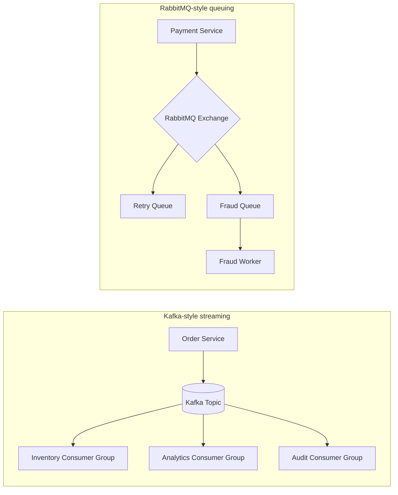

## 1. Executive Summary

**Kafka** is a distributed **commit log** optimized for high-throughput event streaming, replay, and multiple consumer groups. **RabbitMQ** is a classic **message broker** (AMQP) optimized for flexible routing, per-message acknowledgements, and task-queue workloads.

Neither replaces the other — they solve different integration shapes. Pick Kafka when events are a first-class product asset (analytics, audit, replay). Pick RabbitMQ when you need routing, priority queues, and simpler operational semantics for task distribution.

---

## 2. What Problem It Solves

| Pain | Kafka angle | RabbitMQ angle |
| :--- | :--- | :--- |
| Massive event fan-out | Durable log; many consumer groups read independently | Exchanges + queues; fan-out via bindings |
| Replay after bug fix | Reset offset and reprocess | Dead-letter + manual replay patterns |
| Task workers with routing | Possible but awkward | Native routing keys and headers |
| Ordering per entity | Partition key discipline | Single active consumer or consistent-hash exchange |

---

## 3. Where It Fits in Architecture

---

## 4. When to Choose Kafka

- Event volume is **high** (millions/day+) and growing
- **Multiple independent consumers** need the same stream (inventory, BI, search index)
- **Replay** and event sourcing are requirements
- You have (or will hire) staff to run **Kafka ops** — partitions, ISR, rebalancing

---

## 5. When Not to Choose Kafka / Choose RabbitMQ Instead

- Workload is **task queue** with complex routing and per-message ack
- Team needs **quick win** without ZooKeeper/KRaft cluster operations
- Messages should **disappear after ack** — not retained for days
- Low-latency RPC-style request/reply over AMQP is the dominant pattern

---

## 6. Popular Tools / Products

| Ecosystem | Kafka | RabbitMQ |
| :--- | :--- | :--- |
| **Self-hosted** | Apache Kafka, Redpanda | RabbitMQ, ActiveMQ (JMS alternative) |
| **AWS** | MSK, Kinesis (different model) | Amazon MQ |
| **Azure** | Event Hubs (Kafka protocol) | Service Bus (different model) |
| **GCP** | Pub/Sub + Dataflow | Cloud AMQP partners / self-hosted |

See also: [Kafka](/kafka-handbook/kafka/) · [RabbitMQ](/kafka-handbook/rabbitmq/) · [How to Choose a Message Broker](/technology-playbook/how-to-choose-message-broker/)

---

## 7. Trade-offs


| Dimension | Kafka | RabbitMQ |
| :--- | :--- | :--- |
| **Mental model** | Append-only distributed log | Broker routes messages to queues |
| **Throughput** | Very high with batching | High; lower than Kafka at extreme scale |
| **Retention** | Configurable days/weeks | Removed after ack (unless DLQ) |
| **Replay** | First-class (offset reset) | Manual / DLQ replay |
| **Ordering** | Per partition only | Per queue with single consumer |
| **Routing** | Topic + consumer group | Exchanges, bindings, headers |
| **Ops complexity** | Higher (partitions, rebalancing) | Moderate (classic broker HA) |
| **Protocol** | Binary Kafka protocol | AMQP 0-9-1 (+ MQTT, STOMP plugins) |
| **Typical fit** | Event streaming, CDC, analytics | Task queues, integration hub |




---

## 8. Real-World Example

**Global retailer order platform**

| Flow | Choice | Why |
| :--- | :--- | :--- |
| `OrderPlaced` events to warehouse, CRM, and data lake | **Kafka** | One stream, three consumer groups, replay after schema fix |
| Payment retry with exponential backoff | **RabbitMQ** | TTL queues + dead-letter for retry ladder |
| Fraud scoring task dispatch | **RabbitMQ** | Priority queue + routing by payment method |

**Anti-pattern:** Using RabbitMQ as the analytics source of truth with no retained log — BI team cannot rebuild state after a bad deploy.

---

## 9. Failure Scenarios

| Failure | Kafka symptom | RabbitMQ symptom |
| :--- | :--- | :--- |
| Hot partition key | One broker overloaded | Less common — queue skew instead |
| Consumer lag | Analytics hours behind | Queue depth alerts |
| Poison message | Stuck offset unless skip/DLT | DLQ fills; workers idle |
| Cluster upgrade | Rebalance storm | Classic mirrored queue migration pain |

---

## 10. Best Practices

1. **Do not** force one broker for everything — hybrid is normal in enterprises.
2. Define **delivery semantics** (at-least-once + idempotent consumers) explicitly.
3. For Kafka, design **partition keys** early — customer ID, order ID, not random UUID.
4. For RabbitMQ, standardize **DLQ + replay runbook** before production.
5. Propagate **trace IDs** in headers regardless of broker.

---

## 11. Interview Answer


"Kafka is a durable **log** — producers append, consumers track offsets, multiple consumer groups read the same stream, and you can replay. RabbitMQ is a **broker** — messages routed to queues, acked, and removed; great for task distribution and complex routing. I'd pick Kafka for high-volume event streaming, CDC, and analytics fan-out. I'd pick RabbitMQ for work queues, priority routing, and teams that want classic AMQP semantics without running a large Kafka cluster. In both cases I'd design idempotent consumers and dead-letter handling."


---

## 12. Related Topics

- [Apache Kafka](/kafka-handbook/kafka/) · [RabbitMQ](/kafka-handbook/rabbitmq/)
- [How to Choose a Message Broker](/technology-playbook/how-to-choose-message-broker/)
- [Event-Driven Architecture](/technology-playbook/event-driven-architecture/) · [Microservices 1.1 Event-Driven](/microservices/event-driven-architecture-log-streaming/)
- [Point-to-Point Message Queues](/microservices/point-to-point-message-queues/)
