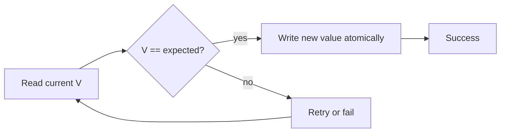

Lock-free code uses **hardware CAS** (compare-and-swap) instead of mutexes for hot counters, queues, and map bins. Interviewers probe CAS mechanics, the **ABA problem**, when to pick `LongAdder`, and how `java.util.concurrent.atomic` maps to CPU instructions.



---

## What is CAS?

**Difficulty:** Medium · **Time:** 1–2 min

### Short Answer

Compare-And-Swap atomically updates a memory location **only if** the current value equals an expected value — a hardware primitive (`cmpxchg` on x86).

### Detailed Explanation

Java exposes CAS via `sun.misc.Unsafe` (internal) and public APIs: `AtomicInteger.compareAndSet`, `AtomicReference`, `VarHandle` (Java 9+). Lock-free algorithms **retry** when CAS fails due to contention instead of parking threads. `AtomicInteger.incrementAndGet` loops: read, compute, CAS until success. CHM uses CAS on empty bins before escalating to synchronized bin heads.

### Internal Working

On x86: `LOCK CMPXCHG`. Contended CAS causes cache-line bouncing — `LongAdder` stripes to reduce this.

### Code Example

```java
AtomicInteger counter = new AtomicInteger(0);

// incrementAndGet: CAS loop internally
int next = counter.incrementAndGet();

// explicit CAS — returns false if another thread won
boolean ok = counter.compareAndSet(5, 6);
```

### Production Notes

Prefer atomics for metrics and single-word updates; use locks when invariants span multiple fields.

### Common Mistakes

- Assuming CAS makes `i++` on a plain `int` atomic — need `AtomicInteger` or synchronized.
- Spinning forever on hot CAS without backoff or striping.

### Interview Questions

1. Walk through `incrementAndGet` at the CPU level — what happens on failure?
2. When would you choose a lock over CAS for a counter?
3. How does CAS relate to optimistic concurrency in databases?

### Follow-up Questions

- CAS vs lock — when prefer each?
- What is lock-free vs wait-free?

---
## CAS vs synchronized — when prefer each?

**Difficulty:** Medium · **Time:** 2 min

### Short Answer

CAS for **single-word** optimistic updates under moderate contention; `synchronized`/`Lock` when you must hold **multi-field invariants** or block waiting.

### Detailed Explanation

CAS wins for counters, stack heads, and CHM-style structures where failure = retry. Locks win when work inside the critical section is non-trivial, when you need `wait`/`notify`, or when retry storms would waste CPU. `ReentrantLock` with `tryLock` blends both: optimistic attempt, fallback to blocking.

### Production Notes

Micrometer counters: `LongAdder`. Sequence IDs needing strict ordering: `AtomicLong` or DB sequence.

### Common Mistakes

- Using CAS loops to guard three related fields — use a lock or transactional model.

### Interview Questions

1. Design a rate limiter with atomics only — what breaks?
2. Why can contended CAS be slower than a short lock?

---
## ABA problem?

**Difficulty:** Hard · **Time:** 2–3 min

### Short Answer

Value changes **A → B → A**; a CAS comparing against expected **A** succeeds even though the structure changed in between.

### Detailed Explanation

Classic in lock-free **stacks/queues** that recycle nodes — thread 1 pops A, thread 2 pops/modifies/pushes A back, thread 1's CAS still sees A. Fixes: **versioned references** (`AtomicStampedReference`, `AtomicMarkableReference`), **hazard pointers**, or **epoch-based reclamation** (non-blocking memory management). Java's `ConcurrentLinkedQueue` uses safe algorithms; don't hand-roll lock-free lists without studying reclamation.

### Common Mistakes

- Ignoring ABA when reusing object pools with CAS-linked structures.
- Assuming `AtomicReference` alone prevents ABA — it does not without stamps.

### Interview Questions

1. Why doesn't `AtomicInteger` suffer ABA for a counter?
2. When would you use `AtomicStampedReference` in production?
3. How do hazard pointers differ from version stamps?

### Follow-up Questions

- Where does ABA matter outside Java?

---
## LongAdder vs AtomicLong?

**Difficulty:** Medium · **Time:** 1–2 min

### Short Answer

`LongAdder` **stripes** increments across internal cells — lower contention under many writers; `AtomicLong` holds a **single** value with CAS on every update.

### Detailed Explanation

`LongAdder.add` spreads writes; `sum()` aggregates cells (not a linearizable snapshot under concurrent adds, but fine for metrics). Use `AtomicLong` when you need **exact current value** on every read, CAS-based sequences, or `getAndIncrement` semantics visible to other threads immediately.

### Code Example

```java
LongAdder requests = new LongAdder();
requests.increment();
long approx = requests.sum();  // good for dashboards

AtomicLong sequence = new AtomicLong();
long id = sequence.incrementAndGet();  // strict unique ID
```

### Production Notes

Request/error counters: `LongAdder`. Global sequence / ledger balance: `AtomicLong` or DB.

### Interview Questions

1. Is `sum()` on LongAdder linearizable? When does that matter?
2. How would you expose LongAdder to Prometheus?

### Follow-up Questions

- DoubleAdder vs AtomicDouble?

---
## AtomicReference use cases?

**Difficulty:** Medium · **Time:** 1–2 min

### Short Answer

Holds a reference updated atomically — lock-free **swap** of immutable snapshots (config, cache entry, state object).

### Detailed Explanation

Pattern: keep an **immutable** object; CAS replaces whole reference when config changes. Readers never see torn state. `AtomicReference<Config>` + `compareAndSet(old, new)` after validation. Used in `ConcurrentHashMap` treeify transitions and lazy initialization patterns.

### Code Example

```java
AtomicReference<Config> live = new AtomicReference<>(Config.defaults());

void publish(Config next) {
    Config prev;
    do {
        prev = live.get();
        if (!next.isValid()) throw new IllegalArgumentException();
    } while (!live.compareAndSet(prev, next));
}
```

### Interview Questions

1. Why must referenced objects be immutable for safe CAS swap?
2. AtomicReference vs volatile reference field?

---
## VarHandle vs legacy Atomic*?

**Difficulty:** Hard · **Time:** 2 min

### Short Answer

`VarHandle` (Java 9+) provides typed CAS/volatile access on fields and arrays — foundation for future intrinsics; `Atomic*` classes are ergonomic wrappers.

### Detailed Explanation

VarHandles enable off-heap / array element CAS with fence modes (`plain`, `opaque`, `release`, `acquire`, `volatile`). Library authors use them; application code usually sticks to `AtomicInteger` etc. Conceptually same CAS semantics.

### Interview Questions

1. What fence modes does VarHandle expose and why?
2. How does this relate to `Unsafe` deprecation path?

---
## Lock-free vs wait-free?

**Difficulty:** Hard · **Time:** 2 min

### Short Answer

**Lock-free:** system-wide progress — some thread completes in finite steps. **Wait-free:** every thread completes in bounded steps regardless of others.

### Detailed Explanation

Most `java.util.concurrent.atomic` ops are lock-free (retry under contention). True wait-free structures are rare in JDK — harder to implement. Interview answer: lock-free is practical JDK goal; wait-free is stronger theoretical guarantee.

### Interview Questions

1. Is `ConcurrentLinkedQueue.offer` wait-free?
2. Why do production systems rarely require wait-freedom?

---
## Rapid-Fire Interview Drill

### 1. Explain CAS in one sentence to a junior.

Atomic update if-and-only-if current value matches expected; retry on failure.

---

### 2. Your metrics spike CPU after switching to AtomicLong — fix?

Stripe with LongAdder or sample; check cache-line false sharing.

---

### 3. Can you implement a lock-free stack with only AtomicReference?

Yes, but address ABA and safe node reclamation.

---

### 4. When does CHM use CAS vs synchronized bin lock?

Empty bin CAS install; collision chains synchronize on bin head.

---

### 5. How do you test lock-free code?

Stress tests, jcstress, Thread.sleep jitter — not single-threaded unit tests only.

---
