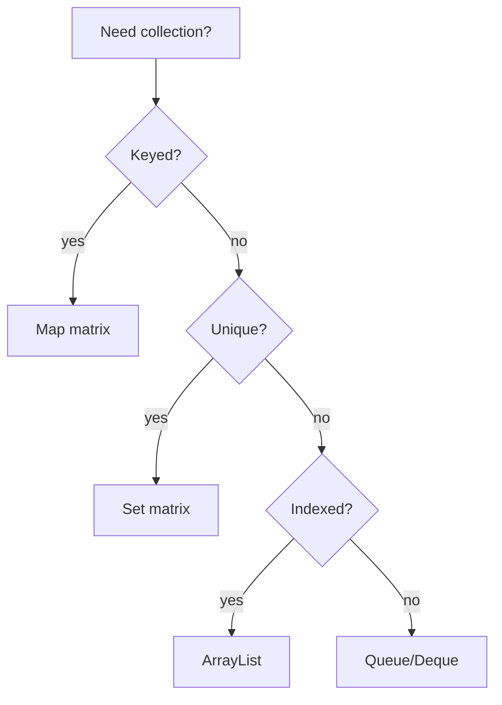

Interview-oriented collection selection for senior engineers.

| Need | Default | Alternatives |
| :--- | :--- | :--- |
| General list | `ArrayList` | `LinkedList` rare |
| Unique unordered | `HashSet` | `LinkedHashSet` for order |
| Unique sorted | `TreeSet` | `ConcurrentSkipListSet` |
| Key-value | `HashMap` | See [Map Implementations](/java-engineering/map-implementations/) |
| FIFO / stack | `ArrayDeque` | `LinkedBlockingQueue` bounded |
| Priority | `PriorityQueue` | Not thread-safe |
| Concurrent map | `ConcurrentHashMap` | Not `Collections.synchronizedMap` for writes |
| LRU cache | `LinkedHashMap` access-order | Caffeine in production |

| List op | ArrayList | LinkedList |
| :--- | :---: | :---: |
| `get(i)` | **O(1)** | O(n) |
| `add(end)` | O(1)* | O(1) |
| `add(i)` | O(n) | O(n) |

| Set op | HashSet | TreeSet |
| :--- | :---: | :---: |
| `add/contains` | O(1) avg | O(log n) |
| Iteration order | Undefined | Sorted |

---

## ArrayList vs LinkedList for 10M random reads?

### Short Answer

`ArrayList` — O(1) indexed access. `LinkedList` is O(n) per get.

### Detailed Explanation

LinkedList rarely wins on modern CPUs due to cache misses walking nodes. Use ArrayList unless deque operations at both ends without index access.

### Follow-up Questions

- When is LinkedList justified?

---
## When LinkedHashMap over HashMap?

### Short Answer

Insertion or access-order iteration, LRU caches, predictable debugging.

### Detailed Explanation

Maintains doubly-linked list through entries. Access-order mode (`true` ctor flag) moves entries on `get` — classic LRU with `removeEldestEntry`.

### Production Notes

Pre-size: `new HashMap<>(expectedSize / 0.75f + 1)`.

---
