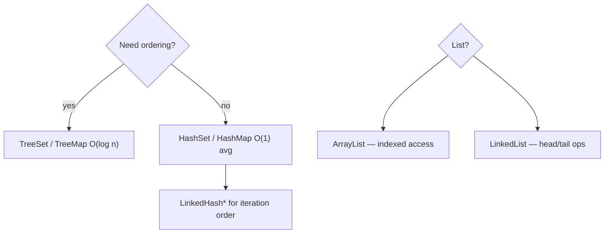

## Executive Summary

Use this page for **last-minute interview revision**. Average-case complexities assume good hash distribution; worst-case hash collisions degrade Hash* structures to **O(n)**. Tree-based structures guarantee **O(log n)** at the cost of ordering overhead.

---

## Why It Exists

| Need | How this page helps |
| :--- | :--- |
| Whiteboard "which collection?" | Pick structure by operation profile |
| Complexity probes | Answer get/put/contains in one glance |
| Trade-off questions | Array vs linked vs hash vs tree |

---

## Key Concepts



---

## List Implementations

| Operation | ArrayList | LinkedList | Vector |
| :--- | :---: | :---: | :---: |
| `get(i)` / `set(i)` | **O(1)** | O(n) | **O(1)** |
| `add(end)` | O(1)* | **O(1)** | O(1)* |
| `add(middle)` | O(n) | O(n) | O(n) |
| `remove(i)` | O(n) | O(n) | O(n) |
| `contains` | O(n) | O(n) | O(n) |
| Thread-safe | No | No | Yes (legacy) |

\* Amortized; occasional resize for `ArrayList`.

---

## Set Implementations

| Operation | HashSet | LinkedHashSet | TreeSet |
| :--- | :---: | :---: | :---: |
| `add` | **O(1)** avg | **O(1)** avg | O(log n) |
| `remove` | **O(1)** avg | **O(1)** avg | O(log n) |
| `contains` | **O(1)** avg | **O(1)** avg | O(log n) |
| Iteration order | Undefined | Insertion | Sorted |
| `null` element | 1 allowed | 1 allowed | No (if natural order) |

---

## Map Implementations

| Operation | HashMap | LinkedHashMap | TreeMap | ConcurrentHashMap |
| :--- | :---: | :---: | :---: | :---: |
| `get` / `put` | **O(1)** avg | **O(1)** avg | O(log n) | **O(1)** avg |
| `remove` | **O(1)** avg | **O(1)** avg | O(log n) | **O(1)** avg |
| `containsKey` | **O(1)** avg | **O(1)** avg | O(log n) | **O(1)** avg |
| `containsValue` | O(n) | O(n) | O(n) | O(n) |
| Thread-safe | No | No | No | **Yes** |
| Null key | 1 | 1 | No | No |

---

## Queue / Deque

| Operation | PriorityQueue | ArrayDeque |
| :--- | :---: | :---: |
| `offer` / `poll` | O(log n) | **O(1)** |
| `peek` | O(1) | O(1) |
| Random access | No | No |
| Ordering | Heap priority | FIFO / LIFO |

---

## Syntax

| Need | Choose |
| :--- | :--- |
| Default map | `HashMap` |
| LRU cache | `LinkedHashMap` (access-order, `removeEldestEntry`) |
| Sorted keys | `TreeMap` |
| Concurrent map | `ConcurrentHashMap` |
| Default list | `ArrayList` |
| Stack (prefer) | `ArrayDeque` — not `Stack` class |

---

## Example

```java
// O(1) average membership
Set<String> tags = new HashSet<>(List.of("java", "jvm"));

// O(log n) sorted navigation
NavigableMap<Integer, String> ranks = new TreeMap<>();
ranks.put(1, "gold");

// O(1) indexed read
List<String> rows = new ArrayList<>(1000);
String row = rows.get(500);
```

---

## Internal Working

- **Hash*** structures: `hashCode` → bucket → `equals` chain or tree (Java 8+ treeify at length 8).
- **Tree*** structures: red-black tree on comparison order.
- **ArrayList**: contiguous array; `grow` ≈ 1.5× copy.
- **CHM**: lock striping / CAS — see [ConcurrentHashMap Internals](/java-engineering/concurrenthashmap-internals/).

---

## Common Mistakes

- Using `LinkedList` for random access — always `ArrayList`.
- Using `Vector` / `Hashtable` in new code — legacy synchronization overhead.
- Assuming `HashMap` iteration order is stable across runs.
- `ConcurrentHashMap` `size()` — approximate under contention (varies by JDK).

---

## Best Practices

- State **average vs worst** case in interviews when discussing Hash*.
- Mention **iteration** cost: O(capacity + size) for hash maps with sparse tables.
- For read-heavy concurrent maps → `ConcurrentHashMap`; for read-heavy immutable → `Map.copyOf`.

---

## Interview Questions


**Q:** ArrayList vs LinkedList for a million random reads?

**A:** `ArrayList` — O(1) indexed access. `LinkedList` is O(n) per `get(i)`; only wins for frequent head/tail insert/remove on very large lists where middle access is rare.



**Q:** When is TreeMap worth the O(log n) cost?

**A:** When you need sorted keys, range queries (`subMap`, `floorKey`), or navigable operations. Otherwise `HashMap` is faster average case.


---

## Related Topics

- [Next: Stream Operations (Interview)](/java-engineering/stream-operations-interview/)
- [HashMap](/java-engineering/hashmap/)
- [Comparable vs Comparator](/java-engineering/comparable-vs-comparator/)
- [Java Engineering Handbook Index](/java-engineering/)
