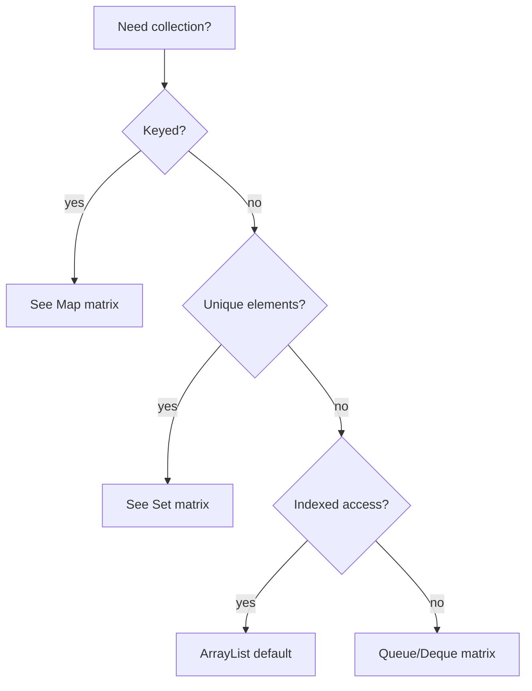

## At a Glance

- Start from access pattern: indexed, keyed, unique, FIFO/LIFO, priority, concurrent.
- Ordering costs O(log n) — pay only when you need sorted or predictable iteration.
- Null policy differs per implementation — document team convention.
- Iteration over hash maps: O(capacity + size) — factor in table load.

---

## Reference Tables



| Need | Default | Alternatives |
| :--- | :--- | :--- |
| General list | `ArrayList` | `LinkedList` rare |
| Unique unordered | `HashSet` | `LinkedHashSet` for order |
| Unique sorted | `TreeSet` | `ConcurrentSkipListSet` concurrent |
| Key-value | `HashMap` | See map page |
| FIFO queue | `ArrayDeque` | `LinkedBlockingQueue` bounded |
| Priority | `PriorityQueue` | Not thread-safe |
| Concurrent map | `ConcurrentHashMap` | Never `Collections.synchronizedMap` for heavy write |
| LRU cache | `LinkedHashMap` access-order | Caffeine for production |

---

## Snippets

```java
// LRU via LinkedHashMap
Map<K,V> lru = new LinkedHashMap<>(16, 0.75f, true) {
    @Override protected boolean removeEldestEntry(Map.Entry<K,V> e) {
return size() > MAX;
    }
};
```

---

## Internals & Gotchas

- `Arrays.asList` fixed-size — `set` OK, `add` throws.
- `List.of`/`Map.of` immutable — no nulls.
- `subList` backed by parent — structural changes invalidate.

---

## Production Notes

- State average vs worst case for hash structures in design docs.
- Pre-size maps: `new HashMap<>(expectedSize / 0.75f + 1)`.
- For read-mostly immutable snapshots: `Map.copyOf`, `List.copyOf`.

---

## Interview Probes


{< interview-answer >}
**Q:** Choose collection for 10M random reads by index?

**A:** `ArrayList` — O(1) get. `LinkedList` O(n) per access.
{< /interview-answer >}

{< interview-answer >}
**Q:** When LinkedHashMap over HashMap?

**A:** Insertion/access-order iteration, LRU caches, predictable debugging. Small memory overhead for links.
{< /interview-answer >}

---

## See Also

- [Previous: Object Contract](/java-engineering/interfaces-and-object-contract/)
- [Next: List/Set/Queue](/java-engineering/list-set-queue-comparison/)
- [Java Engineering Handbook Index](/java-engineering/)
