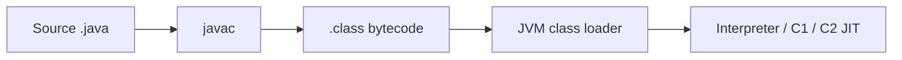

## At a Glance

- Eight primitives + `void`; wrappers box on demand — watch autoboxing in generics/collections.
- `final` on reference = binding immutable; object state may still mutate.
- Arrays are covariant (`String[]` is `Object[]`); generics are invariant.
- Switch: classic + pattern matching (17+) — exhaustiveness required on sealed hierarchies.

---

## Reference Tables

| Primitive | Size | Default | Wrapper | Notes |
| :--- | :---: | :---: | :--- | :--- |
| `byte` | 8b | 0 | `Byte` | Rare except IO/buffers |
| `short` | 16b | 0 | `Short` | |
| `int` | 32b | 0 | `Integer` | Prefer over `long` unless needed |
| `long` | 64b | 0L | `Long` | Suffix `L` on literals |
| `float` | 32b | 0.0f | `Float` | Avoid for money |
| `double` | 64b | 0.0d | `Double` | Default FP type |
| `char` | 16b UTF-16 | `\u0000` | `Character` | Not full Unicode code point |
| `boolean` | 1b* | `false` | `Boolean` | *JVM-dependent |

| Control | Gotcha |
| :--- | :--- |
| Enhanced `for` | No index; can't remove during iteration on `List` |
| `switch` on `String` | NPE if selector null (classic switch) |
| `break`/`continue` labels | Rare — prefer extract method |
| Varargs | Last param; overload resolution prefers fixed arity |



---

## Snippets

```java
// Prefer primitives in hot loops; avoid Integer in collections if millions of entries
int sum = 0;
for (int i = 0; i < n; i++) sum += values[i];

// Pattern switch (21+) — exhaustiveness on sealed types
switch (shape) {
    case Circle c -> area(c.radius());
    case Rectangle r -> area(r.w(), r.h());
}

// var (10+) — local only, not fields/parameters
var map = Map.of("k", 1);
```

---

## Internals & Gotchas

- Widening conversions are implicit; narrowing requires cast.
- `==` on wrappers compares references unless unboxed; use `Objects.equals`.
- `static` init order: static fields → static blocks → instance chain on `new`.
- `record` components are `final` fields with canonical ctor and generated equals/hashCode.

---

## Production Notes

- Enable `-Xlint:all` in CI; fix deprecation before LTS upgrades.
- Avoid `Vector`/`Hashtable`; use `ArrayList` + external sync or concurrent types.
- Money: `BigDecimal` + `MathContext`, never `double`.

---

## Interview Probes


{< interview-answer >}
**Q:** Why is `float`/`double` bad for currency?

**A:** `double` is binary FP — decimal fractions like 0.1 are inexact. Use `BigDecimal` with explicit scale/rounding mode.
{< /interview-answer >}

{< interview-answer >}
**Q:** Covariant arrays vs invariant generics?

**A:** Arrays carry runtime element type → `ArrayStoreException` at runtime. Generics erase type params — compiler enforces safety; no `new List<String>[10]`.
{< /interview-answer >}

---

## See Also

- [Next: Strings & Enums](/java-engineering/strings-and-enums-ref/)
- [Java Engineering Handbook Index](/java-engineering/)
