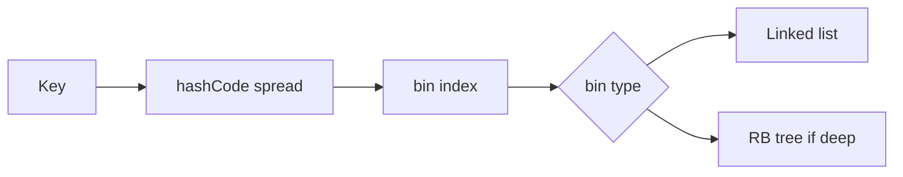

## At a Glance

- Array of bins; index = `(n-1) & hash` after spread (`hash ^ hash>>>16`).
- Load factor 0.75 — resize 2× when `size > threshold`.
- Bin length ≥8 and treeify threshold → red-black tree per bin (Java 8+).
- JDK 8+ linked list bins; treeify on collision depth.

---

## Reference Tables

| Constant | Typical value | Meaning |
| :--- | :---: | :--- |
| Default capacity | 16 | Power of 2 |
| Load factor | 0.75 | Space/time trade-off |
| Treeify threshold | 8 | List → tree in bin |
| Untreeify threshold | 6 | Tree → list when shrink |

| Operation | Average | Worst (attacks/poor hash) |
| :--- | :---: | :---: |
| `get` | O(1) | O(log n) treeified / O(n) list |
| `put` | O(1) | Same |
| `resize` | O(n) | Rehash all entries |



---

## Snippets

```java
// Bad: mutable key field used in hashCode
class BadKey {
    String id;
    public int hashCode() { return id.hashCode(); } // id mutated after insert breaks map
}

// Good: immutable key fields
record UserKey(String tenant, long id) {}
```

---

## Internals & Gotchas

- Resize creates new table — reinsert all entries — STW for caller thread only on that map instance.
- `HashMap` iterator is fail-fast on concurrent structural mod.
- `LinkedHashMap` hooks `afterInsertion`/`afterAccess` for LRU.
- JDK 17+: minor optimizations; algorithm unchanged conceptually.

---

## Production Notes

{}
Do not use user-controlled keys with weak `hashCode` — collision DoS risk; consider limiting map size or using `LinkedHashMap` + eviction.
{}
- Pre-size expected entries.
- Never mutate keys while in map.

---

## Interview Probes


{< interview-answer >}
**Q:** Why power-of-two capacity?

**A:** Bit mask `(n-1) & hash` is fast modulo; requires good spread function to avoid index clustering.
{< /interview-answer >}

{< interview-answer >}
**Q:** When treeify?

**A:** When single bin chain length exceeds threshold — degrades to tree to bound worst case O(log n) per bin.
{< /interview-answer >}

---

## See Also

- [Previous: Utils & Ordering](/java-engineering/collections-utils-and-ordering/)
- [Next: CHM Internals](/java-engineering/concurrenthashmap-internals/)
- [Collection Choice](/java-engineering/collections-decision-matrix/)
- [Maps](/java-engineering/map-implementations-ref/)
- [CHM Internals](/java-engineering/concurrenthashmap-internals/)
- [Java Engineering Handbook Index](/java-engineering/)
