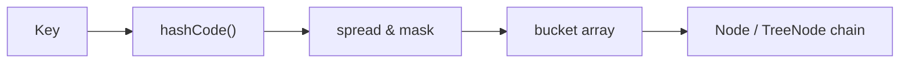
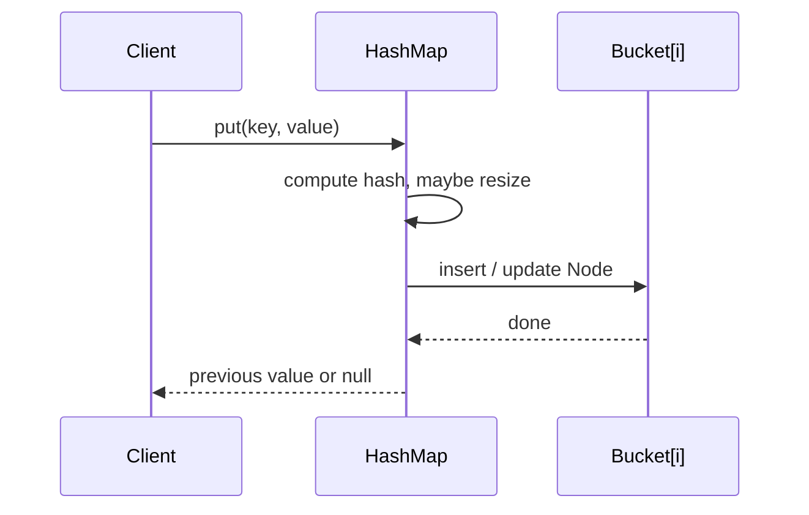

## Executive Summary

`HashMap<K,V>` stores key-value pairs in a **hash table** with **O(1) average** `get`, `put`, and `remove`. It allows **one `null` key** and multiple `null` values. Iteration order is **undefined**. Use `LinkedHashMap` for insertion order or `ConcurrentHashMap` for thread safety.

---

## Why It Exists

| Problem | How HashMap helps |
| :--- | :--- |
| Fast lookup by key | Hash + bucket index → near-constant time |
| Sparse key space | Grows dynamically; no fixed size like array |
| Flexible key types | Any object with consistent `hashCode` / `equals` |

---

## Key Concepts



| Concept | Behavior |
| :--- | :--- |
| **Load factor** | Default `0.75` — resize when `size > capacity × loadFactor` |
| **Initial capacity** | Default `16`; set expected size to avoid rehashing |
| **Null key** | Stored in bucket 0 |
| **Not thread-safe** | External sync or `ConcurrentHashMap` |
| **Fail-fast iterators** | `ConcurrentModificationException` on structural change during iteration |

---

## Syntax

```java
Map<String, Integer> scores = new HashMap<>();
scores.put("alice", 95);
scores.put("bob", 88);

int alice = scores.getOrDefault("alice", 0);
scores.putIfAbsent("carol", 70);
scores.remove("bob");

for (Map.Entry<String, Integer> e : scores.entrySet()) {
    System.out.println(e.getKey() + "=" + e.getValue());
}
```

| Method | Average time |
| :--- | :---: |
| `get`, `put`, `remove` | O(1) |
| `containsKey`, `containsValue` | O(1) / O(n) |
| `keySet`, `values`, `entrySet` iteration | O(capacity + size) |

---

## Example

```java
import java.util.HashMap;
import java.util.Map;

public class HashMapDemo {
    public static void main(String[] args) {
        Map<String, String> capitals = new HashMap<>(Map.of(
            "France", "Paris",
            "Japan", "Tokyo"
        ));
        capitals.put("Germany", "Berlin");
        capitals.put(null, "Unknown");   // allowed once as key

        capitals.forEach((country, city) ->
            System.out.println(country + " → " + city));
    }
}
```

{}
Java 9+ `Map.of` returns an **immutable** map — wrap in `new HashMap<>(Map.of(...))` when you need mutability.
{}

---

## Internal Working

1. `hash(key)` spreads high bits to reduce collisions.
2. Index = `(n - 1) & hash` where `n` is table length (power of 2).
3. Collisions chain in **linked lists**; chains **treeify** to red-black trees when length ≥ 8 (Java 8+).
4. Resize **doubles** capacity and rehashes entries.

See [HashMap Internals](/java-engineering/hashmap-internals/) for bucket treeify and resize detail.



---

## Common Mistakes

{}
Mutable keys — if a key's `hashCode` changes after insertion, `get` will fail silently.
{}

- Using `HashMap` from multiple threads without synchronization.
- Relying on iteration order for business logic.
- Implementing `equals` without consistent `hashCode`.
- `containsValue` in hot paths — scans all entries O(n).

---

## Best Practices

- Set **initial capacity** when size is known: `new HashMap<>(expectedSize * 4 / 3 + 1)`.
- Use **immutable keys** (`String`, `Integer`, records).
- Prefer `getOrDefault`, `putIfAbsent`, `computeIfAbsent` over manual null checks.
- For concurrent access → [ConcurrentHashMap](/java-engineering/concurrenthashmap/).

---

## Interview Questions


**Q:** Can `HashMap` store a null key? null values?

**A:** Yes to both — one null key (bucket 0) and any number of null values. `Hashtable` and `ConcurrentHashMap` do not allow null keys or values.



**Q:** What happens when two keys have the same hash code?

**A:** They land in the same bucket. `equals` disambiguates along the chain (or tree). Poor `hashCode` distribution degrades to O(n) linked-list walks.


---

## Related Topics

- [Previous: TreeSet](/java-engineering/treeset/)
- [Next: LinkedHashMap](/java-engineering/linkedhashmap/)
- [HashMap Internals](/java-engineering/hashmap-internals/)
- [Java Engineering Handbook Index](/java-engineering/)
