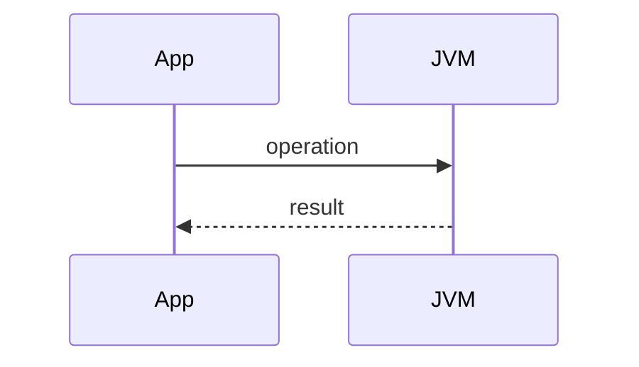

## Executive Summary

_TODO: Explain **Java 14 — Switch Expressions** in simple English — one short paragraph._

---

## Why It Exists

| Problem | How Java 14 — Switch Expressions helps |
| :--- | :--- |
| _TODO_ | _TODO_ |

---

## Key Concepts


| Concept | Description |
| :--- | :--- |
| _TODO_ | _TODO_ |


_TODO: important note for readers._


---

## Syntax

```java
// TODO: canonical syntax pattern
```

| Element | Meaning |
| :--- | :--- |
| _TODO_ | _TODO_ |

---

## Example

```java
public class Example {
    public static void main(String[] args) {
        // TODO: small runnable example
        System.out.println("TODO");
    }
}
```


_TODO: practical tip._


---

## Internal Working

- _TODO: JVM / compiler / runtime behavior_
- _TODO: performance characteristic_



---

## Common Mistakes


_TODO: pitfall that causes bugs in production._


- _TODO: mistake 1_
- _TODO: mistake 2_

---

## Best Practices

- _TODO: production-ready recommendation_
- _TODO: readability or performance guidance_

---

## Interview Questions

{< interview-answer >}
**Q:** _TODO frequently asked question_

**A:** _TODO answer in 2–4 sentences_
{< /interview-answer >}

{< interview-answer >}
**Q:** _TODO follow-up probe_

**A:** _TODO answer_
{< /interview-answer >}

---

## Related Topics

- [Previous: Switch (12–13)](/java-engineering/java-12-13-switch-improvements/)
- [Next: Text Blocks](/java-engineering/java-15-text-blocks/)
- [Java Engineering Handbook Index](/java-engineering/)
