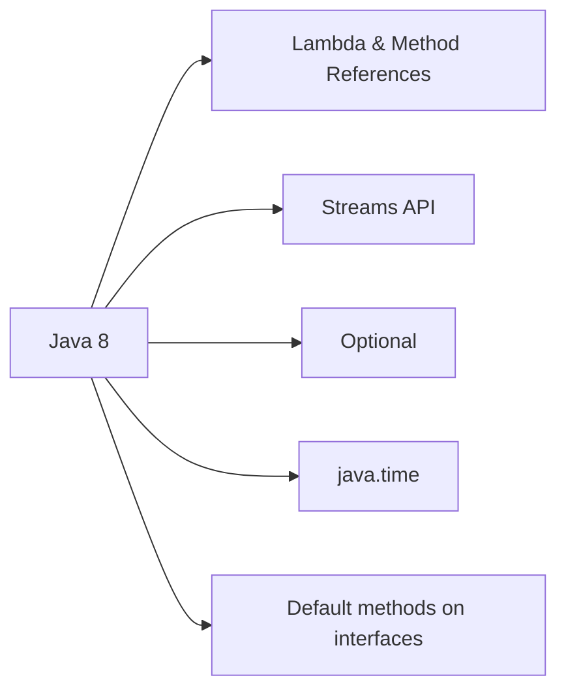

## Executive Summary

**Java 8** (March 2014) is the **most deployed baseline** in enterprise. It introduced **lambda expressions**, the **Streams API**, **`Optional`**, and the **`java.time`** package. Most codebases still target 8 bytecode; understanding Java 8 is mandatory before learning newer releases.

---

## Why It Exists

| Problem | Java 8 solution |
| :--- | :--- |
| Verbose collection processing | Streams + lambdas |
| Null-heavy APIs | `Optional` for return types |
| Broken `java.util.Date` | `java.time` (JSR-310) |
| Parallel batch processing | `parallelStream()` on collections |

---

## Key Concepts



| Feature | Package / location |
| :--- | :--- |
| Lambda | Language + `java.util.function` |
| Streams | `java.util.stream` |
| Optional | `java.util.Optional` |
| Date/Time | `java.time.*` |
| Default methods | Interfaces (e.g. `Collection.stream()`) |

---

## Syntax

### Lambda & functional interfaces

```java
Predicate<String> nonEmpty = s -> s != null && !s.isBlank();
Comparator<String> byLen = Comparator.comparingInt(String::length);
```

### Streams

```java
List<String> result = names.stream()
    .filter(n -> n.length() > 3)
    .map(String::toUpperCase)
    .sorted()
    .toList();  // .collect(Collectors.toList()) in Java 8
```

{}
`Stream.toList()` is **Java 16+**. On Java 8 use `.collect(Collectors.toList())`.
{}

### Optional

```java
Optional<User> user = findUser(id);
String email = user.map(User::getEmail).orElse("unknown@example.com");
```

### java.time

```java
Instant now = Instant.now();
ZonedDateTime tokyo = ZonedDateTime.now(ZoneId.of("Asia/Tokyo"));
Duration gap = Duration.between(start, end);
```

---

## Example

```java
import java.time.*;
import java.util.*;
import java.util.stream.*;

public class Java8Demo {
    record Order(String id, double total, Instant at) {}

    public static void main(String[] args) {
        List<Order> orders = List.of(
            new Order("A1", 120.0, Instant.parse("2026-01-15T10:00:00Z")),
            new Order("B2", 45.5, Instant.parse("2026-02-01T14:30:00Z")),
            new Order("C3", 89.0, Instant.parse("2026-01-20T09:15:00Z"))
        );

        double janTotal = orders.stream()
            .filter(o -> o.at().atZone(ZoneOffset.UTC).getMonth() == Month.JANUARY)
            .mapToDouble(Order::total)
            .sum();

        Map<String, Double> byId = orders.stream()
            .collect(Collectors.toMap(Order::id, Order::total));

        System.out.println("January total: " + janTotal);
        System.out.println(byId);
    }
}
```

{}
`record` in the example requires **Java 16+**. Replace with a simple class when compiling for Java 8.
{}

---

## Internal Working

- **Streams** are lazy until a terminal operation; pipeline fused where possible.
- **Parallel streams** use `ForkJoinPool.commonPool()` — shared across the JVM.
- **LambdaMetafactory** generates call sites via `invokedynamic` — not inner classes.
- **`java.time`** types are immutable; thread-safe without synchronization.

---

## Common Mistakes

- `Optional` as field type or method parameter — intended for **returns**.
- `parallelStream()` on small collections or with blocking I/O.
- Mixing `java.util.Date` and `java.time` without explicit conversion.
- Ignoring timezone in `LocalDateTime` — use `ZonedDateTime` for global apps.

---

## Best Practices

- Target **Java 8 syntax** in shared libraries until org upgrades JDK.
- Prefer `java.time` exclusively for new code.
- Use streams for **declarative transforms**; loops when stepping debugger or mutating external state.
- Plan upgrade path: 8 → 11 → 17 → 21 LTS.

---

## Interview Questions


**Q:** What did Java 8 add that changed everyday coding?

**A:** Lambdas, functional interfaces, Streams API, Optional, default interface methods, and java.time. Together they shifted Java toward functional-style collection processing.



**Q:** Difference between `Collection.stream()` and `parallelStream()`?

**A:** `parallelStream()` splits work across the common ForkJoinPool. Useful for large in-memory CPU-bound transforms on thread-safe sources; harmful for small data, ordered side effects, or blocking tasks.


---

## Related Topics

- [Next: Java 9 Features](/java-engineering/java-9-features/)
- [Lambda Expressions](/java-engineering/lambda/)
- [Creating Streams](/java-engineering/creating-streams/)
- [Optional](/java-engineering/optional/)
- [Java Version Features (Interview)](/java-engineering/java-version-features-interview/)
- [Java Engineering Handbook Index](/java-engineering/)
