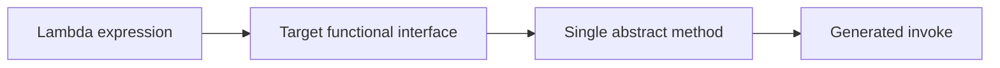
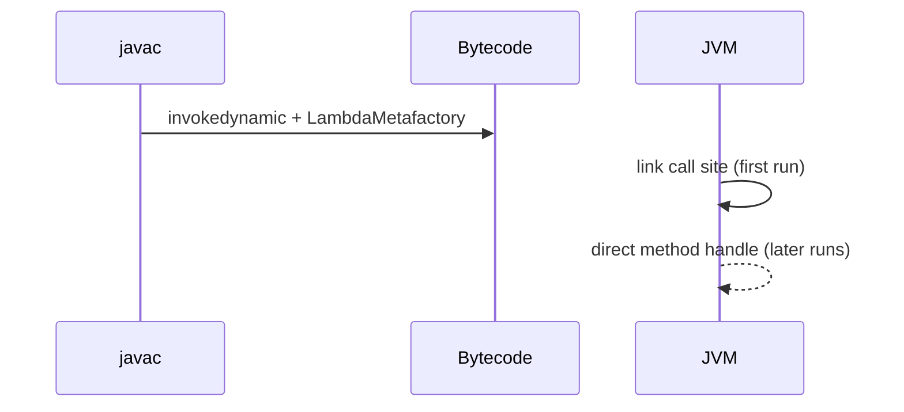

## Executive Summary

A **lambda** is a short anonymous function passed as a value — typically to functional interfaces (`Runnable`, `Comparator`, `Predicate`). The compiler infers parameter types from the **target type**. Lambdas enable Streams, event handlers, and cleaner collection operations without anonymous inner classes.

---

## Why It Exists

| Problem | How lambdas help |
| :--- | :--- |
| Verbose anonymous classes | `(a, b) -> a + b` instead of 5+ lines |
| One-method interfaces | Direct fit for `@FunctionalInterface` |
| Deferred execution | Pass behavior, not just data |

---

## Key Concepts



| Rule | Detail |
| :--- | :--- |
| **Target typing** | Type comes from context (assignment, argument, cast) |
| **Effective final** | Captured locals must not be reassigned |
| **No `this` of outer class** | Inside lambda, `this` refers to the lambda object (if any), not enclosing class |
| **Not a object** | No identity — `==` compares references of synthetic objects, not lambdas as concepts |

---

## Syntax

```java
// Full form
(int x, int y) -> { return x + y; }

// Inferred types
(x, y) -> x + y

// Single parameter — parens optional
s -> s.length()

// No parameters
() -> System.out.println("hi")

// Block body
n -> {
    int sq = n * n;
    return sq;
}
```

| Form | When to use |
| :--- | :--- |
| Expression body `-> expr` | Single expression return |
| Block body `-> { }` | Multiple statements or local variables |
| [Method reference](/java-engineering/method-reference/) | Delegate to existing method |

---

## Example

```java
import java.util.Comparator;
import java.util.List;

public class LambdaDemo {
    public static void main(String[] args) {
        List<String> names = List.of("carol", "alice", "bob");

        names.sort(Comparator.comparing(String::length)
                           .thenComparing(String::compareToIgnoreCase));

        names.forEach(name -> System.out.println(name));

        int threshold = 4;  // effectively final
        long count = names.stream()
            .filter(s -> s.length() > threshold)
            .count();

        System.out.println("long names: " + count);
    }
}
```

{}
Extract complex lambdas to **private methods** or **named functional interfaces** when they exceed one line — readability beats brevity.
{}

---

## Internal Working

- Compiler generates a **private static or instance method** (or uses `invokedynamic` + `LambdaMetafactory` since Java 8).
- First invocation links the call site; subsequent calls are efficient.
- Captured variables are stored in **synthetic fields** of the generated object.
- Lambdas are **not** serialized unless the functional interface extends `Serializable` with special handling.



---

## Common Mistakes

{}
Mutating captured variables breaks compilation — locals must be effectively final.
{}

- Using lambdas with **non-functional interfaces** (more than one abstract method).
- Heavy work inside `parallelStream()` lambdas without thread safety.
- Assuming lambda instance identity is stable across calls.

---

## Best Practices

- Prefer **method references** when they read clearly: `String::valueOf` over `s -> String.valueOf(s)`.
- Keep lambdas **pure** in streams — no side effects on external state.
- Use explicit types in public APIs when inference hurts readability: `(String s) -> ...`.
- For multi-line reuse, extract a **private method** instead of a long lambda.

---

## Interview Questions


**Q:** What is a functional interface?

**A:** An interface with exactly one abstract method (SAM). `@FunctionalInterface` is optional but enables compile-time checking. Lambdas must match that method's signature.



**Q:** Can a lambda access local variables? Why must they be effectively final?

**A:** Yes, by capture into a synthetic field. They must be effectively final because the lambda may execute later (another thread, stream pipeline) after the stack frame is gone — a mutable local would be unsafe.


---

## Related Topics

- [Previous: Functional Interface](/java-engineering/functional-interface/)
- [Next: Method Reference](/java-engineering/method-reference/)
- [Java 8 Features](/java-engineering/java-8-features/)
- [Streams API — Creating Streams](/java-engineering/creating-streams/)
- [Java Engineering Handbook Index](/java-engineering/)
