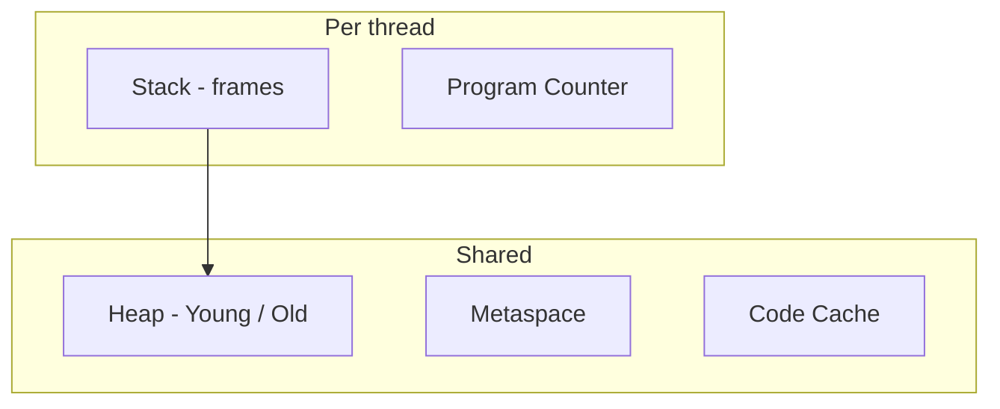

| Region | Stores | GC |
| :--- | :--- | :--- |
| Stack | Locals, refs | Auto on pop |
| Eden | New objects | Minor GC |
| Old | Tenured | Major / mixed |
| Metaspace | Class metadata | Class unloading |
| Direct | NIO buffers | Cleaner |

| Object (64b, compressed oops) | |
| :--- | :--- |
| Mark word | Hash, locks, GC age |
| Klass pointer | Class metadata |
| Fields | + padding |

**Deep dive:** [JVM Memory, GC & OOM Guide](/java-engineering/jvm-memory-gc-oom-guide/)
