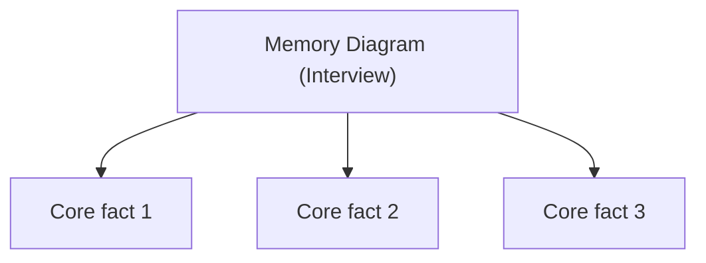

## Executive Summary

_One-page interview reference for **Memory Diagram (Interview)** — no coding problems._

---

## Why It Exists

| Need | How this page helps |
| :--- | :--- |
| Last-minute revision | Scannable tables and diagrams |
| Whiteboard interviews | Canonical facts without tutorial depth |
| Senior probes | Trade-offs in one screen |

---

## Key Concepts



| Concept | Summary |
| :--- | :--- |
| _TODO_ | _TODO_ |

---

## Syntax

| Item | Reference |
| :--- | :--- |
| _TODO_ | _TODO_ |

---

## Example

```java
// TODO: minimal illustrative snippet
public class Example {
    public static void main(String[] args) {
        System.out.println("TODO");
    }
}
```

---

## Internal Working

- _TODO: behind-the-scenes behavior in 3–5 bullets_

---

## Common Mistakes

- _TODO: typical interview wrong answers_

---

## Best Practices

- _TODO: what seniors expect you to say_

---

## Interview Questions

{< interview-answer >}
**Q:** _TODO interview question_

**A:** _TODO concise answer_
{< /interview-answer >}

---

## Related Topics

- [Previous: Version Features](/java-engineering/java-version-features-interview/)
- [Next: Thread Lifecycle](/java-engineering/thread-lifecycle-interview/)
- [Java Engineering Handbook Index](/java-engineering/)
