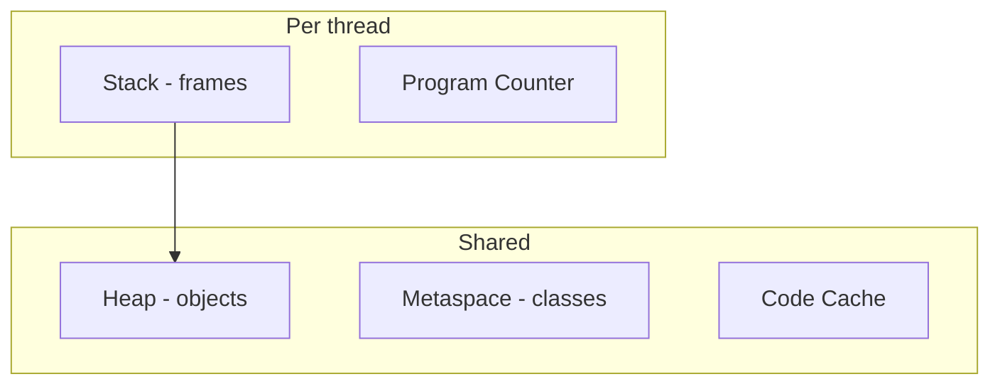

## At a Glance

- Stack: frames, locals, operand stack per thread.
- Heap: objects, arrays — shared across threads.
- Metaspace: class metadata (post-8).
- Off-heap: direct buffers, mapped files.

---

## Reference Tables



| Region | Stores | GC |
| :--- | :--- | :--- |
| Stack | Primitives, refs | Auto on pop |
| Heap Young | New objects | Minor GC |
| Heap Old | Tenured | Major/mixed |
| Metaspace | Class metadata | Class unloading |
| Direct | NIO buffers | Cleaner / explicit |

| Object layout (64b, compressed oops) | |
| :--- | :--- |
| Mark word | Hash, locks, GC age |
| Klass pointer | Class metadata |
| Fields | + padding |

---

## Snippets

```java
// stack: primitives and references
// heap: new Object()
Object o = new Object();
```

---

## Internals & Gotchas

- TLAB allocation in Eden reduces contention.
- Escape analysis may scalar-replace — not guaranteed observable.
- `-XX:+UseCompressedOops` default on 64-bit heaps <32GB.

---

## Production Notes

- Thread stack size `-Xss` matters at thousands of platform threads — not virtual threads.
- Monitor Metaspace in dynamic class loaders (Groovy, JSR223).

---

## Interview Probes


{< interview-answer >}
**Q:** Stack vs heap?

**A:** Stack: thread-local frames, automatic lifetime. Heap: shared objects, GC-managed — references on stack point to heap objects.
{< /interview-answer >}

{< interview-answer >}
**Q:** Where do static fields live?

**A:** Field data in heap inside class mirror; metadata in Metaspace — static references are heap objects.
{< /interview-answer >}

---

## See Also

- [Previous: Version Features](/java-engineering/java-version-features-interview/)
- [Next: Thread Lifecycle](/java-engineering/thread-lifecycle-interview/)
- [Java Engineering Handbook Index](/java-engineering/)
